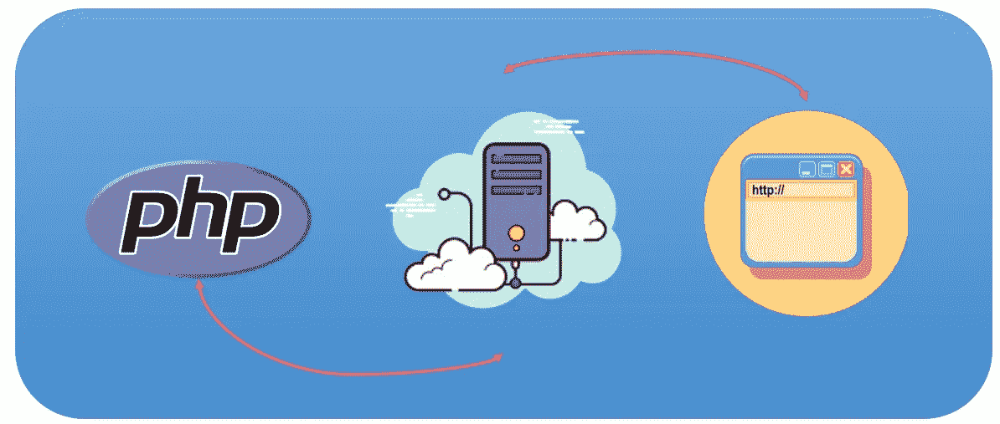
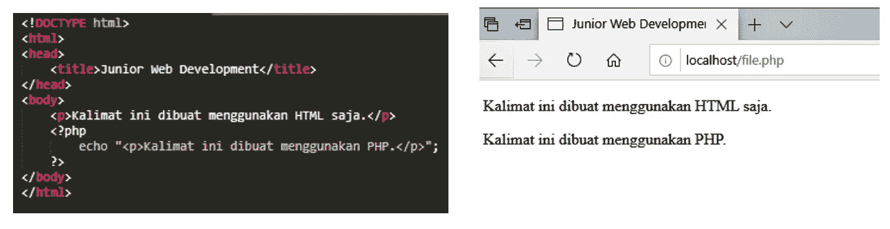
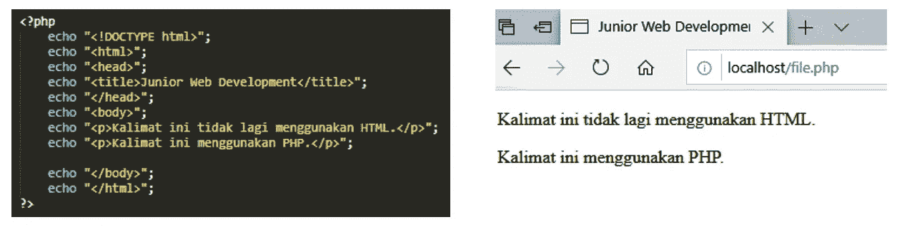

# PHP 基本编程第 2 卷:执行源代码

> 原文：<https://blog.devgenius.io/php-basic-programming-vol-2-executing-source-code-767b744bf1e0?source=collection_archive---------6----------------------->


动机

朋友们好。也许我们很多人已经熟悉了什么是编程语言，特别是什么是 PHP 编程语言。这次我们将继续讨论 PHP 编程的基础知识。我们直接进入第一个讨论。

# 执行源代码



## 如何执行 PHP 源代码

我们从这个讨论开始。

1.  首先，我们必须用 Sublime Text 或 Notepad++这样的文本编辑器创建源代码。
2.  然后将源代码保存到 C:/xampp/htdocs 文件夹中扩展名为. php 的文件中。
3.  打开 xampp 应用程序，并在 Apache 部分单击 start。
4.  打开 web 浏览器。输入地址/localhost/htdocs/filename . PHP。Filename.php 是包含步骤 1 中保存的源代码的文件。不要忘记写。文件名后的 php 扩展名。



```
Note : 
The picture above is the result of the execution of the PHP program in which there is also the HTML language. The server will read or detect the PHP code When the server finds the <?php tag and ends When it finds the ?> . tag
```



两个脚本产生相同的显示。区别在于 PHP 源代码的执行方式。

```
Note :
The picture above is an example of the HTML language that is loaded using the PHP script
```

# 运行、调试和可执行文件之间的区别

*   运行是运行一个 php 程序以便它被成功执行的过程
*   调试是在已经执行的程序中寻找 bugs 错误并发生错误的过程。
*   可执行文件是将 PHP 程序转换成可在 PC 上作为应用程序使用的 exe 文件的过程

# 结论

我们已经得出结论。我们讨论的结论是，PHP 文件存储在 c:/xampp/htdocs 文件夹中，以便可以执行。然后在 xampp 应用程序上运行 apache 模块开始执行。我们将在下一篇文章中继续讨论基本 PHP。希望这篇文章能有用。

谢谢你。