# PHP 基础编程第 3 卷:使用数据类型和程序控件

> 原文：<https://blog.devgenius.io/php-basic-programming-vol-3-using-data-types-and-program-controls-f8be342d7038?source=collection_archive---------9----------------------->

动机

朋友们好。也许我们很多人已经熟悉了什么是编程语言，特别是什么是 PHP 编程语言。这次我们将继续讨论 PHP 编程的基础知识。我们直接进入第一个讨论。

# 使用数据类型和程序控件

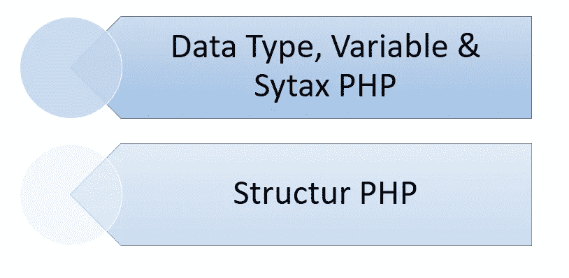

# PHP 数据类型、变量和系统

## 什么是数据类型？

数据类型是数据类型的分类或数据的构成。它描述数据:它是由哪种数据组成的？什么是实数？还是分数？还是由字符构成的数据？等等。

## PHP 上的数据类型

*   Integer:包含单位整数，不带任何逗号
*   Float:包含十进制数
*   Boolean:包含十进制数
*   字符串:包含用“”或“”括起来的文本数据
*   数组:包含不同数据类型的数据集

## PHP 上的数据类型

PHP 是一种动态类型的编程语言，这意味着它没有为每个变量定义数据类型的严格规则。PHP 会在程序运行时自动确定某个变量的数据类型。

# 可变的

## 什么是变量？

变量是用来存储数据或值的“容器”。我们可以存储各种类型的各种数据，例如，我们存储学生姓名的文本数据或学生 GPA 值的十进制数据，等等。

## 变量命名规则

为了在变量中存储数据，我们需要给变量一个名字。在 PHP 中，命名变量有几个规则，即:

*   以$符号开始:PHP 编程语言中的每个变量名都是由一个$符号后跟变量本身的名称来定义的
*   名称以字母或下划线开头(_): PHP 变量名必须以字母或下划线开头(_)我们可以创建名为$_nilai 或$nilai value 的变量，但不能创建名为$1nilai 的变量。
*   区分大小写:PHP 在变量命名中区分大小写。那么变量$value、$value 和$value 被认为是 3 个不同的变量。
*   仅限字母和数字:变量名只能由字母[A-Z]或[A-Z]以及数字[0–9]组成。我们不能给变量命名，比如用*或者&等等。我们也不能在 PHP 中使用空格来命名变量。
*   用*初始化:我们可以用等号(=)给变量赋值。example $ name = " Agung Prabowo

建议使用与变量赋值相对应的名称来命名变量。例如，使用名称$ nilaiMatematika 来存储数学值，而不使用名称$a 来存储日期。

## 变量创建

对于 PHP 中的变量创建，语法组合如下:

$namaVariabel 部分是您赋予变量的名称，而[变量值]是您要分配给变量的值。这个变量的值决定了变量本身的数据类型。如果您输入一个数字，那么数据类型将变为数字数据类型(整数/浮点数)，如果您输入 true/false，那么结果将为布尔值，依此类推。

# 数据类型

## 数据类型整数

整数数据类型是用于存储整数的数据类型。示例:

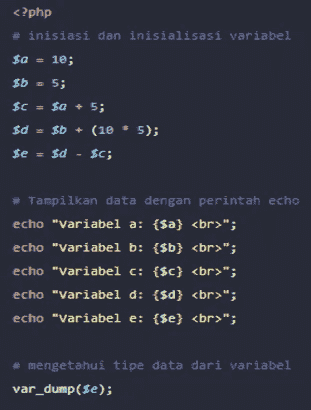

结果:

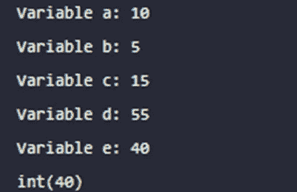

## 数据类型浮点

对于 float 数据类型，方法与整数相同。只不过，它接受带数字的十进制数据。作为分割线。示例如下:

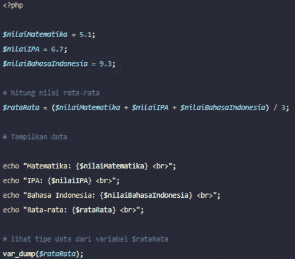

结果:

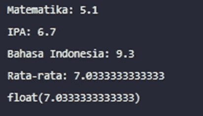

## 布尔数据类型

布尔数据类型只能保存 true 或 false 值。这种数据类型是最简单的数据类型，但是需要很强的逻辑才能正确使用。

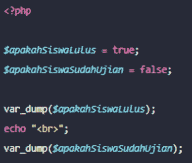

结果:

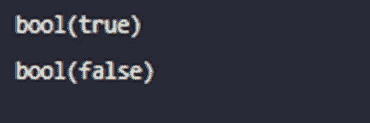

## 数据类型字符串

字符串数据类型是用于存储文本的数据类型。所有文本都用单引号(“”)或双引号(“”)括起来。

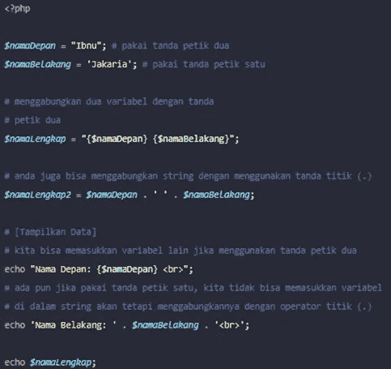

结果:

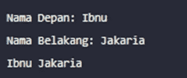

## 数据类型数组

数组数据类型用于存储数据集。数据集用方括号([])括起来。例如，我有 3 个学生，我想将这三个学生的名字都存储在一个变量中。因此，我可以通过使用如下数组数据类型来实现这一点:

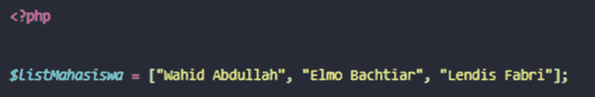

要访问数组变量的内容，我们可以使用索引。索引从 0 开始。因此，如果我要显示变量$listStudent 的名字，我将使用索引 0，如下所示:

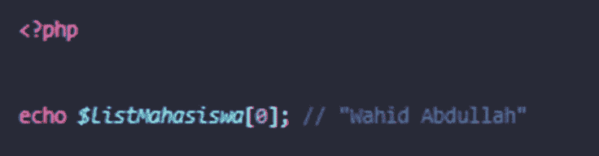

# 可变运算符

运算符是用于对值和变量执行运算的符号。在 PHP 编程中，我们应该知道 6 种类型的运算符:

*   算术运算符；
*   赋值运算符；
*   递增和递减运算符；
*   关系运算符或比较；
*   逻辑运算符；
*   和三元运算符。

## 算术运算符

算术运算符是执行算术运算的运算符。算术运算符包括:

*   加法:php 中的加法运算符用于将数字或变量相加。例如$a + $b。
*   减法:php 中的减法运算符用于减去一个数字或变量。例如$a — $b。
*   乘法:php 中的乘法运算符用于数字或变量相乘。在 php 中使用星号“*”进行乘法运算。例如$a * $b。
*   除法:php 中的除法运算符用于对数字或变量进行除法运算。要在 php 中创建除法，请使用斜杠“/”。例如$a / $b。
*   减号:在 php 中创建减号运算符的一个例子是“-$a”。
*   加号:在 php 中做加号运算符的例子就像“+$a”。
*   模数:模数运算符是求除法结果的运算符。使用百分号“%”在 php 中编写模数运算符。例如“$a % $b”。模数运算符用于获得除法的余数。例如 18 % 8，则结果为 2。因为 18 / 8 = 2，8 x 2 = 16，18–16 = 2

示例:

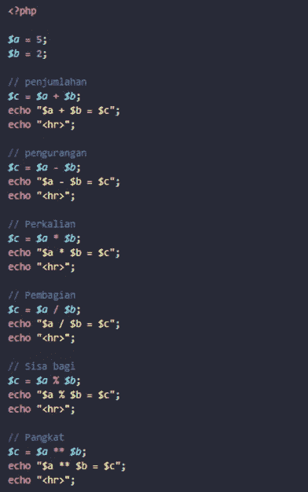

## 赋值运算符

您应该知道的下一个操作符是赋值操作符。这个操作符是给变量赋值的操作符。通常用于填充值。

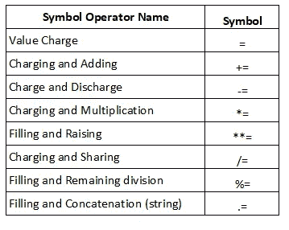

## 和算术运算符有什么区别？

可以说，赋值运算符是算术表达式的一种更简单的形式。举个例子:

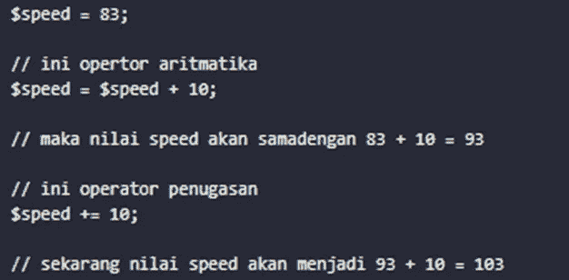

## 操作员增量和减量

递增和递减运算符是用于加+1(加 1)和减-1(减 1)的运算符。递增运算符使用++符号，而递减运算符使用——符号。例如:

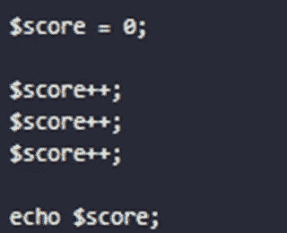

## 关系运算符

关系运算符是比较两个值的运算符。以下是关系运算符的列表:

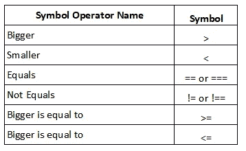

关系运算符的运算结果将返回一个布尔数据类型的值，即 true(真)和 false(假)。从侧边的结果，我们得到值 1 为真，而假不显示或 0。

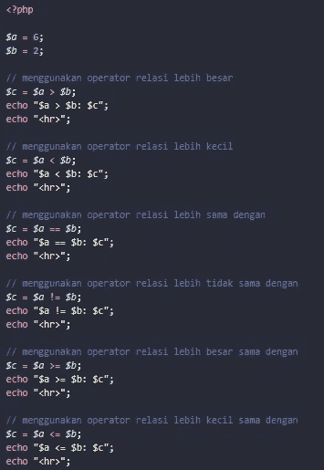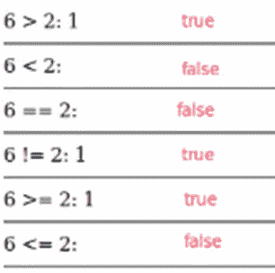

## 逻辑运算符

逻辑运算符是执行逻辑运算的运算符，例如 AND、OR 和 NOT。逻辑运算符包括:

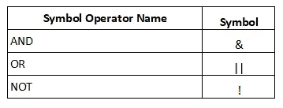

逻辑运算符与关系运算符相同，它们将返回布尔数据类型的值。注意使用&& (AND)运算符、|| (OR)、AND 时得到的结果！(不是)。

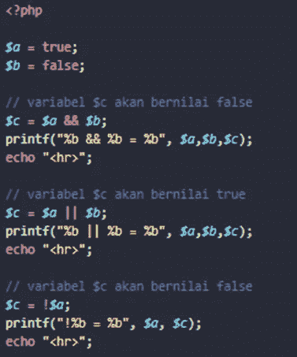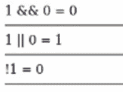

如果 left 和 right 值为 true，则&&运算符将返回 true。而运算符||在左右值为假时会返回假。
试重新检查逻辑与、或、与非的规律。

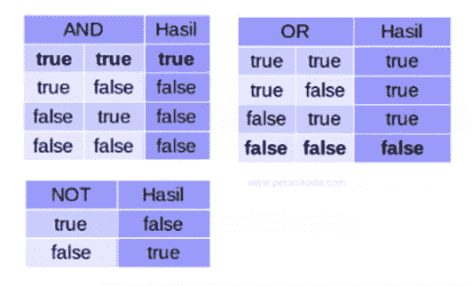

## 三元运算符

三元运算符是创建条件的运算符。使用的符号是一个问号(？)和冒号(:)。

示例:

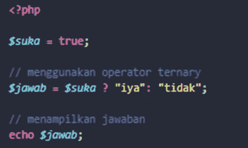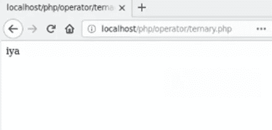

# 结论

我们已经得出结论。从我们的讨论中得出的结论是，数据类型在编程语言中起着重要的作用，因为它们与制作软件时使用的变量有关。我们将在下一篇文章中继续讨论基本 PHP。希望这篇文章能有用。

谢谢你。

# 参考

*   [https://kelaspprogrammer . com/syntax-dasar-PHP-Bela jar-struktur-PHP/](https://kelasprogrammer.com/syntax-dasar-php-belajar-struktur-php/)
*   [https://www.w3schools.com/php/](https://www.w3schools.com/php/)