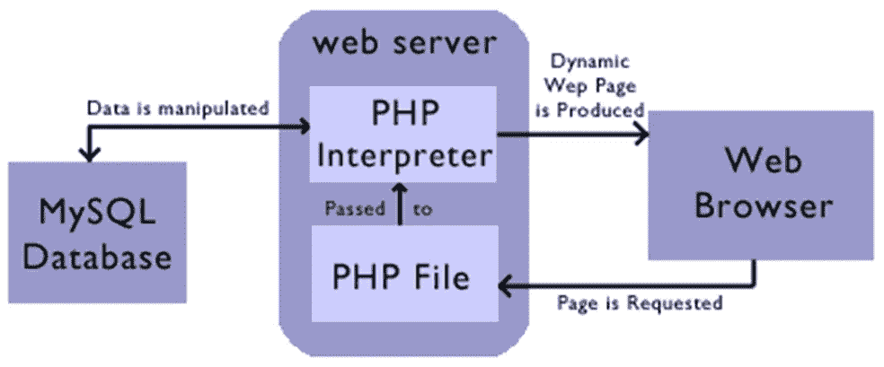
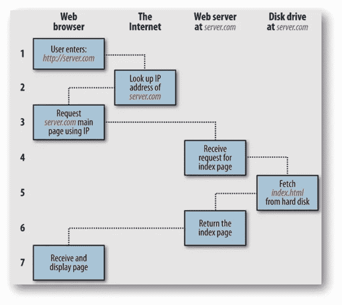
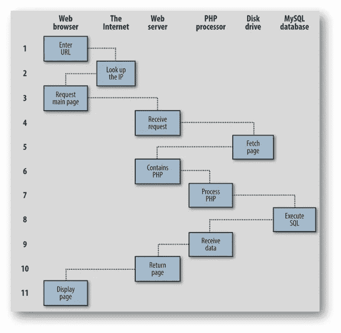
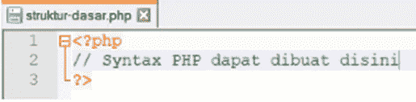
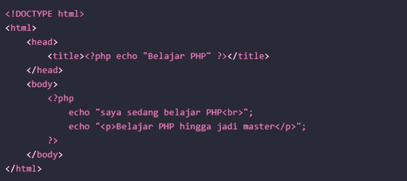

# PHP 基础编程第 4 卷:结构

> 原文：<https://blog.devgenius.io/php-basic-programming-vol-4-structur-php-4073ffbaff5c?source=collection_archive---------8----------------------->

朋友们好。也许我们很多人已经熟悉了什么是编程语言，特别是什么是 PHP 编程语言。这次我们将继续讨论 PHP 编程的基础知识。我们直接进入第一个讨论。

# 结构 PHP

## 基于 PHP 服务器端的数据处理

构建一个网站由几个组件组成，包括 HTML(超文本标记语言)作为一种网络语言，其处理是在客户端进行的。还有 CSS(层叠样式表),它与客户端处理 HTML 是一样的。而 PHP 数据处理是在服务器端(服务器端)。

## Web 浏览器-Web 服务器-PHP 关系示意图

## 请求/响应程序

# PHP 基本结构

PHP 有一个简单的结构。PHP 语法以开头

PHP 文件扩展名可以用。php 扩展名(在 php 中)如上图所示，使文件名为 basic-structure.php

## 关于 PHP 的评论

当我们在 PHP 中创建程序行时，我们可以使用注释函数来解释我们创建的每一行或每一个函数的含义。因此我们制作的每个 PHP 语法都有清晰的文档。PHP 中的注释前面有一个//符号。PHP 将不执行//符号后的任何字符。因为 PHP 会读取它是一个注释。

## PHP 中的敏感度

在 PHP 中，像 if、for、while、echo、print 等函数是不区分大小写的。我们可以对大写和小写字母使用这些函数。例如 PHP 中的 echo 函数，当我们创建 echo 和 ECHO 函数时，PHP 将读取这两个语法是相同的。而 PHP 中变量的命名是区分大小写的。

## 在 HTML 中组合 PHP

默认情况下，php 文档以扩展名. PHP 结尾。html 扩展，其中 HTML 也可以被 PHP 处理器解析，通常是因为他们想隐藏他们正在使用 PHP 的事实。PHP 文档将像 HTML 文档一样输出。index.html 和 index.php 的文件看起来是一样的。

# 结论

我们已经得出结论。从我们的讨论中得出的结论是 PHP 编程结构有助于理解程序执行过程，并使创建软件变得更容易。我们将在下一篇文章中继续讨论基本 PHP。希望这篇文章能有用。

谢谢你。