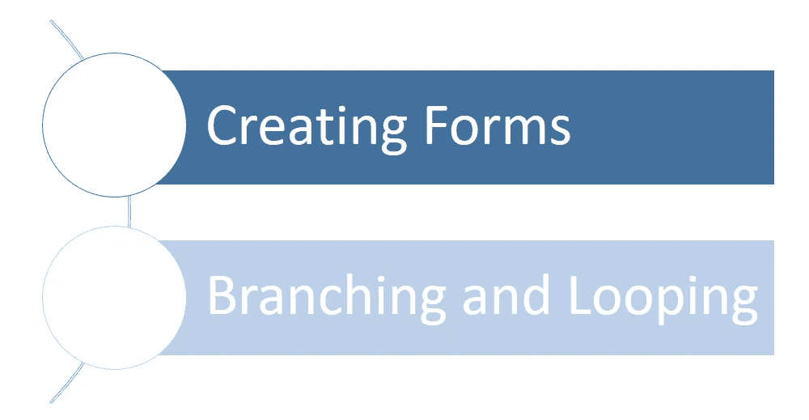
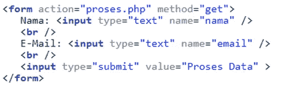
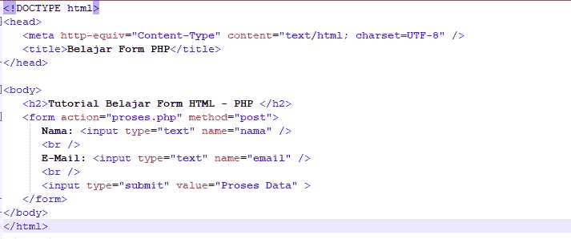
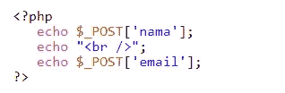

# PHP 基础编程第 5 卷:创建简单的程序

> 原文：<https://blog.devgenius.io/php-basic-programming-vol-5-create-simple-programs-3652483803e2?source=collection_archive---------9----------------------->

动机

朋友们好。也许我们很多人已经熟悉了什么是编程语言，特别是什么是 PHP 编程语言。这次我们将继续讨论 PHP 编程的基础知识。我们直接进入第一个讨论。

# 创建简单的程序

# 创建表单

## 了解 HTML 表单的基本结构

根据上面的基本结构，在

## 动作属性

第一个属性是行动。action 属性以 PHP 页面地址的形式填充了一个值，我们将在这里处理表单的内容。action 属性的内容是 PHP 页面的地址。因为上面例子中的 action 属性被写成 action="process.php "，所以文件 process.php 必须和包含这个表单的 HTML 页面在一个文件夹中。但是，这个 process.php 的地址可以根据文件所在的位置进行更改，例如更改为相对地址，如 action="file_php/process.php "

## 属性方法

与 HTML 表单处理相关的第二个属性是方法属性。此属性将决定表单如何“提交”到 process.php 页面。方法属性的值只能填充两个选项中的一个，即 get 或 post。

## 将 HTML 表单值发送到 PHP

为了检索 HTML 表单值，PHP 提供了两个全局变量，即$_GET 和$_POST 变量。如果表单是使用 method=get 属性创建的，我们使用$_GET 变量，如果表单是使用 method=post 创建的，我们使用$_POST 变量。这两个变量实际上是数组，所以从表单中访问值的方法是通过:$_GET['name_object_form']。“表单对象名称”是表单中名称属性的值。如果我们有一个 HTML 代码为的标签，那么用$_GET['name']访问该值，用$_GET['email']访问标签。

示例:

Belajar.php

Proses.php

# 结论

我们已经得出结论。从我们的讨论中得出的结论是，形式有两个属性，即必须根据需要进行调整的行为和方法。我们将在下一篇文章中继续讨论基本 PHP。希望这篇文章能有用。

谢谢你。