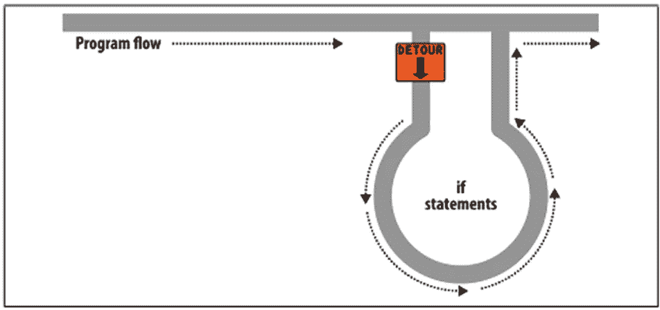

# PHP 基本编程第 6 卷:分支和循环

> 原文：<https://blog.devgenius.io/php-basic-programming-vol-6-branching-and-looping-fd9cb1b80786?source=collection_archive---------4----------------------->

朋友们好。也许我们很多人已经熟悉了什么是编程语言，特别是什么是 PHP 编程语言。这次我们将继续讨论 PHP 编程的基础知识。我们直接进入第一个讨论。

# 分支和循环

## 分支

分支是一种程序逻辑，允许程序基于某些条件执行不同的操作。各种分支:

*   如果
*   如果…否则…
*   如果…否则…否则
*   转换

## If 条件

如果条件为真，则执行命令

示例:

## If…else 条件

如果条件为真，执行一个命令；如果条件为假，执行另一个命令

示例:

## if…elseif…else 条件

在两种以上的情况下运行不同的命令

示例:

## 开关/外壳

基于不同的条件执行不同的命令。使用开关选择要执行的许多代码之一

示例:

# 环

允许程序根据特定条件重复一系列动作。编程中有两种类型的循环:计数循环；未计算的循环。

在 PHP 中，我们可以使用 4 种类型的循环:

*   For 循环
*   While 循环
*   Do/While 循环
*   Foreach 循环

## For 循环

For 循环是包含在计数循环中的循环，因为我们可以确定重复的次数。

示例:

For 循环中的$i 变量充当计数器，计算它将重复的次数。计数将从零(0)开始，因为我们给出的值是$i = 0。然后，只要$i 的值小于 10，循环就会重复。也就是说，这个循环将重复 10 次。$i++的意思是$i 的值每迭代一次就加 1。

## While 循环

while 循环是属于未计数循环的循环。因为通常是用来重复一些还不清楚重复次数的东西。但是，while 循环也可以像 for 循环一样用作计数循环。

示例:

只要$repeat 的值小于 10，while 循环就会继续循环。然后在循环中，我们用$repeat++增加$repeat 的值。含义:每次迭代加 1。注意不要忘记添加增量，否则代码会影响循环。因为如果不这样，重复将永远不会停止，并将使我们的计算机挂起。

## Do/While 循环

Do/While 循环与 While 循环相同。也属于不可数循环。Do/While 和 While 的区别在于它开始循环的方式。

示例:

Do/While 循环将总是重复 1 次，然后检查条件。而 While 循环将首先检查条件，然后重复。

## Foreach 循环

foreach 循环与 for 循环相同。但是，它更专门用于打印数组。

示例:

# 结论

我们已经得出结论。我们讨论的结论是，分支或循环越复杂，服务器加载时间过程就越慢。我们将在下一篇文章中继续讨论基本 PHP。希望这篇文章能有用。

谢谢你。

# 参考

*   [https://www . duniailkom . com/tutorial-form-PHP-cara-menampilkan-hasil-form-html-dengan-PHP/](https://www.duniailkom.com/tutorial-form-php-cara-menampilkan-hasil-form-html-dengan-php/)
*   https://www.w3schools.com/php/