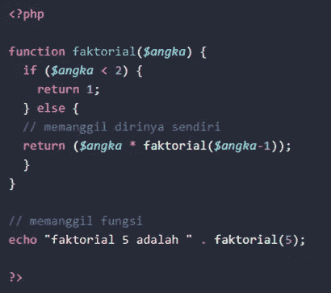

# PHP 基本编程第 7 卷:过程和函数

> 原文：<https://blog.devgenius.io/php-basic-programming-vol-7-procedure-and-function-f8f8be154013?source=collection_archive---------2----------------------->

朋友们好。也许我们很多人已经熟悉了什么是编程语言，特别是什么是 PHP 编程语言。这次我们将继续讨论 PHP 编程的基础知识。我们直接进入第一个讨论。

# 功能和程序

# 了解 PHP 中的类型和函数

## 理解 PHP 中的函数

函数是包装在块中的一组指令。函数可以重用，而不必重写其中的指令。

## PHP 中的函数类型

PHP 中的函数分为两种，即内置函数和自定义函数，内置函数是 PHP 的固有函数，自定义函数是我们自己创建的函数。php 提供的函数非常多，比如 sbstr()等。我们可以直接使用。完整的列表可以在页面上看到: [PHP:函数和方法列表—手动](https://www.php.net/manual/en/indexes.functions.php)

## PHP 中函数和过程的差异

*   过程:不返回值
*   函数:返回值
*   在 PHP 中，过程和函数使用函数。句法

# 在 PHP 中创建函数

## 函数写作结构

示例:

如果没有调用已创建的函数，它将不会返回任何内容。我们可以通过写函数的名字来调用它。

完整代码:

## 带参数或自变量的函数

为了使函数内部的指令更加动态，我们可以使用参数向函数传递一个值。该值将在函数内部进行处理。

## 具有默认值的参数

我们可以在参数中给出默认值。如果参数没有填充值，默认值用来填充参数的值。

## 返回值的函数

处理函数值的结果可能需要进一步处理。因此，我们必须创建一个可以返回值的函数。

## 在函数中调用函数

我们创建的函数也可以在另一个函数中调用。

## 递归函数

递归函数是调用自身的函数。该函数通常用于解决阶乘、斐波那契数、动态规划等问题。

## 函数与过程

# 通过编写注释来完成程序中的每个功能/过程

## 关于 PHP 的评论

当我们在 PHP 中创建程序行时，我们可以使用注释函数来解释我们创建的每一行或每一个函数的含义。因此我们制作的每个 PHP 语法都有清晰的文档。PHP 中的注释前面有一个//符号。PHP 将不执行//符号后的任何字符。因为 PHP 会读取它是一个注释。示例如下:

示例:

## 对函数进行注释

通常，函数/过程/程序在开始时伴随有关于函数/过程/程序描述的注释；初始状态和最终状态；作者(创作者)；版本和/或日期。

# 结论

我们已经得出结论。从我们的讨论中得出的结论是 PHP 中的函数和过程几乎是相同的，唯一的区别是如果函数返回值，否则过程不返回值。我们将在下一篇文章中继续讨论基本 PHP。希望这篇文章能有用。

谢谢你。

# 参考

*   [https://www.petanikode.com/php-prosedur-fungsi/](https://www.petanikode.com/php-prosedur-fungsi/)
*   https://www.w3schools.com/php/