# PHP 基本编程第 8 卷:数组

> 原文：<https://blog.devgenius.io/php-basic-programming-vol-8-array-a802b3b5aaba?source=collection_archive---------4----------------------->

朋友们好。也许我们很多人已经熟悉了什么是编程语言，特别是什么是 PHP 编程语言。这次我们将继续讨论 PHP 编程的基础知识。我们直接进入第一个讨论。

# 使用数组创建程序

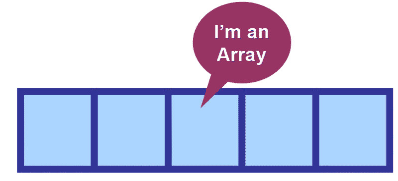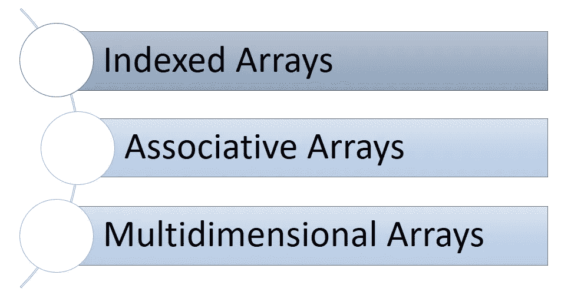

# 索引数组

## 什么是数组？

数组是一种数据结构，它包含一组数据并有一个索引。索引用于访问数组值。数组索引总是从零(0)开始。

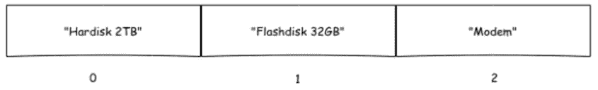

## 在 PHP 中创建数组

PHP 中的数组可以用 array()函数和方括号[]创建。数组可以用任何数据类型填充。

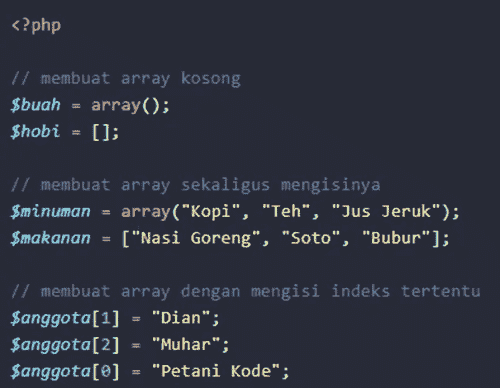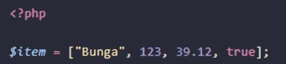

## 显示数组的内容

为了显示数组的内容，我们可以通过索引来访问它。

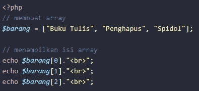

也可以使用循环

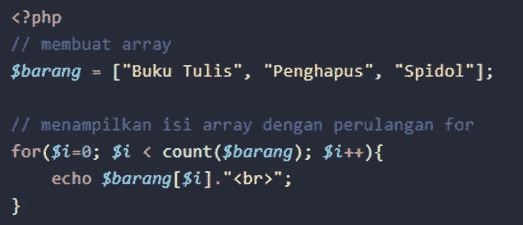

## 删除数组的内容

要删除数组的内容，我们可以使用 unset()函数。该功能也可用于删除变量。

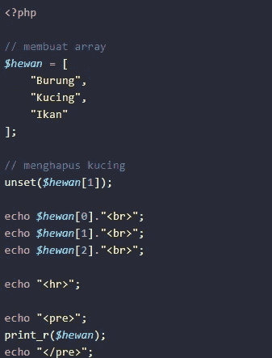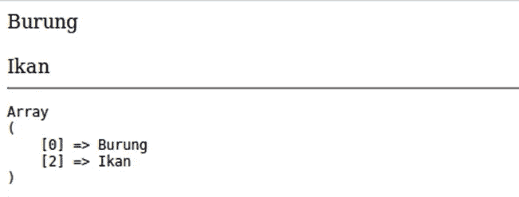

## 添加数组

有两种方法可以增加数组的内容:直接填充到你想要添加的索引号直接填充到最后一个索引

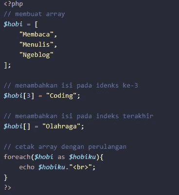

如果我们添加到已经有内容的索引中，那么新的内容将被覆盖。

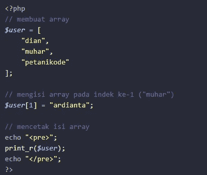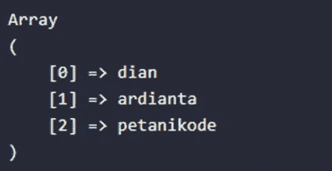

## 排序数组

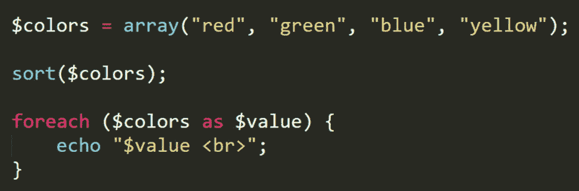

## 排序数组(反向)

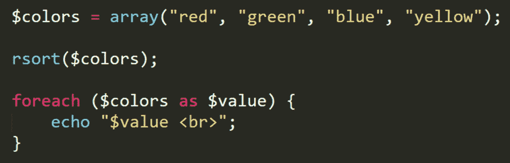

# 关联数组

## 什么是关联数组？

关联数组是其索引不使用数字或数字的数组。关联数组索引是关键字的形式。

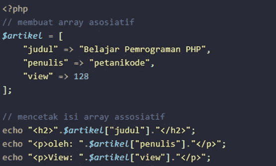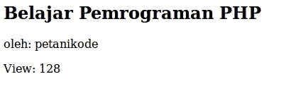

在关联数组中，我们使用= >符号将关键字与数组的内容关联起来。除了使用= >符号，我们还可以创建一个这样的关联数组:

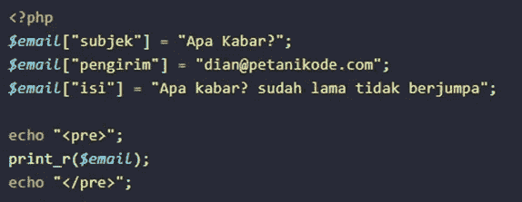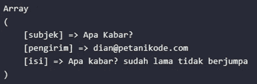

# 多维数组

## 什么是多维数组？

多维数组是具有多个维度的数组。通常用于创建矩阵、图形和其他复杂的数据结构。

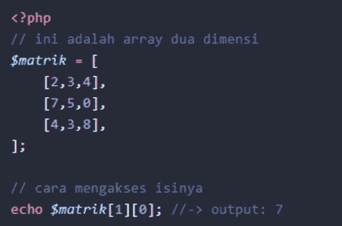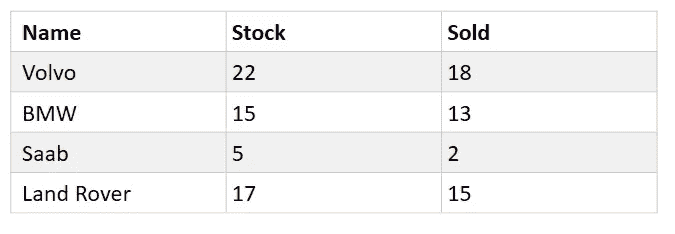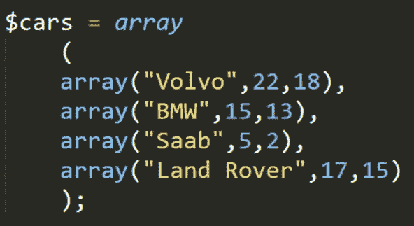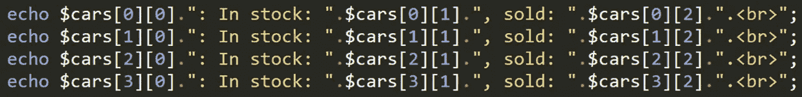

## 显示多维数组

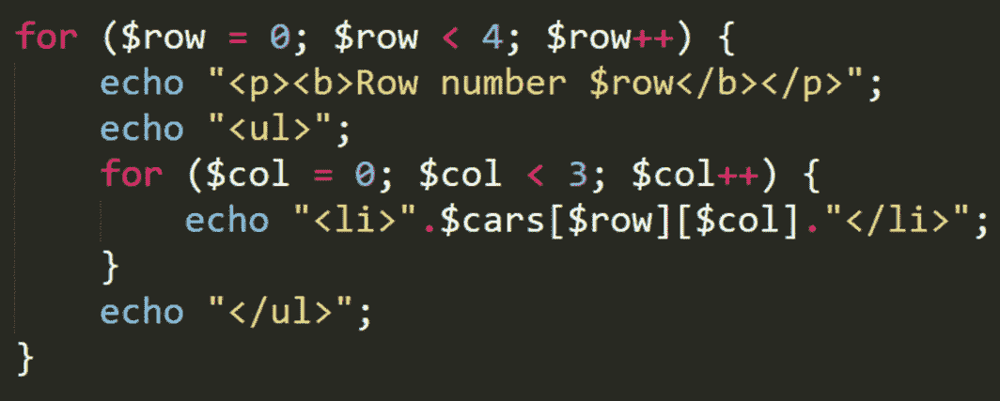

# 结论

我们已经得出结论。从我们的讨论中得出的结论是，数组可以用来存储多种类型的数据，因此它们非常灵活且易于组织..我们将在下一篇文章中继续讨论基本 PHP。希望这篇文章能有用。

谢谢你。

# 参考

*   [https://www.petanikode.com/php-array/](https://www.petanikode.com/php-array/)
*   https://www.w3schools.com/php/