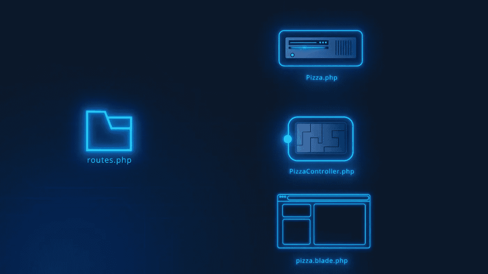
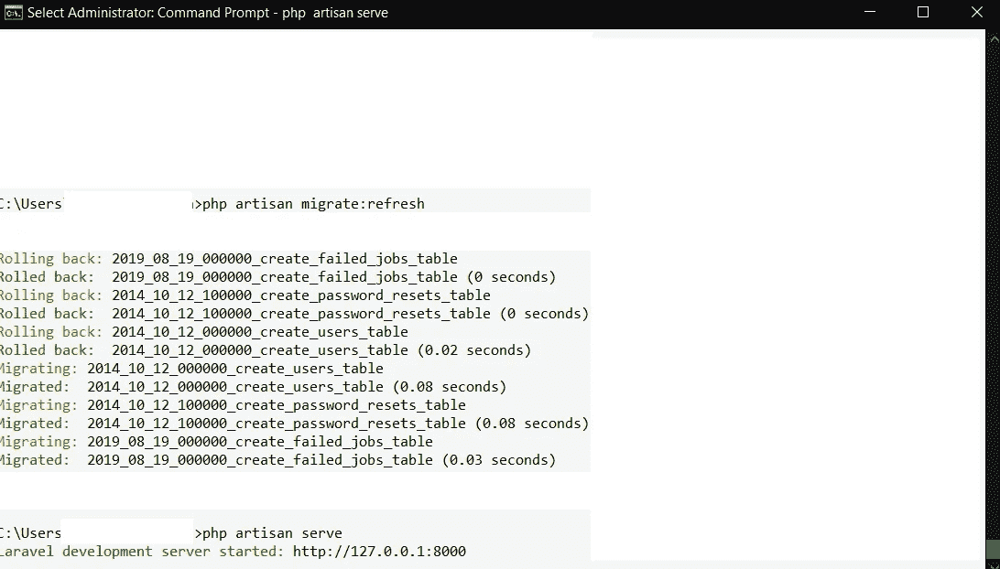
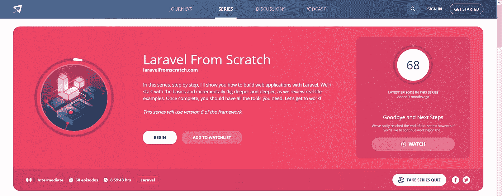

# PHP Laravel 框架用于更干净的 Web 应用程序

> 原文：<https://blog.devgenius.io/php-laravel-framework-for-cleaner-web-applications-640b07228f73?source=collection_archive---------4----------------------->

## 程序员指南

Laravel 与其他 PHP 开发框架相比没有多少优势

[KOBU 机构](https://unsplash.com/@kobuagency?utm_source=unsplash&utm_medium=referral&utm_content=creditCopyText)在 [Unsplash](https://unsplash.com/s/photos/php?utm_source=unsplash&utm_medium=referral&utm_content=creditCopyText) 上拍摄的照片

今天，每个企业都必须有一个网站。Web 开发是一个过程，通过这个过程可以创建功能性和视觉吸引力的网站。web 开发最重要的一个方面是 web 编程，这让大多数开发人员陷入了为他们的网站选择最适合的 Web 开发语言的两难境地。选择正确的编程语言来为你的企业开发你的网站可能是一场斗争，因为有太多的选择。

在本文中，我们将了解 PHP 的 [Laravel 框架](https://www.laravel.com)所提供的更多特性，这些特性使它从其他可用的 web 开发语言中脱颖而出。

1.  **为您的应用程序启用身份验证:**

Laravel 框架几乎自动化了 web 应用程序中用户认证的实现。任何基本的 web 应用程序都需要用户认证，使用 Laravel 框架几乎不需要做任何配置。当您设置用户认证时，Laravel 会创建所有重要的组件，比如用户模型、注册和登录控制器以及相应的视图。它还包括一个社交包，负责使用脸书、谷歌和 Twitter 等社交网络实现用户认证。

**2。Artisan 命令行界面支持:**

**Artisan** 是 Laravel 框架的一个内置工具，带有一个命令行界面，允许开发人员自动执行大多数重复而乏味的编程任务，如创建模型、控制器、数据库种子等。这些 artisan 命令可以根据您的应用程序需求进行配置，您也可以创建新的 artisan 命令来自动执行应用程序的自定义任务。

**3。最佳模型-视图-控制器:**

Laravel 框架的 MVC 架构使您的应用程序的业务逻辑和表示视图之间变得清晰。Laravel 处理路由的方式是理解在 MVC 架构的不同组件之间产生干净的控制转移的无缝 MVC 架构的最好例子。有一个单一的 web.php 文件来处理您的应用程序的所有 web 路由。

此外，Laravel 的模板引擎——Blade 使视图与业务逻辑的分离更加清晰。Blade 还支持模板继承，这使得将模板划分为多个部分以及从这些部分继承到其他视图文件变得更加容易。

拉腊卡斯特 —第一集

**4。数据库连接**

Laravel 框架具有简单的数据库迁移命令，使数据库连接变得简单明了。

**5。拉腊卡斯特**

Laracasts 是一系列免费的网络教程，帮助开发者开始学习 Laravel 框架。此外，Laravel 还提供广泛的社区支持。

**结论**

PHP Laravel 框架的这些特性使其成为动态创建 web 应用程序的最佳框架。由于上述令人难以置信的特性，Laravel 框架的受欢迎程度一直在上升。