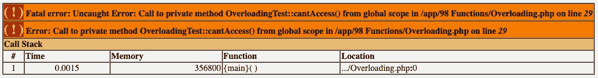

# PHP — P101: trim、htmlspecialchars 和 __call 内置函数

> 原文：<https://blog.devgenius.io/php-p101-trim-htmlspecialchars-and-call-built-in-functions-7b4f25728db9?source=collection_archive---------11----------------------->


在过去的 100 篇 PHP 文章中，我们使用了各种内置函数。是时候把它们收集到一个地方，给出几个例子，并添加我可能遗漏的其他例子。你可能会问什么是内置函数。这只是 PHP 安装自带的一个功能。你不必知道他们在哪里。你不必实例化一个对象。它们在全球都有售。

我们要看的函数如下:

*   `**trim(),**`**`**ltrim()**`**`**rtrim()**`****
*   ****`**htmlspecialchars()**`****
*   ****`**__call()**`****
*   ****`preg_match()`****
*   ****`filter_var()`****
*   ****`addslashes()`****
*   ****`str_replace()`****
*   ****`strlen()`****
*   ****`strtolower()`****
*   ****`strtoupper()`****
*   ****`ucfirst()`****
*   ****`strpos()`、`stripos()`、`strrpos()`、`strripos()`****
*   ****数组函数有:`array_chunk()`、`array_diff()`、`array_key_exists()`、`array_key_first()`、`array_key_last()`、`array_map()`、`array_merge()`、`array_push()`、`array_sum()`、`asort()`、`arsort()`、`count()`、`in_array()`、`ksort()`、`krsort()`、`sort()`、`rsort()`、`shuffle()`、`sizeof()`、`is_array()`、`explode()`、`implode()`****
*   ****魔术方法有:`__invoke()`，`__toString()`****

****没有韵律或理由。我们先浏览一下名单。****

# ****trim()，ltrim()，rtrim()****

****这些是“修剪”或删除空格的字符串操作。`trim()`函数删除两边的空格；`ltrim()`仅删除字符串左侧的空白；`rtrim()`仅删除右侧的空白。这些函数都不能删除字符串中间的空格。****

```
**<?php

// trim()
$string = " Hello There ";
$string = trim($string);
var_dump($string);**
```

```
**/app/98 Functions/index.php:6:string 'Hello There' (length=11)**
```

****`trim()`函数删除开头和结尾的空白。初始字符串长度为`13`，但仅在`trim()`功能应用后为`11`。****

```
**<?php

// ltrim()
$string = " Hello There ";
$string = ltrim($string);
var_dump($string);**
```

```
**/app/98 Functions/index.php:11:string 'Hello There ' (length=12)**
```

****`ltrim()`函数只移除左边的空白。这就是为什么我们只剩下一个长度为`12`的字符串。****

```
**<?php

// rtrim()
$string = " Hello There ";
$string = rtrim($string);
var_dump($string);**
```

```
**/app/98 Functions/index.php:16:string ' Hello There' (length=12)**
```

****`rtrim()`函数产生与`ltrim()`相同的字符串长度，但是最后一个空格这次被删除了，而不是第一个。****

# ****htmlspecialchars()****

****这是一个非常重要的功能。它将特殊字符转换成 HTML 实体。这有助于防止您的应用程序接受恶意代码，如一些 JavaScript 注入。****

```
**<?php

$html = '<script>alert("Hacked");</script>';
$sanitized = htmlspecialchars($html);
var_dump($sanitized);**
```

```
**/app/98 Functions/index.php:21:string '&lt;script&gt;alert(&quot;Hacked&quot;);&lt;/script&gt;' (length=55)**
```

****如你所见，`<`转化为`&lt;`，`>`转化为`&gt;`。****

# ****_ _ 调用()****

****call 方法允许方法重载。你可以想出任何你喜欢的方法名。我会告诉你我的意思。****

```
**<?php

class OverloadingTest
{
    private function cantAccess(string $name)
    {
        echo "Hello " . $name;
    }
}

$test = new OverloadingTest();
$test->cantAccess("Dino Cajic");**
```

****我们有一个非常简单的叫做`OverloadingTest`的类，它有一个私有方法`cantAccess`。如果我们实例化这个类并调用`cantAccess`方法，我们会得到致命错误。****

********

****但是假设您试图在用户通过身份验证的情况下授予对该方法的访问权。让我们首先“认证”用户。****

```
**<?php

class OverloadingTest
{
    private bool $userHasAccess = false;

    public function __construct($userHasAccess)
    {
        $this->userHasAccess = $userHasAccess;
    }

    private function cantAccess(string $name)
    {
        echo "Hello " . $name;
    }
}

$test = new OverloadingTest(true);
$test->cantAccess("Dino Cajic");**
```

****我们现在有一个类，`OverloadingTest`，它现在有一个私有属性叫做`$userHasAccess`；它被初始化为`false`。如果我们将`true`传递给构造函数，它会将属性值更改为`true`。太好了，但是我们还是不能访问`cantAccess()`私有方法。我们可以用我们的`__call()`方法。****

```
**<?php

class OverloadingTest
{
    private bool $userHasAccess = false;

    public function __construct($userHasAccess)
    {
        $this->userHasAccess = $userHasAccess;
    }

    public function __call($name, $args)
    {
        if ( $this->userHasAccess ) {
            $this->cantAccess($args[0]);
        }
    }

    private function cantAccess(string $name)
    {
        echo "Hello " . $name;
    }
}

$test = new OverloadingTest(true);
$test->cantAccess("Dino Cajic");**
```

****当我们有一个`__call()`方法时，如果它们不可访问，它优先于我们的常规方法。所以，如果你调用`$test->cantAccess("Dino Cajic")`，它实际上调用了`__call()`方法。参数`$name`和`$args`将分别接收函数名和参数，分别为`cantAccess`和`Dino Cajic`。****

****我们的`__call()`方法首先检查`userHasAccess`是否存在，如果存在，则调用`cantAccess`方法并传递`$args[0]`方法；`$args`是`__call()`方法中的一个数组。****

****我们收到的输出是预期的:`Hello Dino Cajic`。****

****我选择了与我们的私有方法相同的名称，但是我可以选择任何名称，比如`randomFunction`。你认为这有用吗？****

```
**<?php

class OverloadingTest
{
    private bool $userHasAccess = false;

    public function __construct($userHasAccess)
    {
        $this->userHasAccess = $userHasAccess;
    }

    public function __call($name, $args)
    {
        if ( $this->userHasAccess ) {
            $this->cantAccess($args[0]);
        }
    }

    private function cantAccess(string $name)
    {
        echo "Hello " . $name;
    }
}

$test = new OverloadingTest(true);
$test->randomFunction("Dino Cajic");**
```

****确实如此。所以你想通过什么都可以。让我们通过转储`$name`和`$args`参数来仔细看看`__call()`方法。****

```
**<?php

class OverloadingTest
{
    public function __call($name, $args)
    {
        var_dump($name);
        var_dump($args);
    }
}

$test = new OverloadingTest(true);
$test->randomFunction("Dino Cajic");**
```

```
**/app/98 Functions/Overloading.php:17:string 'randomFunction' (length=14)

/app/98 Functions/Overloading.php:18:
array (size=1)
  0 => string 'Dino Cajic' (length=10)**
```

****正如所料:`$name`是函数名`randomFunction`,`$args`是一个数组，包含我们刚刚传递给`Dino Cajic`的字符串。****

****让我们回到我们的功能:****

****`$this->cantAccess`而不是`$this->randomFunction`****

```
**<?php

class OverloadingTest
{
    private bool $userHasAccess = false;

    public function __construct($userHasAccess)
    {
        $this->userHasAccess = $userHasAccess;
    }

    public function __call($name, $args)
    {
        if ( $this->userHasAccess ) {
            $this->cantAccess($args[0]);
        }
    }

    private function cantAccess(string $name)
    {
        echo "Hello " . $name;
    }
}

$test = new OverloadingTest(true);
$test->cantAccess("Dino Cajic");**
```

****我们可以在 __call()方法内部进行修改。我们不必在里面调用`$this->cantAccess()`;我们可以叫`$this->$name()`。****

```
**<?php

class OverloadingTest
{
    private bool $userHasAccess = false;

    public function __construct($userHasAccess)
    {
        $this->userHasAccess = $userHasAccess;
    }

    public function __call($name, $args)
    {
        if ( $this->userHasAccess ) {
            $this->$name($args[0]);
        }
    }

    private function cantAccess(string $name)
    {
        echo "Hello " . $name;
    }
}

$test = new OverloadingTest(true);
$test->cantAccess("Dino Cajic");**
```

****这可能会变得超级混乱。让我们将第一个`__call()`参数从`$name`重命名为`$function_name`。****

```
**<?php

class OverloadingTest
{
    private bool $userHasAccess = false;

    public function __construct($userHasAccess)
    {
        $this->userHasAccess = $userHasAccess;
    }

    public function __call($function_name, $args)
    {
        if ( $this->userHasAccess ) {
            $this->$function_name($args[0]);
        }
    }

    private function cantAccess(string $name)
    {
        echo "Hello " . $name;
    }
}

$test = new OverloadingTest(true);
$test->cantAccess("Dino Cajic");**
```

****现在让我们放大一下`__call()`方法。****

```
**public function __call($function_name, $args)
{
    if ( $this->userHasAccess ) {
        $this->$function_name($args[0]);
    }
}**
```

*   ****一旦对象被实例化，我们调用方法`cantAccess`，它就调用`__call(“cantAccess”, array(“Dino Cajic”))`。****
*   ****接下来，如果调用了`userHasAccess`，`$this->$function_name`。这个和`$this->cantAccess`一次评估一样。****
*   ****第一个参数是从`$args`数组传递过来的，也就是`Dino Cajic` : `$this->cantAccess(“DinoCajic”)`。****
*   ****因为我们在同一个对象中，所以我们可以访问私有的`cantAccess`方法。它对表达式求值并回显出来。****

****来固化这个概念。让我们创建另一个方法，并以完全相同的方式调用它。****

```
**<?php

class OverloadingTest
{
    private bool $userHasAccess = false;

    public function __construct($userHasAccess)
    {
        $this->userHasAccess = $userHasAccess;
    }

    public function __call($function_name, $args)
    {
        if ( $this->userHasAccess ) {
            $this->$function_name($args[0]);
        }
    }

    private function cantAccess(string $name)
    {
        echo "Hello " . $name . ". ";
    }

    private function cantAccessTwo(int $age)
    {
        echo "You are " . $age . " years old.";
    }
}

$test = new OverloadingTest(true);
$test->cantAccess("Dino Cajic");
$test->cantAccessTwo(25);**
```

****我们添加了`cantAccessTwo`方法。我们不能正常访问它，但是我们可以通过我们的`__call()`方法访问它。为了做，再加一个吧。我们将传递一个输出用户电子邮件的回调函数。这个函数我们称之为:****

```
**<?php
//...

$test->randomCallbackFunction( function($email) {
    echo "Your email is " . $email;
}, "dino@example.com" );**
```

****如果您需要复习回调函数，可以这样做:****

****[](/php-7-x-p42-callback-functions-6552477f2a87) [## PHP — P42:回调函数

### 是时候结束这个话题了。我通过令人痛苦的细节来简化这个概念。

blog.devgenius.io](/php-7-x-p42-callback-functions-6552477f2a87) 

这是怎么回事？

*   既然我们已经实现了`__call()`方法，我们将调用它。第一个参数是`randomCallbackFunction`名称。它被附加到`$function_name`参数上。
*   第二个参数是一个匿名函数，它显然会接受一个电子邮件地址并输出该电子邮件。它附着在`$args[0]`上。
*   传递了一个额外的参数:字符串`dino@example.com`。它附属于`$args[1]`。

接下来我们需要修改我们的`__call()`方法。我们首先需要看看我们的方法是否存在。如果是的话，我们就称之为。

```
public function __call($function_name, $args)
{
    if ( $this->userHasAccess && method_exists($this, $function_name) ) {
        $this->$function_name($args[0]);
    }
}
```

这对我们的`cantAccess`方法很好，但是`randomCallbackFunction`方法呢？不存在，我们跳过。回调函数存储在我们的`$args[0]`元素中。让我们将它赋给一个`$callback`变量，使它更加明确。

```
public function __call($function_name, $args)
{
    if ( $this->userHasAccess && method_exists($this, $function_name) ) {
        $this->$function_name($args[0]);
    } else {
        $callback = $args[0];
    }
}
```

电子邮件地址存储在`$args[1]`中，所以让我们把它分配给更容易阅读的东西。

```
public function __call($function_name, $args)
{
    if ( $this->userHasAccess && method_exists($this, $function_name) ) {
        $this->$function_name($args[0]);
    }

    $callback = $args[0];
    $callback_argument = $args[1];
}

public function __call($function_name, $args)
{
    if ( $this->userHasAccess && method_exists($this, $function_name) ) {
        $this->$function_name($args[0]);
    } else {
        $callback = $args[0];
        $callback_argument = $args[1];
    }
}
```

太好了。现在我们需要称之为。但在此之前，我们需要确保它确实是一个可调用的函数。我们如何做到这一点？具有`is_callable`功能。

```
public function __call($function_name, $args)
{
    if ( $this->userHasAccess && method_exists($this, $function_name) ) {
        $this->$function_name($args[0]);
    } else {
        $callback = $args[0];
        $callback_argument = $args[1];

        if (is_callable($callback)) {
            // Do Something if callable
        }
    }
}
```

如果它是可调用的，我们将调用回调并将`$callback_argument`传递给它，这是我们的`dino@example.com`电子邮件地址。

```
public function __call($function_name, $args)
{
    if ( $this->userHasAccess && method_exists($this, $function_name) ) {
        $this->$function_name($args[0]);
    } else {
        $callback = $args[0];
        $callback_argument = $args[1];

        if (is_callable($callback)) {
            $callback($callback_argument);
        }
    }
}
```

完整的代码如下所示:

```
<?php

class OverloadingTest
{
    private bool $userHasAccess = false;

    public function __construct($userHasAccess)
    {
        $this->userHasAccess = $userHasAccess;
    }

    public function __call($function_name, $args)
    {
        if ( $this->userHasAccess && method_exists($this, $function_name) ) {
            $this->$function_name($args[0]);
        } else {
            $callback = $args[0];
            $callback_argument = $args[1];

            if (is_callable($callback)) {
                $callback($callback_argument);
            }
        }
    }

    private function cantAccess(string $name)
    {
        echo "Hello " . $name . ". ";
    }

    private function cantAccessTwo(int $age)
    {
        echo "You are " . $age . " years old. ";
    }
}

$test = new OverloadingTest(true);
$test->cantAccess("Dino Cajic");
$test->cantAccessTwo(25);

$test->randomCallbackFunction( function($email) {
    echo "Your email is " . $email;
}, "dino@example.com" );
```

结果是:

```
Hello Dino Cajic. You are 25 years old. Your email is dino@example.com
```

最后一点清理工作。让我们将`$callback_argument`移入`is_callable`体内。如果它不可调用，就不能保证我们会在元素`$args[1]`上有争论。

```
public function __call($function_name, $args)
{
    if ( $this->userHasAccess && method_exists($this, $function_name) ) {
        $this->$function_name($args[0]);
    } else {
        $callback = $args[0];

        if (is_callable($callback)) {
            $callback_argument = $args[1];
            $callback($callback_argument);
        }
    }
}
```

相当有趣的东西。我将把它留在这里，并在下一篇文章中继续我们剩余的功能。

[](https://github.com/dinocajic/php-youtube-tutorials) [## GitHub-dinocajic/PHP-YouTube-tutorials:PHP YouTube 教程的代码

### PHP YouTube 教程的代码确保你已经安装了 Docker。克隆回购。运行以下命令…

github.com](https://github.com/dinocajic/php-youtube-tutorials) 

Dino Cajic 目前是 [Absolute Biotech](http://absolutebiotech.com/) 的 IT 主管，该公司是 [LSBio(寿命生物科学公司)](https://www.lsbio.com/)、 [Absolute 抗体](https://absoluteantibody.com/)、 [Kerafast](https://www.kerafast.com/) 、 [Everest BioTech](https://everestbiotech.com/) 、 [Nordic MUbio](https://www.nordicmubio.com/) 和 [Exalpha](https://www.exalpha.com/) 的母公司。他还担任我的自动系统的首席执行官。他拥有计算机科学学士学位，辅修生物学，并拥有十多年的软件工程经验。他的背景包括创建企业级电子商务应用程序、执行基于研究的软件开发，以及通过写作促进知识的传播。

你可以在 [LinkedIn](https://www.linkedin.com/in/dinocajic/) 上联系他，在 [Instagram](https://instagram.com/think.dino) 上关注他，或者[订阅他的媒体出版物](https://dinocajic.medium.com/subscribe)。

阅读 Dino Cajic(以及 Medium 上成千上万的其他作家)的每一个故事。你的会员费直接支持迪诺·卡吉克和你阅读的其他作家。你也可以在媒体上看到所有的故事。****