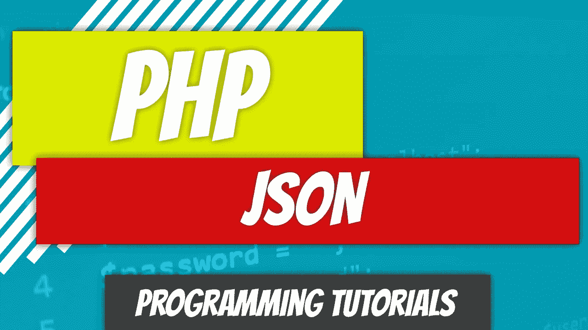
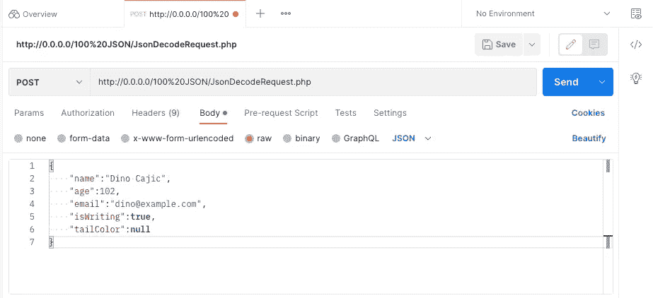
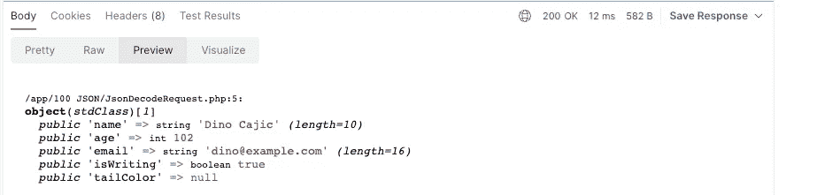

# PHP — P108:使用 JSON

> 原文：<https://blog.devgenius.io/php-p108-working-with-json-e91d243abe3c?source=collection_archive---------16----------------------->



我不知道你怎么想，但我绝对喜欢 JSON。JSON 或 JavaScript 对象符号是一种存储和传输数据的方式。无论我们是生成从服务器发送的 JSON 对象，还是从客户端接受 JSON 对象，我们都需要理解 JSON 格式。不要想太多:JSON 只是一个字符串。

JSON 可以以括号([)或花括号({)开头。两个都行。对象用花括号表示，有序列表以括号开始。

对象有键/值对，而数组没有。

```
// Array Notation
[
   "Dino Cajic",
   "Frank Johnson",
   "Steven Brown"
]
```

```
// Object Notation
{
   "name":"Dino Cajic",
   "age":102,
   "email":"dino@example.com"
}
```

您也可以创建一个对象数组。

```
[
   {
      "name":"Dino Cajic",
      "age":102,
      "email":"dino@example.com"
   },
   {
      "name":"Frank Johnson",
      "age":50,
      "email":"frank@example.com"
   }
]
```

我们已经看了上面的几种数据类型:

*   排列
*   目标
*   线
*   数字

但是我们也可以发送布尔值和`null`值。

```
[
   {
      "name":"Dino Cajic",
      "age":102,
      "email":"dino@example.com",
      "isWriting":true,
      "tailColor":null
   },
   {
      "name":"Frank Johnson",
      "age":50,
      "email":"frank@example.com",
      "isWriting":false,
      "tailColor":null
   }
]
```

# 用 PHP 创建一个 JSON 对象

现在我们理解了格式，让我们看看如何用 PHP 创建一个 JSON 对象。其实真的很简单。我们使用`json_encode`内置函数。`json_encode`函数接受一个数组或一个对象，并将其转换成一个字符串。

让我们看几个例子来看看这种转换是如何发生的。

```
<?php

$array = ["Dino Cajic", "Steven Johnson", "Fred Smith"];

echo json_encode($array);
```

输出为:`[“Dino Cajic”,”Steven Johnson”,”Fred Smith”]`。

因为数组不是关联数组，所以它创建一个数组。让我们看一个关联数组的例子。

```
<?php

$array = [
    "name" => "Dino Cajic",
    "age" => 102,
    "email" => "dino@example.com",
    "isWriting" => true,
    "tailColor" => null
];

echo json_encode($array);
```

这次的输出是一个对象:

```
{
   "name":"Dino Cajic",
   "age":102,
   "email":"dino@example.com",
   "isWriting":true,
   "tailColor":null
}
```

如果我们有一个混合数组呢？

```
<?php

$array = [
    "name" => "Dino Cajic",
    "age" => 102,
    "email" => "dino@example.com",
    true,
    null
];

echo json_encode($array);
```

我们实际上仍然得到一个对象，但是添加了索引值而不是命名键。

```
{
   "name":"Dino Cajic",
   "age":102,
   "email":"dino@example.com",
   "0":true,
   "1":null
}
```

我们也可以从一个对象创建一个 JSON。任何公开可用的属性都将被转换成 JSON 键，它们包含的值将是值。

```
<?php

class PublicObject
{
    public string $name;
    public int $age;
    public string $email;
    public bool $isWriting;
    public ?string $tailColor;

    public function __construct($data) {
        $this->name      = $data['name'];
        $this->age       = $data['age'];
        $this->email     = $data['email'];
        $this->isWriting = $data['isWriting'];
        $this->tailColor = $data['tailColor'];
    }
}

$publicObject = new PublicObject([
    "name"      => "Dino Cajic",
    "age"       => 102,
    "email"     => "dino@example.com",
    "isWriting" => true,
    "tailColor" => null
]);

echo json_encode($publicObject);
```

我们得到的回应是:

```
{
   "name":"Dino Cajic",
   "age":102,
   "email":"dino@example.com",
   "isWriting":true,
   "tailColor":null
}
```

如果我们把其中的一些财产变成私有呢？例如，如果我们将`$isWriting`和`$tailColor`属性设置为私有。JSON 输出只是将它们从字符串中删除。

```
{
   "name":"Dino Cajic",
   "age":102,
   "email":"dino@example.com"
}
```

但是如果我们不顾一切地想见他们呢？嗯，我们可以实现`__toString`魔法方法，并在那里调用我们的`json_encode`。或者我们可以创建任何方法，比如`toJSON`并在那里调用它。再来看`__toString`。

```
<?php

class PrivateObject
{
    private string $name;
    private int $age;
    private string $email;
    private bool $isWriting;
    private ?string $tailColor;

    public function __construct($data) {
        $this->name      = $data['name'];
        $this->age       = $data['age'];
        $this->email     = $data['email'];
        $this->isWriting = $data['isWriting'];
        $this->tailColor = $data['tailColor'];
    }

    public function __toString() {
        return json_encode([
            "name"      => $this->name,
            "age"       => $this->age,
            "email"     => $this->email,
            "isWriting" => $this->isWriting,
            "tailColor" => $this->tailColor
        ]);
    }
}

$privateObject = new PrivateObject([
    "name"      => "Dino Cajic",
    "age"       => 102,
    "email"     => "dino@example.com",
    "isWriting" => true,
    "tailColor" => null
]);

echo $privateObject;
```

还有一个我们可以实现的`JsonSerializable`接口。我们得到的输出是一样的。

```
<?php

class JsonSerializableTest implements JsonSerializable
{
    private string $name;
    private int $age;
    private string $email;
    private bool $isWriting;
    private ?string $tailColor;

    public function __construct($data) {
        $this->name      = $data['name'];
        $this->age       = $data['age'];
        $this->email     = $data['email'];
        $this->isWriting = $data['isWriting'];
        $this->tailColor = $data['tailColor'];
    }

    public function jsonSerialize()
    {
        return [
            "name"      => $this->name,
            "age"       => $this->age,
            "email"     => $this->email,
            "isWriting" => $this->isWriting,
            "tailColor" => $this->tailColor
        ];
    }
}

$jsonSerializableTest = new JsonSerializableTest([
    "name"      => "Dino Cajic",
    "age"       => 102,
    "email"     => "dino@example.com",
    "isWriting" => true,
    "tailColor" => null
]);

echo json_encode($jsonSerializableTest);
```

唯一的区别是使用`__toString`，我将`json_encode`函数包装在函数本身中，而`jsonSerialize`方法只是返回数组。

# 用 PHP 读取 JSON 对象

既然我们知道了如何创建(编码)一个 JSON 对象，我们还应该知道如何读取(解码)一个从客户端发送的 JSON 对象。我们不会过多讨论数组的实际发送，因为这是通过前端处理的，但我会给你看几个例子。

最简单的例子是用 PHP 创建 JSON 字符串，并使用内置函数`json_decode`来测试它。

```
<?php

$encoded_json = '{"name":"Dino Cajic","age":102,"email":"dino@example.com","isWriting":true,"tailColor":null}';
$decoded_json = json_decode($encoded_json);

var_dump($decoded_json);
```

因为这是一个对象表示，我们将得到一个实际的对象。

```
/app/100 JSON/JsonDecode.php:6:
object(stdClass)[1]
  public 'name' => string 'Dino Cajic' (length=10)
  public 'age' => int 102
  public 'email' => string 'dino@example.com' (length=16)
  public 'isWriting' => boolean true
  public 'tailColor' => null
```

这意味着我们现在可以使用对象操作符`->`像平常一样调用属性。

```
<?php

$encoded_json = '{"name":"Dino Cajic","age":102,"email":"dino@example.com","isWriting":true,"tailColor":null}';
$decoded_json = json_decode($encoded_json);

var_dump($decoded_json->name);
```

```
/app/100 JSON/JsonDecode.php:6:string 'Dino Cajic' (length=10)
```

让我们看一个数组的例子。

```
<?php
$encoded_json = '["Dino Cajic", "Steven Johnson", "Fred Smith"]';
$decoded_json = json_decode($encoded_json);

var_dump($decoded_json);
```

这次，我们得到了一个简单的数组。

```
/app/100 JSON/JsonDecode.php:13:
array (size=3)
  0 => string 'Dino Cajic' (length=10)
  1 => string 'Steven Johnson' (length=14)
  2 => string 'Fred Smith' (length=10)
```

要访问数组元素，我们需要使用索引值。

```
<?php
$encoded_json = '["Dino Cajic", "Steven Johnson", "Fred Smith"]';
$decoded_json = json_decode($encoded_json);

var_dump($decoded_json[0]);
```

```
/app/100 JSON/JsonDecode.php:14:string 'Dino Cajic' (length=10)
```

我们还能如何将 JSON 对象发送到后端？让我们看看邮递员。



单击几何体并选择 Raw。粘贴您的 JSON 对象。对于这个实例，`POST`被设置为请求类型，但这无关紧要。你实际上无法通过`$_POST`阅读内容；您需要使用`php://input`，这是一个只读流，允许您从请求体中读取原始数据([https://www.php.net/manual/en/wrappers.php.php](https://www.php.net/manual/en/wrappers.php.php))。

```
<?php
$json_encoded = file_get_contents('php://input');
$json_decoded = json_decode( $json_encoded );

var_dump( $json_decoded );
```

我们在 Postman 中收到的输出如下所示。



还有很多其他方法可以将 JSON 发送到后端；这完全取决于你使用的前端库。您也可以将`JSON.stringify`与普通的 JavaScript 一起使用，或者甚至用 Ajax 做一些事情。

```
<!DOCTYPE html>
<html lang="en">
<head>
    <meta charset="UTF-8">
    <title>Send JSON</title>
</head>
<body>
    <div id="result"></div>

    <script>
        let data = {
            "name":"Dino Cajic",
            "age":102,
            "email":"dino@example.com",
            "isWriting":true,
            "tailColor":null
        };

        let xhr = new XMLHttpRequest();

        xhr.open("POST", "http://0.0.0.0/100%20JSON/JsonDecodeRequest.php");
        xhr.onreadystatechange = function() {
            if (xhr.readyState === 4 && xhr.status === 200) {
                let div = document.getElementById("result");
                div.innerHTML = xhr.responseText;
            }
        }

        xhr.setRequestHeader("Content-type", "application/json")
        xhr.send( JSON.stringify(data) );
    </script>
</body>
</html>
```

我希望这有助于揭开 PHP 和 JSON 协同工作的神秘面纱。

[](https://github.com/dinocajic/php-youtube-tutorials) [## GitHub-dinocajic/PHP-YouTube-tutorials:PHP YouTube 教程的代码

### PHP YouTube 教程的代码确保你已经安装了 Docker。克隆回购。运行以下命令…

github.com](https://github.com/dinocajic/php-youtube-tutorials) 

Dino Cajic 目前是[Absolute biotechnology](http://absolutebiotech.com/)的 IT 负责人，该公司是[LSBio(life BioSciences，Inc.)](https://www.lsbio.com/) 、 [Absolute 抗体](https://absoluteantibody.com/)、 [Kerafast](https://www.kerafast.com/) 、[珠穆朗玛峰 biotechnology](https://everestbiotech.com/)、 [Nordic MUbio](https://www.nordicmubio.com/) 和 [Exalpha](https://www.exalpha.com/) 的母公司。他还是 [MyAutoSystem](https://myautosystem.com/) 的首席执行官。他拥有计算机科学学士学位，生物学辅修学位，以及超过十年的软件工程经验。他的背景包括创建企业级电子商务应用程序，进行基于研究的软件开发，以及通过写作促进知识的传播。

您可以在 [LinkedIn](https://www.linkedin.com/in/dinocajic/) 上与他联系，在 [Instagram](https://instagram.com/think.dino) 上关注他，或者[订阅他的媒体出版物](https://dinocajic.medium.com/subscribe)。

[*阅读 Dino Cajic(以及其他数千名 Medium 上的作家)的每一个故事。您的会员费直接支持 Dino Cajic 和您阅读的其他作者。您还可以完全了解 Medium 上的每个故事。*](https://dinocajic.medium.com/membership)