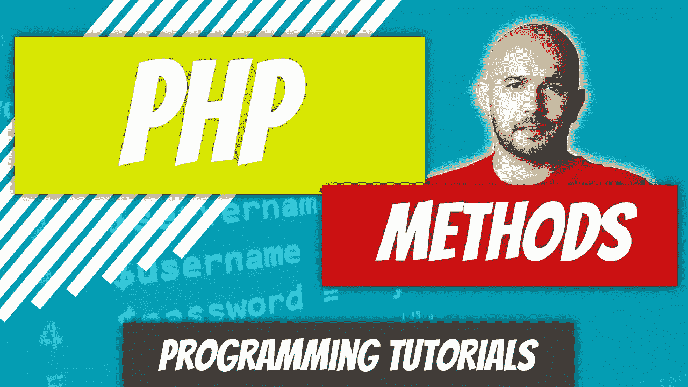

# PHP — P46:方法

> 原文：<https://blog.devgenius.io/php-p46-methods-513072ed48cf?source=collection_archive---------10----------------------->

什么是方法？在 PHP 中，它只是一个类内部的函数。这是最简单的思考方式。你可以像初始化函数一样初始化它们，包括使用 **function** 关键字。

 [## PHP 7.x — P35:用户定义的函数

### 我肯定你接触过数学中的函数，但是你真的理解“函数”这个术语的含义吗？

blog.devgenius.io](/php-7-x-p35-user-defined-functions-c6e23a7309c5) 

在面向对象编程中，对象可以有特定的[特征](/php-p44-class-properties-277c7c17b74b)，但是它们也可以执行特定的动作。动作由方法表示。方法也可以有可见性修饰符，比如**私有**、**受保护**和**公共**，但是我们将这些从本文中去掉，并坚持使用默认的**公共**修饰符。

我们基于上一篇文章，向 Dog 和 Car 类添加方法。

 [## PHP — P45:类常量

### 类常数类似于常规常数，只是它们存在于类中。类别常数…

blog.devgenius.io](/php-p45-class-constants-4a93c49b917f) 

有些方法是用参数(可选参数)声明的，而其他方法则没有；我们将涵盖两者。方法放在哪里？通常紧接在类中的属性之后。常量贴在类的顶部，后面是属性，后面是方法。它们可以按不同的顺序排列吗？当然，根据惯例，我们将它们放在属性之后。

## 创建方法

方法定义如下:

修饰符是指关键字**公共**、**私有**或**受保护**。在本文中，我们将只关注 **public** 修饰符。坦率地说， **public** 关键字可以省略，因为默认的修饰符是 public，但是为了最佳实践，我们将包括它。

现在我们知道了如何创建一个方法，让我们开始在我们的 Dog 类中实现它。我们要定义的第一个方法是方法 **walk()** 。这个方法没有任何参数，只是回显一个语句。

要调用一个方法，我们必须首先实例化对象。在这种情况下，让我们创建一个狗对象，并调用我们的 walk 方法。

**$dog** 对象会回复“我在走路。”狗经常执行的另一个动作是吠叫，因此我们可以创建一个 **bark()** 方法。

当我们调用该方法时，它会发出“我在叫”的回声

## 带参数的方法

既然我们已经看到了几个不带参数的方法示例，那么让我们来看看一个带参数的方法。一个很好的方法是**睡眠()**。一只狗可能会根据它所拥有的能量去睡觉，所以我们将在我们的 **sleep()** 方法的括号内声明一个 **$energy_level** 参数。

*公共功能睡眠($energy_level ) { }*

当我们实例化我们的对象时，我们可以将狗的能量级别作为参数传递给 sleep 方法。在 sleep 方法的主体中，我们将创建一个 if 语句，该语句检查它刚刚接收到的参数，并输出它正在休眠或不想休眠。

如果我们将 20 作为参数传递，我们将得到一个狗正在睡觉的响应。

## 默认参数值

我们还可以为 **$energy_level** 参数声明一个默认值。要声明参数的默认值，只需在参数声明后加上等号和参数值。

对于我们的 **sleep()** 方法，我们将把 **$energy_level** 的默认值设置为 **100** 。我们为什么要这么做？因为我们现在可以调用这个方法而不用传递任何参数给它。

在第一个没有传递任何参数的例子中，输出将是“我不想睡觉”第二次调用 **sleep()** 方法时，30 作为参数被传递，输出将是“我正在睡觉”

## 汽车行动

让我们考虑一下汽车可以执行的动作。想到的三个是打开、关闭和驱动。启动和关闭汽车非常简单。我们可以检查是否插入了键，但是为了让例子更简单，我们将在这个例子中跳过它。

在上面的例子中，我们创建了两个方法: **turnOn()** 和**turnOn()**。一辆新的兰博基尼被制造出来，这辆车被启动和关闭。上述程序的输出将是:“我开着”后面跟着“我关着”

让我们看看如何构造 **drive()** 方法。车辆的默认状态将是关闭。为了驾驶我们的兰博基尼，我们必须先打开它。

在我们班下面，我们创造了一个新的兰博基尼暗黑破坏神。我们试图在不向 **drive()** 方法传递任何参数的情况下驱动它，但是我们得到了下面的响应，“你必须让我兴奋。”在我们的下一次尝试中，我们将 **true** 布尔值传递给我们的 **drive()** 方法，我们得到了我们一直在寻找的响应，“我正在驾驶。”当我们将一个参数传递给一个有默认参数值的方法时，这个值会被覆盖，并且这个参数总是有效的。

这些都是过于简单的例子，但是我相信你现在已经明白什么是真正的方法了。

 [## dinocajic/PHP-7-YouTube-教程

### PHP 7.x YouTube 教程的代码。

github.com](https://github.com/dinocajic/php-7-youtube-tutorials) 

迪诺·卡伊奇目前是 [LSBio(生命周期生物科学公司)](https://www.lsbio.com/)、[绝对抗体](https://absoluteantibody.com/)、 [Kerafast](https://www.kerafast.com/) 、[珠穆朗玛生物](https://everestbiotech.com/)、[北欧 MUbio](https://www.nordicmubio.com/) 和 [Exalpha](https://www.exalpha.com/) 的 IT 主管。他还担任我的自动系统的首席执行官。他有十多年的软件工程经验。他拥有计算机科学学士学位，辅修生物学。他的背景包括创建企业级电子商务应用程序、执行基于研究的软件开发，以及通过写作促进知识的传播。

你可以在 [LinkedIn](https://www.linkedin.com/in/dinocajic/) 上联系他，在 [Instagram](https://instagram.com/think.dino) 上关注他，或者[订阅他的媒体出版物](https://dinocajic.medium.com/subscribe)。

[*阅读迪诺·卡吉克(以及媒体上成千上万其他作家)的每一个故事。你的会员费直接支持迪诺·卡吉克和你阅读的其他作家。你也可以在媒体上看到所有的故事。*](https://dinocajic.medium.com/membership)