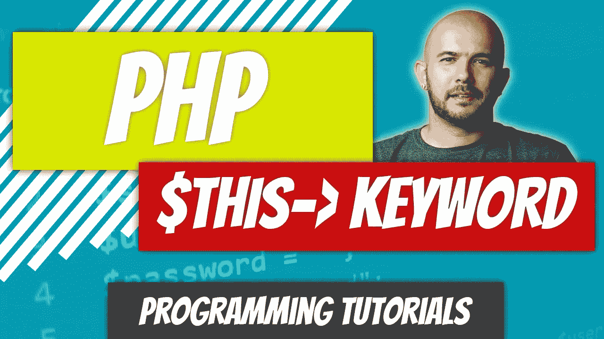

# PHP—P47:$此关键字

> 原文：<https://blog.devgenius.io/php-p47-this-keyword-f7397e560949?source=collection_archive---------10----------------------->

在前面的文章中，我们已经看到了如何使用对象操作符访问对象内部的方法。这是在实例化对象时完成的。我们已经创建了一个 Car 对象，并访问了 **drive()** 方法。在实例化对象:*$兰博基尼- > drive()之后，您使用对象运算符 **- >** 完成了此操作；*

 [## PHP-P46:方法

### 什么是方法？在 PHP 中，它只是类中的一个函数。这是考虑这件事最简单的方法。你…

blog.devgenius.io](/php-p46-methods-513072ed48cf) 

您还应该知道，您可以在另一个对象内部实例化一个对象，并以完全相同的方式引用另一个对象的方法。但是，当您需要从对象本身中引用方法或属性时会发生什么呢？这就是关键词**$这个**发挥作用的地方。这只是意味着对象正在引用它自己。

如果你认为自己是物体，并且你想接近自己，你会使用 **I** 代词。如果对象想访问它自己，它使用**$这个**。

足够的解释；让我们看一个例子。狗和车课程只是为了解释基本概念，所以我们会坚持这些。

上面的代码与我们在[上一篇文章](/php-p46-methods-513072ed48cf)中结束的代码完全相同。

如果我们是对象，我们试图参考自己，我可能会问自己，我的眼睛是什么颜色的？上面的物体具有属性$ **eye_color** ，并且恰好是棕色。让我们创建一个名为 **get_eye_color()** 的方法，返回 **$eye_color** [属性](/php-p44-class-properties-277c7c17b74b)的值。

**get_eye_color()** 方法返回对象的眼睛颜色。我们能够通过在方法中的 **$eye_color** 属性前面加上**$ this->$ 来访问 **$eye_color** 属性。为了测试它，我们实例化该对象并调用 **get_eye_color()** 方法。**

您可能会问自己，为什么我们不直接访问$ **eye_color** 房产。可见性修饰符将在后面的文章中讨论，届时该问题的答案将变得显而易见。把你所有的财产都公开通常不是很好的做法。每当您访问或修改对象的属性时，您都希望使用方法。让我们看看另一个例子，它可能会帮助您更好地想象这一点。

我们有一个属性叫做**$ does _ shed；**当前设置为真。为了良好的用户体验，当有人问我们狗是否会掉毛时，我们不想说**真的**。我们想用**是**或**否**来回答。

为了说明这一点，让我们创建一个名为 **does_shed()** 的方法。当我们调用它时，我们只想让方法返回 **yes** 或 **no** 。在三元运算符的帮助下，我们可以返回正确的值。我们再次使用 **$this** 关键字访问 **does_shed()** 方法中的 **$does_shed** 属性。

当我们后来问这个问题时，“德国牧羊犬蜕皮吗？”我们的回答很简单:是的，T21。

你还想着可以直接给物业打电话。明白了。让它变得令人讨厌。这通常是开发人员开始以正确的方式做事的时候…当他们感到恼火的时候。如果我们想返回科学分类。如果不想以方法调用的形式返回，就必须单独返回每个属性。通过一个方法，我们可以一次返回数据数组。

再举一个例子应该有助于巩固这个概念，尽管我认为你已经明白了。又到了谈论汽车的时候了。

我看到的第一个困扰我的是 **drive()** 方法中的参数 **$is_car_on** 。我们希望汽车能够告诉我们它是否开着，而不是让我们告诉汽车它开着。第一步是使该参数成为一个属性。然后我们可以检查汽车是否开着，如果开着，返回“我在开车”，否则，“你得让我开着。”

我们还有两个方法， **turnOn()** 和 **turnOff()** ，可以用来打开和关闭汽车，或者将 **$car_on** 属性从 **true** 更改为 **false** ，反之亦然。我们还希望检查并确保当我们试图打开汽车时，汽车还没有启动，同样，我们希望检查汽车是否关闭，我们没有再次试图关闭它。

在本文中，我们调用了各种属性，但是我们也可以使用 **$this** 关键字调用对象中的其他方法。不要说“车已经开了”，让我们使用车辆的品牌和型号。尽管我们可以只从方法内部调用属性，但是让我们创建一个 **get_make_and_model()** 帮助器方法，为我们返回一个格式化的字符串。

然后，我们可以更新我们的 **turnOn()** 和**turnOn()**方法，使用 **get_make_and_model()** 方法，并用对象的实际品牌和型号替换通用的“汽车”字符串。

最后，我们来做一些测试。实例化对象并设置车辆的品牌和型号。浏览各种选项，例如在驾驶前和驾驶后打开和关闭车辆。

上面的输出应该很有趣。会有人提醒你，在开车之前，你需要把车打开。**$这个**到此为止。这是一个非常简单的概念，但是却很难理解。一旦你掌握了窍门，你会很快意识到没什么可紧张的。

 [## dinocajic/PHP-7-YouTube-教程

### PHP 7.x YouTube 教程的代码。

github.com](https://github.com/dinocajic/php-7-youtube-tutorials) 

Dino Cajic 目前是 [LSBio(寿命生物科学公司)](https://www.lsbio.com/)、[绝对抗体](https://absoluteantibody.com/)、 [Kerafast](https://www.kerafast.com/) 、 [Everest BioTech](https://everestbiotech.com/) 、 [Nordic MUbio](https://www.nordicmubio.com/) 和 [Exalpha](https://www.exalpha.com/) 的 IT 负责人。他还是我的自动系统公司的首席执行官。他有十多年的软件工程经验。他拥有计算机科学学士学位，辅修生物学。他的背景包括创建企业级电子商务应用程序、执行基于研究的软件开发，以及通过写作促进知识的传播。

你可以在 [LinkedIn](https://www.linkedin.com/in/dinocajic/) 上联系他，在 [Instagram](https://instagram.com/think.dino) 上关注他，或者[订阅他的媒体出版物](https://dinocajic.medium.com/subscribe)。

阅读 Dino Cajic(以及 Medium 上成千上万的其他作家)的每一个故事。你的会员费直接支持迪诺·卡吉克和你阅读的其他作家。你也可以在媒体上看到所有的故事。