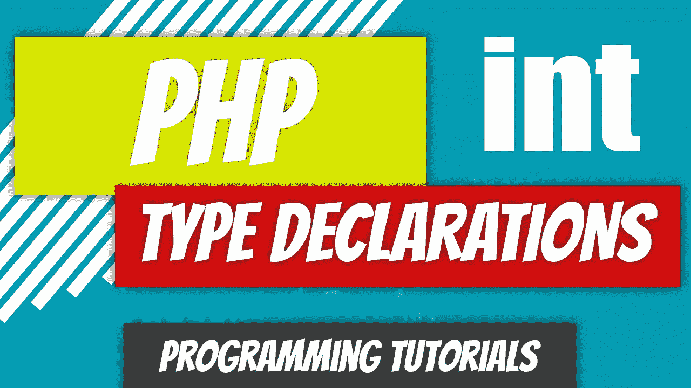
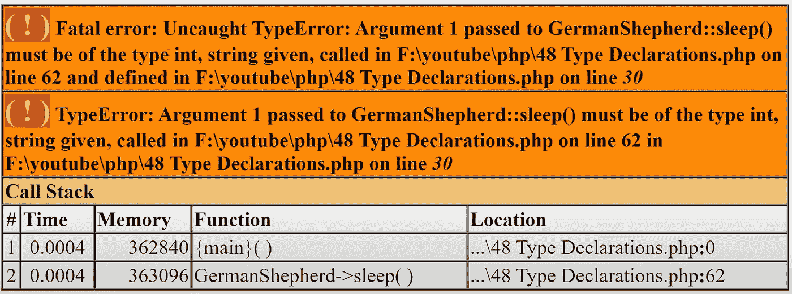

# PHP — P48:类型声明

> 原文：<https://blog.devgenius.io/php-p48-type-declarations-47114a7a0e0b?source=collection_archive---------5----------------------->

如果您来自 PHP 的旧时代，您可能已经被 PHP 自动为您声明类型宠坏了。便利不是你每次都想要的。有时，您希望能够指定要存储或返回的数据类型。

在 PHP 中还是可选的；要不要用，你自己看着办。如果您使用它，我鼓励您这样做，并且您指定了错误的数据类型，PHP 将抛出一个错误。

从 PHP 7 开始，我们可以添加 PHP 返回类型声明。

类型声明还允许我们指定参数将接受什么类型的数据类型。要指定类型，只需在参数前添加类型。

从 PHP 7 开始，如果出现不正确的数据类型，PHP 将抛出 type-error-exception。

只要参数有默认的 **null** 值，任何类型都可以接受 **null** 值。

PHP 不要求你在任何地方都使用类型声明。为了说明这一点，让我们对以前的 GermanShepherd 类进行修改。

 [## PHP—P47:$这个关键字

### 在前面的文章中，我们已经看到了如何使用 object 操作符访问对象内部的方法。这个…

blog.devgenius.io](/php-p47-this-keyword-f7397e560949) 

我们不会触及常量和属性类型，我们将只修改两个方法。第一个修改是对 **sleep()** 方法的修改。让我们将 **$energy_level** 参数声明为一个 **int** 。

如果你现在试图传递除了一个 **int** 之外的任何其他类型的参数，你将得到一个错误。例如，实例化对象并将一个**字符串**传递给 **sleep()** 方法。您应该得到一个**类型错误**致命错误。

*$ GS = new german shepherd()；
$gs- >睡眠(“迪诺”)；*

我们还将修改 **get_eye_color()** 和 **does_shed()** 方法。这些方法返回字符串，所以我们将指定**字符串**作为返回类型。

最后，让我们修改一下**get _ scientific _ classification()**方法，将**数组**指定为返回类型。

完全修改后的代码如下所示。请注意，只有一些项收到了类型声明；大多数人没有。

对于 **Car** 类，让我们更改属性类型并为每个方法指定返回类型。我们的每个方法都返回一个字符串，所以我们将为每个方法指定**字符串**返回类型。

对于属性，我们有**字符串**用于颜色、品牌、型号、传输、车辆类型和两个测量单位属性。

年份、燃料类型、马力和扭矩参数是整数值，因此它们有一个 **int** 类型声明。

由于车辆的外部尺寸和重量可以以十进制格式存储，我们将把它们声明为**浮点数。**我们还有一个额外的属性， **car_on** ，用于存储布尔值。

这就完成了汽车类的修改。所有的属性和方法都已修改。你的准则现在更严格了。这应该有助于错误检查，并防止您意外出错。

 [## dinocajic/PHP-7-YouTube-教程

### PHP 7.x YouTube 教程的代码。

github.com](https://github.com/dinocajic/php-7-youtube-tutorials) 

Dino Cajic 目前是 [LSBio(寿命生物科学公司)](https://www.lsbio.com/)、[绝对抗体](https://absoluteantibody.com/)、 [Kerafast](https://www.kerafast.com/) 、[珠穆朗玛生物科技](https://everestbiotech.com/)、[北欧 MUbio](https://www.nordicmubio.com/) 和 [Exalpha](https://www.exalpha.com/) 的 IT 负责人。他还担任我的自动系统的首席执行官。他有十多年的软件工程经验。他拥有计算机科学学士学位，辅修生物学。他的背景包括创建企业级电子商务应用程序、执行基于研究的软件开发，以及通过写作促进知识的传播。

你可以在 [LinkedIn](https://www.linkedin.com/in/dinocajic/) 上联系他，在 [Instagram](https://instagram.com/think.dino) 上关注他，或者[订阅他的媒体出版物](https://dinocajic.medium.com/subscribe)。

阅读 Dino Cajic(以及 Medium 上成千上万的其他作家)的每一个故事。你的会员费直接支持迪诺·卡吉克和你阅读的其他作家。你也可以在媒体上看到所有的故事。