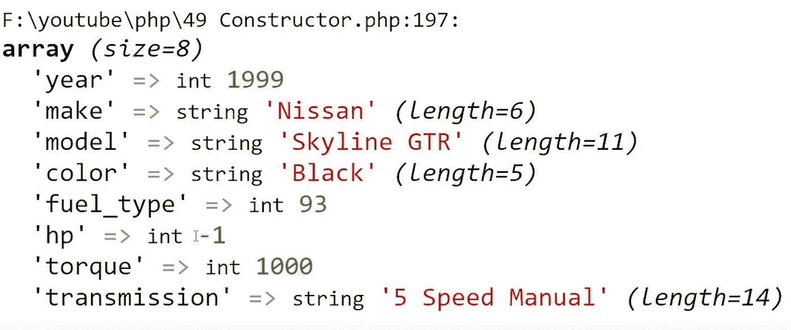

# PHP — P49:构造函数

> 原文：<https://blog.devgenius.io/php-p49-constructors-5956272de3bc?source=collection_archive---------9----------------------->

如果你习惯于其他面向对象的编程语言，你可能对构造函数很熟悉。您可能也熟悉被命名为类名的构造函数；它只是一个与类名同名的方法。

在 PHP 里，在我看来其实是简化了的。你命名构造器方法，**构造**前面有**两个下划线**:*_ _ construct()*。很好，但是构造函数的意义是什么。它在实例化时初始化对象内部的属性；当对象被实例化时，PHP 自动调用构造函数方法。让我们看一些代码来详细了解构造函数。

如果您没有阅读 PHP 系列文章，在这篇文章之前，我还有 48 篇文章。要获取代码并继续学习，请查阅上一篇关于类型声明的文章。

 [## PHP — P48:类型声明

### 如果您来自 PHP 的旧时代，您可能已经被 PHP 自动为您声明类型所宠坏了…

blog.devgenius.io](/php-p48-type-declarations-47114a7a0e0b) 

评估下面的代码，您会注意到我们的 GermanShepherd 类的所有属性都已初始化。这对于像**$王国**和**$品种**这样的普通[属性](https://dinocajic.medium.com/php-p44-class-properties-277c7c17b74b)来说是很棒的，然而，并不是所有的德国牧羊犬都有相同的出生日期。

在我们进行修改之前，让我们向该类添加一个空白的构造函数。

我们希望在对象实例化时将参数传递给构造函数。构造函数是在任何事情发生之前首先被调用的方法。需要在对象实例化时初始化的属性有:

*   眼睛的颜色
*   出生日期
*   毛皮颜色

就像普通的方法一样，我们将从声明参数开始。

接下来，我们需要用传递的[参数](https://dinocajic.medium.com/php-7-x-p36-function-arguments-f0b4c131ad1b)设置我们的 **$eye_color** 、 **$dob** 和 **$fur_color** 属性。记住，要访问对象内部的属性，我们需要 [**$this** 关键字](https://dinocajic.medium.com/php-p47-this-keyword-f7397e560949)的帮助。

对于这个例子，我选择用与我们的属性完全相同的方式来命名参数。 **$this** 关键字有助于区分我们访问的是属性还是参数值。

您可以随意命名您的参数。只需确保在方法体中也进行修改。

尽管上面的代码可以工作，但并不理想，因为它不够描述性。在本文的剩余部分，我们将回到以前的命名约定。现在我们已经创建了构造函数，让我们实际使用它。

如何将参数传递给构造函数？到目前为止，您已经在没有构造函数的情况下实例化了对象,所以让我们看看这是如何完成的。

**$ GS = new german shepherd()；**

要将参数传递给构造函数，请将它们添加到类名后面的括号中。

**$gs =新日耳曼牧羊犬(“棕色”、“2019 年 2 月 20 日”、“黑色”)；**

确保以正确的顺序传递参数，即定义参数的顺序。

上面代码的输出会是**棕色**。

看看我们的汽车类，构造器变得超级有用。汽车是一个抽象的概念，而不是一个实际的物体。我们稍后将讨论抽象类。

正如您在上面看到的，我们有相当多的属性需要在对象实例化时初始化。

每次实例化都很痛苦，尤其是如果你想快速创建一辆车。我们可以只要求传递一小部分参数，而让其他参数可选。我们需要做的修改很简单:为您想要标记为可选的参数设置默认值。

在设置可选参数时，唯一要记住的是，它们都应该进行到底。在上面的示例中，我们将 **$year、$make、**和 **$model** 作为唯一必需的参数。如果我们将 **$model** 移动到 **$color** 之后，那么颜色将是必需的，尽管它有一个默认值。为了简单起见，将您的强制参数移到前面。为了进行测试，我创建了一个新方法，它在一个关联数组中返回我们的一些属性，我还创建了日产天际线 GTR 对象。

GTR 的创作如期开始。我们添加了年份、品牌和型号，因为这些是我们必需的属性。我也想添加颜色和扭矩。颜色很简单，因为它排在第二位，但扭矩排在燃料类型和马力规格之后。如上所示，如果您想将默认值保留为默认值，您必须将默认值传递给构造函数。如果我们跳过为马力添加-1，1000 将被标记为马力，这不是我们想要的。

我们的输出也显示了传输。尽管我们没有在构造函数中传递它，但它确实有一个默认值，因此变速器显示为 5 速手动变速器。

 [## dinocajic/PHP-7-YouTube-教程

### PHP 7.x YouTube 教程的代码。

github.com](https://github.com/dinocajic/php-7-youtube-tutorials) 

迪诺·卡伊奇目前是 [LSBio(生命周期生物科学公司)](https://www.lsbio.com/)、[绝对抗体](https://absoluteantibody.com/)、 [Kerafast](https://www.kerafast.com/) 、[珠穆朗玛生物](https://everestbiotech.com/)、[北欧 MUbio](https://www.nordicmubio.com/) 和 [Exalpha](https://www.exalpha.com/) 的 IT 主管。他还担任我的自动系统的首席执行官。他有十多年的软件工程经验。他拥有计算机科学学士学位，辅修生物学。他的背景包括创建企业级电子商务应用程序、执行基于研究的软件开发，以及通过写作促进知识的传播。

你可以在 [LinkedIn](https://www.linkedin.com/in/dinocajic/) 上联系他，在 [Instagram](https://instagram.com/think.dino) 上关注他，或者[订阅他的媒体出版物](https://dinocajic.medium.com/subscribe)。

[*阅读迪诺·卡吉克(以及媒体上成千上万其他作家)的每一个故事。你的会员费直接支持迪诺·卡吉克和你阅读的其他作家。你也可以在媒体上看到所有的故事。*](https://dinocajic.medium.com/membership)