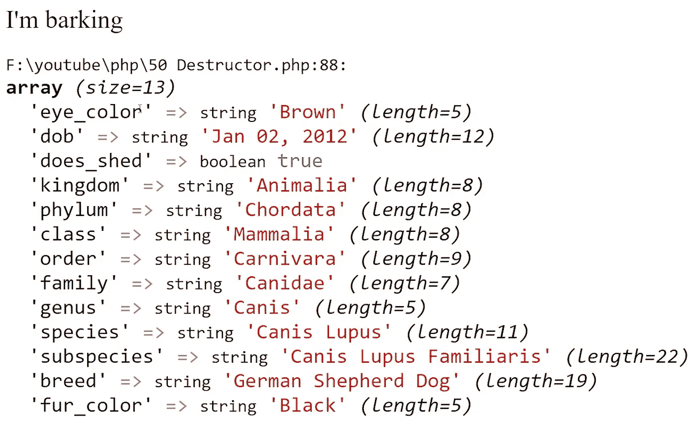

# PHP — P50:析构函数

> 原文：<https://blog.devgenius.io/php-p50-destructors-da52a94cbb0?source=collection_archive---------10----------------------->

析构函数是构造函数的反义词……想想吧。析构函数方法在对象不再被引用后被调用。在 PHP 中，首先调用构造函数，然后调用用户访问的任何内部方法，最后调用析构函数方法进行清理。

如果使用 PHP 的 **exit()** 函数退出 PHP 脚本，甚至会调用析构函数。

 [## PHP — P49:构造函数

### 如果你习惯于其他面向对象的编程语言，你可能对构造函数很熟悉。你可以…

blog.devgenius.io](/php-p49-constructors-5956272de3bc) 

为了创建析构函数方法，我们将遵循与构造函数方法相似的命名约定。你以两个下划线开始，然后是关键字 destruct: *__destruct()。*

尽管您可能会尝试使用 destruct 方法来清理资源，但通常最好是在使用完资源后立即清理。

让我们看看我们最喜欢的例子:德国牧羊人和汽车类。

析构函数方法通常被放在类中的最后一个方法，这样阅读你的代码的人会更容易理解它。简单回顾一下:我们通常首先列出常数，然后是属性、构造方法、所有其他方法，最后是析构方法。

在我们的析构函数中列出什么是好的例子？在我们的 GermanShepherd 类中，属性将在对象的整个生命周期中被修改。如果我们想看看这些属性最后是什么样子，就在对象被销毁之前，我们可以利用析构函数。我们的析构方法将只是变量转储对象的属性。

在上面的例子中，我们创建了一个新的 GermanShepherd 对象，并调用了 **bark()** 方法。因为我们现在有了一个 **__destruct()** 方法，输出将会很有趣。

很明显，一旦执行完成，就调用了 destruct 方法。我们先把 **bark()** 方法叫做。PHP 执行了这个脚本，并说，“我不需要执行额外的方法。存在 __destruct()方法吗？是的。让我也执行它。”我们显式调用了 **bark()** 方法，PHP 隐式调用了 **__destruct()** 方法。

对于汽车类，我将向您展示一些我在开发人员中经常看到的东西。程序员倾向于在 **__destruct()** 方法中关闭他们与数据库的连接。当您使用完数据库连接时，您会想要立即终止它，但是如果您在构造函数中注入或初始化数据库连接，这将会特别有用。

我们将在后面全面介绍数据库，所以现在我们只回显一条声明，“连接成功关闭。”我们甚至可以在构造函数中添加“连接成功建立”来查看工作中的完整执行范围。

代码输出“连接成功建立”字符串，然后是车辆的品牌和型号，最后如预期的那样显示“连接成功关闭”字符串。PHP 依次调用构造函数，调用方法，最后调用析构函数。

 [## dinocajic/PHP-7-YouTube-教程

### PHP 7.x YouTube 教程的代码。

github.com](https://github.com/dinocajic/php-7-youtube-tutorials) 

迪诺·卡伊奇目前是 [LSBio(生命周期生物科学公司)](https://www.lsbio.com/)、[绝对抗体](https://absoluteantibody.com/)、 [Kerafast](https://www.kerafast.com/) 、[珠穆朗玛生物](https://everestbiotech.com/)、[北欧 MUbio](https://www.nordicmubio.com/) 和 [Exalpha](https://www.exalpha.com/) 的 IT 主管。他还担任我的自动系统的首席执行官。他有十多年的软件工程经验。他拥有计算机科学学士学位，辅修生物学。他的背景包括创建企业级电子商务应用程序、执行基于研究的软件开发，以及通过写作促进知识的传播。

你可以在 [LinkedIn](https://www.linkedin.com/in/dinocajic/) 上联系他，在 [Instagram](https://instagram.com/think.dino) 上关注他，或者[订阅他的媒体出版物](https://dinocajic.medium.com/subscribe)。

[*阅读迪诺·卡吉克(以及媒体上成千上万其他作家)的每一个故事。你的会员费直接支持迪诺·卡吉克和你阅读的其他作家。你也可以在媒体上看到所有的故事。*](https://dinocajic.medium.com/membership)