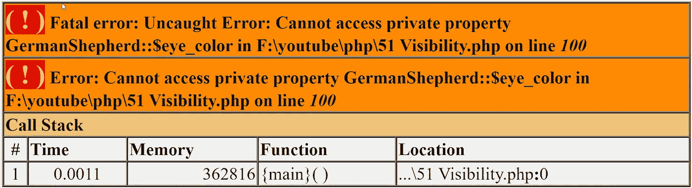

# PHP — P51:可见性修饰符

> 原文：<https://blog.devgenius.io/php-p51-visibility-modifiers-b277591e7c0b?source=collection_archive---------7----------------------->

好像我在以前的大部分文章中都提到了可见性修饰符；终于到了解决它们的时候了。我们将从上一篇文章中停止的地方继续我们的类。

 [## PHP — P50:析构函数

### 析构函数是构造函数的反义词……想想吧。析构函数方法在对象不是…

blog.devgenius.io](/php-p50-destructors-da52a94cbb0) 

到目前为止，我们已经为每个属性和方法使用了 **public** visibility 修饰符；这只是意味着每个人都可以访问它。您可以在对象内部和外部访问它们。默认的可见性修饰符是 **public** ，这意味着如果我们创建了任何属性或方法并省略了可见性修饰符，PHP 会自动假定您指的是 **public** 。

我们将修改现有的 GermanShepherd 和 Car 类，以包含适当的可见性修改器。如果我们真的做出改变，那将是从**公开**到**私人**。当我们处理**继承**时，受**保护的**修改器将被覆盖。**受保护的**可见性修饰符的作用类似于私有修饰符，因为你不能在类外访问它，所以如果我们实例化这个类并使用对象操作符(- >)，我们将不能访问它。然而，从包含 **protected** 修饰符的类继承的类将可以访问它。例如，如果我们创建一个 Dog 类并从 GermanShepherd 类扩展它，我们将可以访问 Dog 类中受保护的属性。

私有属性或方法只能从对象本身内部访问。如果我们实例化该类并试图使用对象操作符访问该方法，我们将得到一个错误；同样，我们也不能通过继承获得私有的 T21 财产。类内部的方法可以借助 [**$this** 关键字](/php-p47-this-keyword-f7397e560949)访问其他私有属性和方法。

查看我们的 GermanShepherd 类，我们可以看到所有的属性和方法都被标记为 public。没有一个**公共**属性实际上需要是公共的。我们希望使用我们的访问器和赋值器方法来访问和修改我们的属性，我们将在后面介绍这些方法。我们可以安全地将每个**公共**属性更改为**私有**。

既然所有的东西都被改成了 private，那么在对象实例化之后，我们就不能再用 object 操作符来访问它们了。我们仍然可以通过使用我们的**公共**方法来访问其中的一些。

即使我们的 GermanShepherd 的 **$eye_color** 属性是**私有的**，我们仍然可以用 **get_eye_color()** 访问器方法来访问它。如果我们试图直接回显私有属性 **$eye_color** ，我们会得到一个错误。

*echo $ GS _ dog->eye _ color；*

类似于我们的 GermanShepherd 类，我们也将对我们的 Car 类做一些修改。

汽车类的公共属性可以并且应该转换为私有属性。

看看我们的类，我们现在可以访问我们所有的方法，但是我们不能再访问我们的属性。我们也可以将特定的**公共**方法转换成**私有**方法。你想什么时候做？大多数类中都有*助手方法*。这些助手方法通常包含一些被其他方法使用的重复代码。在我们汽车示例中，该方法是 **get_make_and_model()** 方法；这个方法永远不会在我们的类之外被访问。如果需要的话，我们会将其保留为**public**；不过，既然不是，我们就要改成 **private** 。

如果我们现在试图访问我们的 **get_make_and_model()** 方法，我们将得到我们对私有方法的*调用错误。*

最后要注意的是，构造函数和析构函数必须总是 **public** 。这就完成了本教程。我们将很快更详细地介绍**受保护的**方法。

 [## dinocajic/PHP-7-YouTube-教程

### PHP 7.x YouTube 教程的代码。

github.com](https://github.com/dinocajic/php-7-youtube-tutorials) 

迪诺·卡伊奇目前是 [LSBio(生命周期生物科学公司)](https://www.lsbio.com/)、[绝对抗体](https://absoluteantibody.com/)、 [Kerafast](https://www.kerafast.com/) 、[珠穆朗玛生物](https://everestbiotech.com/)、[北欧 MUbio](https://www.nordicmubio.com/) 和 [Exalpha](https://www.exalpha.com/) 的 IT 主管。他还担任我的自动系统的首席执行官。他有十多年的软件工程经验。他拥有计算机科学学士学位，辅修生物学。他的背景包括创建企业级电子商务应用程序、执行基于研究的软件开发，以及通过写作促进知识的传播。

你可以在 [LinkedIn](https://www.linkedin.com/in/dinocajic/) 上联系他，在 [Instagram](https://instagram.com/think.dino) 上关注他，或者[订阅他的媒体出版物](https://dinocajic.medium.com/subscribe)。

[*阅读迪诺·卡吉克(以及媒体上成千上万其他作家)的每一个故事。你的会员费直接支持迪诺·卡吉克和你阅读的其他作家。你也可以在媒体上看到所有的故事。*](https://dinocajic.medium.com/membership)