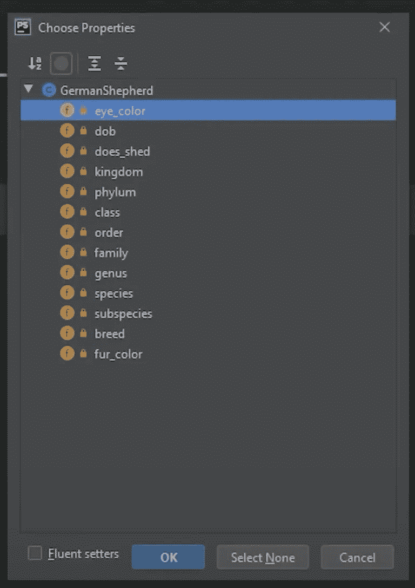

# PHP—P52:getter 和 Setters

> 原文：<https://blog.devgenius.io/php-p52-getters-and-setters-55ed07ecc0bc?source=collection_archive---------2----------------------->

在上一篇文章中，我们讨论了可见性修饰符，并将我们所有的属性设置为 **private** 。

 [## PHP — P51:可见性修饰符

### 私有、受保护和公共。让我们解决它们。

blog.devgenius.io](/php-p51-visibility-modifiers-b277591e7c0b) 

如果我们想访问这些属性或在它们的当前状态下修改它们，我们将无法做到。这就是 getters 和 setters，或者 accessors 和 mutators 发挥作用的地方。

Getters 和 setters 只是修改或检索属性的**公共**方法。通过各种 setter 方法，我们可以使用检查来验证提交的数据。例如，假设我们用 setter 修改了 **$year** 属性。setter 方法收到的参数将被验证，例如，负数，因为你不能有一个负数的年份。

## 吸气剂

使用 getters，我们可以返回确切的属性值或它的某种变体。在我们的 Car 类中，我们有一个名为 **$car_on** 的属性，它存储一个布尔值 **0** 或 **1** 。我们不必返回 0 或 1，而是可以返回一个字符串，比如关闭的**或打开**的**。**

让我们来看一些例子，因为 getters 和 setters 相对容易理解。我们实际上已经看到了吸气剂的作用。在我们的 GermanShepherd 类中，我们使用了 **get_eye_color()** 方法来返回眼睛的颜色。它已经遵循了 getter 的命名约定，即 **get** 后跟您试图返回的属性。

我们的 **does_shed()** 方法在技术上也是一个 getter。我们只需要修改名称，使其前面包含 **get** 字符串，以符合命名约定。这是一个返回一个**字符串**的完美例子，即使 **$does_shed** 属性存储一个布尔值。

## 安装员

Setters 遵循类似的命名约定，但有两个例外。你猜到了第一个:字符串 **set** 是前置的，而不是 **get** 。另一个区别是，每次都要向 setter 传递一个参数。如果我们想要设置眼睛的颜色，我们将使用**setEyeColor(string $ eye _ color)**方法。设置器不返回任何东西，所以我们的返回类型将被设置为无效。

让我们为其余的属性运行并生成 getters 和 setters。如果您使用的是 PHPStorm 这样的编辑器，那么可以让 getters 和 setters 自动生成。在 PHPStorm 中，点击*代码- >生成- > Getters 和 Setters* 。这将生成所有的 getters 和 setters。

如果使用这个 PHPStorm 特性，有一点需要注意，那就是定义布尔 getters 的方式。因为我们在询问值是否为真，所以 getter 的命名带有前置的 **is** 字符串，例如**isdoessed()**。你可以把它重命名为 **getDoesShed()** ，特别是如果你真的要返回一个字符串，但我会让它保持原样。如果您不希望某些 getters 和 setters 出现，您可以取消选择它们，它们将不可访问也不可修改。

因为这些现在都是公共方法，所以在对象被实例化后，您可以调用它们并访问属性值。如果为该属性定义了 setter，我们也可以修改该属性。

在上面的例子中，我们使用构造函数创建了一个新的棕色眼睛的 GermanShepherd。我们调用我们的 **getEyeColor()** 方法，它返回 **Brown** 。然后我们使用 setter 方法将眼睛的颜色设置为蓝色。我们再次调用 **getEyeColor()** 方法，这次它返回 **Blue** 。

您可能已经注意到了一个主题:这些文章中的每一篇都是建立在彼此之上的。为了给下一篇文章做好准备，让我们也为 Car 类实现 getters 和 setters。既然我们已经讨论过了，让我们检查一下我们的 **setYear()** 方法。如果年份小于零，那么我们将回显一个表示“不是有效年份”的字符串它将返回 void 并阻止属性被更新。否则，它将允许更新属性。您可以实现任意多的检查。

现在我们已经定义了 getter 和 setter，我们可以创建一个 Car 对象，用 setter 属性对它进行一些修改，然后用 getter 检索属性。*顺便提一下:有时候设置器没有意义……问问铁杆面向对象开发者就知道了。例如，如果你创建了一个包含动物界的狗类，你不应该改变它。如果你这样做了，那就太奇怪了。*

在上面的例子中，我们创建了一辆新车，并在 setter 方法的帮助下设置了马力和扭矩属性。然后，我们检索马力和扭矩。最后，我们试图用一个负数来设置年份，但是它只是回显一个字符串，表明这不是一个有效的年份。

就是这样。您已经掌握了 getters 和 setters，或者 accessors 和 mutators，这取决于您向谁提问；它们的意思是一样的。

 [## dinocajic/PHP-7-YouTube-教程

### PHP 7.x YouTube 教程的代码。

github.com](https://github.com/dinocajic/php-7-youtube-tutorials) 

迪诺·卡伊奇目前是 [LSBio(生命周期生物科学公司)](https://www.lsbio.com/)、[绝对抗体](https://absoluteantibody.com/)、 [Kerafast](https://www.kerafast.com/) 、[珠穆朗玛生物](https://everestbiotech.com/)、[北欧 MUbio](https://www.nordicmubio.com/) 和 [Exalpha](https://www.exalpha.com/) 的 IT 主管。他还担任我的自动系统的首席执行官。他有十多年的软件工程经验。他拥有计算机科学学士学位，辅修生物学。他的背景包括创建企业级电子商务应用程序、执行基于研究的软件开发，以及通过写作促进知识的传播。

你可以在 [LinkedIn](https://www.linkedin.com/in/dinocajic/) 上联系他，在 [Instagram](https://instagram.com/think.dino) 上关注他，或者[订阅他的媒体出版物](https://dinocajic.medium.com/subscribe)。

[*阅读迪诺·卡吉克(以及媒体上成千上万其他作家)的每一个故事。你的会员费直接支持迪诺·卡吉克和你阅读的其他作家。你也可以在媒体上看到所有的故事。*](https://dinocajic.medium.com/membership)