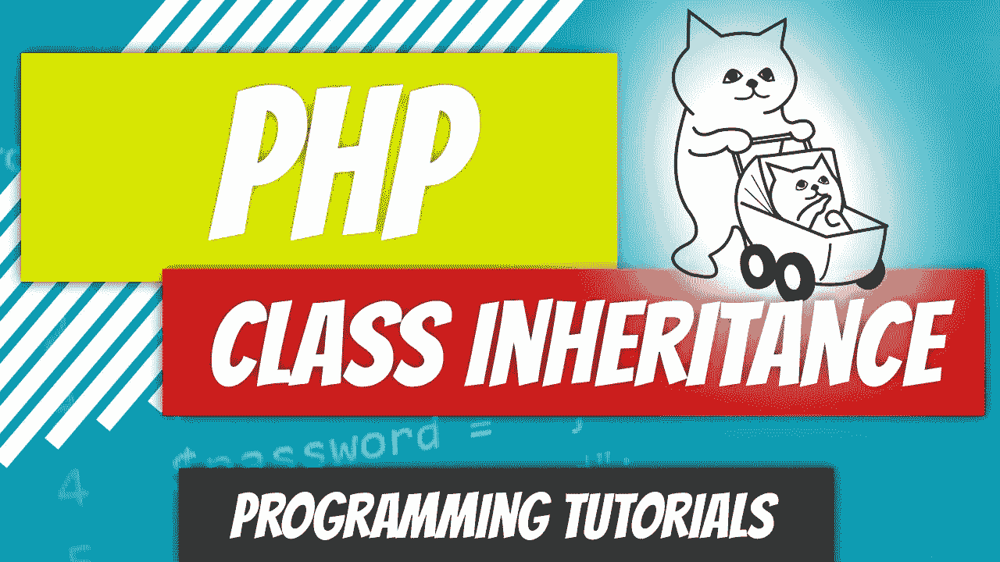
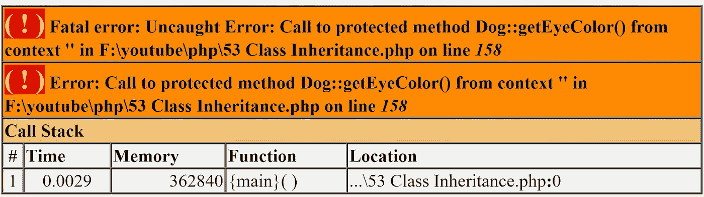
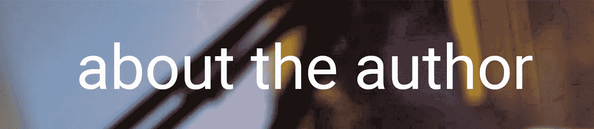

# PHP — P53:类继承

> 原文：<https://blog.devgenius.io/php-p53-class-inheritance-e743de094a06?source=collection_archive---------6----------------------->

谁会想到 PHP 支持继承？自从面向对象编程成为一种事物以来，每个人都在使用 PHP，这就是谁。如果你不熟悉编程中的继承，它只是模仿现实世界的概念，主要是祖先的继承。你从你的父母那里继承特质或特征，你的父母从他们的父母那里继承等等。你和我拥有和所有人类一样的特质，所以我们的父类可以是人类。在那个人类类中，我们可以列出像走路和说话这样的方法。即使我们说不同的语言，机制是相同的。我们分享说话的能力，并使用相同的器官来完成任务。

在面向对象编程中，您可以从其他类继承属性和方法。继承的类称为**子类**；它继承自**父**类。子类也被称为**子类**，父类被称为**超类**。

我们将修改上一篇文章中的 GermanShepherd 类。

 [## PHP—P52:getter 和 Setters

### 在上一篇文章中，我们讨论了可见性修饰符，并将所有属性设置为 private。

blog.devgenius.io](/php-p52-getters-and-setters-55ed07ecc0bc) 

我们将把相当多的属性移出 GermanShepherd 类，放入一个更通用的 Dog 类中。我们也可以修改 Car 类，尽管它是一个足够抽象的概念，从一个更通用的 Vehicle 类继承。我们将在下一篇文章中讨论这个问题。

先说 GermanShepherd 类。每只德国牧羊犬都是一只狗，而且有不同的狗品种，比如狮子狗和德国牧羊犬。

从常量开始，每只狗都有一颗心和一条尾巴，所以我们可以把它移到新的 Dog 类中。

接下来是属性。每只狗都有特定的眼睛颜色、出生日期等。我们可以将所有属性移动到我们的 Dog 类中。我们唯一需要改变的是品种。一旦 breed 成为 Dog 类的一部分，将它初始化为 German Shepherd 是没有意义的，因为我们可以使用我们的 Dog 类来创建其他品种。我们不想要德国牧羊犬。

您可能已经注意到，我们将**私有**属性修饰符切换为**受保护的**。我们在上一篇文章中提到了可见性修饰符，包括受保护的可见性修饰符。

 [## PHP — P51:可见性修饰符

### 私有、受保护和公共。让我们解决它们。

blog.devgenius.io](/php-p51-visibility-modifiers-b277591e7c0b) 

如果我们将带有私有可见性修饰符的属性移动到 Dog 类，我们的 GermanShepherd 类在继承时将不能访问这些属性。为了确保我们的 GermanShepherd 类继承这些属性，我们必须将**私有**修改为**受保护**。

到目前为止，我们已经讨论了作为一个概念的继承，但是 GermanShepherd 类实际上如何从 Dog 类继承属性。借助于**扩展了**关键字。

*类*子类**扩展** *父类*

只能扩展(继承)一个类。我们的狗类也可以从另一个类继承，比如动物。

为了测试这一点，让我们创建一个新的 GermanShepherd 对象，并在实例化后回显眼睛的颜色。

您应该收到的结果是绿色的。尽管 eye_color 属性不存在于子类中，但它存在于父类中，并且正在被继承。这个概念可能会让初学者感到困惑，尤其是当您看到 getEyeColor()方法正在返回$this->eye_color 时。[关键字$this](/php-p47-this-keyword-f7397e560949) 正在引用它所在的对象，即 GermanShepherd，而 eye_color 属性不再存在。然而，眼睛的颜色被正确地恢复了。为了更好地形象化，可以把属性想象成从父类复制到子类；然而，当您在代码中查找而找不到属性时，您将开始沿着继承树向上走。您将在 Dog 父类中找到 eye_color 属性。

如前所述，我们可以将属性和方法移动到父类中。看看我们的 GermanShepherd 类，没有一个方法是 german shepherd 所独有的，所以我们可以把它们都移到我们的 Dog 类中。

看起来很干净。你可能想把所有的**公共**方法都改成**受保护的**方法。您的子类将可以访问这些方法，但是，一旦对象被实例化，将看不到任何方法。

让我们将 getEyeColor()可见性修饰符从 **public** 改为 **protected** 并再次运行我们的代码。您将看到显示一个致命错误。

您可能会问自己，如果我们只是将所有东西都移到 Dog 类中，那么创建 GermanShepherd 对象还有什么意义。除了这样做是正确的以外，你还可以在 GermanShepherd 类中覆盖你的方法，使它们成为特定于 GermanShepherd 的方法。例如，有一个默认的 bark()方法可以模仿“我在叫”我们可以在 GermanShepherd 类中重写该方法，这样 GermanShepherd 就可以说“大声吠叫”

如何重写一个方法？您在子类(GermanShepherd)中创建一个方法，并将其命名为您试图覆盖的方法。不要从 Dog 类中删除 bark 方法。

调用 bark()方法会输出响亮的叫声，因为该方法已被成功覆盖。当我们调用 bark()方法时，PHP 将进入 GermanShepherd 对象并开始查找 bark()方法。如果它找到了，那太好了。如果没有，它开始查找继承树。

谈到继承，还有几个概念需要学习，但是我们将在下一篇文章中讨论。

 [## dinocajic/PHP-7-YouTube-教程

### PHP 7.x YouTube 教程的代码。

github.com](https://github.com/dinocajic/php-7-youtube-tutorials) 

迪诺·卡伊奇目前是 [LSBio(生命周期生物科学公司)](https://www.lsbio.com/)、[绝对抗体](https://absoluteantibody.com/)、 [Kerafast](https://www.kerafast.com/) 、[珠穆朗玛生物](https://everestbiotech.com/)、[北欧 MUbio](https://www.nordicmubio.com/) 和 [Exalpha](https://www.exalpha.com/) 的 IT 主管。他还担任我的自动系统的首席执行官。他有十多年的软件工程经验。他拥有计算机科学学士学位，辅修生物学。他的背景包括创建企业级电子商务应用程序、执行基于研究的软件开发，以及通过写作促进知识的传播。

你可以在 [LinkedIn](https://www.linkedin.com/in/dinocajic/) 上联系他，在 [Instagram](https://instagram.com/think.dino) 或 [Twitter](https://twitter.com/dino_cajic) 上关注他，或者[订阅他的媒体出版物](https://dinocajic.medium.com/subscribe)。

阅读 Dino Cajic(以及 Medium 上成千上万的其他作家)的每一个故事。你的会员费直接支持迪诺·卡吉克和你阅读的其他作家。你也可以在媒体上看到所有的故事。