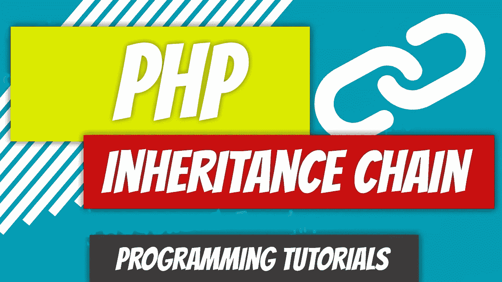
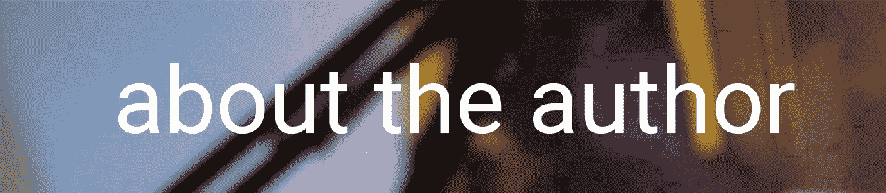

# PHP — P54:继承链

> 原文：<https://blog.devgenius.io/php-p54-inheritance-chain-3cb62edcb373?source=collection_archive---------9----------------------->

在上一篇文章中，我简单地提到了你不能一次扩展多个类。但是父类本身可以是子类，并扩展自己的类。在这篇文章中，我们将清理我们的狗类。我们已经将 GermanShepherd 类中的所有东西都移到了 Dog 类中，但是还有一些属性和方法可以进一步扩展到哺乳动物和动物类中。

在我们开始之前，让我们回顾一下在上一篇文章中没有提到的 [Car 类](https://github.com/dinocajic/php-7-youtube-tutorials/blob/master/52%20Getters%20and%20Setters.php)的继承。

 [## PHP — P53:类继承

### 谁会想到 PHP 支持继承？自从面向对象程序设计成为一种…

blog.devgenius.io](/php-p53-class-inheritance-e743de094a06) 

[汽车类](https://github.com/dinocajic/php-7-youtube-tutorials/blob/master/52%20Getters%20and%20Setters.php)包含常量，如 HAS _ TAIL、HAS_TAIL_LIGHTS 和 HAS_TURN_SIGNALS。如果你从总体上考虑汽车，每辆车都会有前灯、尾灯和转向灯，但不是每辆*车*都会有这些。因此，我们将把它们留在汽车类中。

现在，让我们来看看我们的汽车属性。每辆车都包含年份、品牌和型号，但并不是每辆车都需要燃料:想想马车。我们将把 fuel_type 属性留在汽车对象内部。类似地，马力、扭矩、传输、车辆类型(无论是轿跑还是轿车:据我所知，这不是一个很好的属性名称)和 car_on 可以留在 car 类中。维度可以向上移动到车辆类别，因为每辆车都有维度。由于**私有**属性正在向 Vehicle 移动，如果我们想从 Car 类中访问它们，我们需要将它们的可见性修饰符更改为 **protected** 。

我们移到 Vehicle 类中的属性的访问器和赋值器也可以移到 Vehicle 类中。这就完成了汽车类元素到汽车类的移动。

接下来是狗课。我们通过从 GermanShepherd 类上移一些元素来创建 Dog 类。如果我们想，我们也确实这样做了，我们可以继续从孩子到父母扩展课程。对于这个例子，我们将创建另外两个类:哺乳动物和动物。狗会继承哺乳动物，而哺乳动物会继承动物。你可以清楚地看到，班级可以同时是孩子和家长。狗类是德国牧羊犬的父类，但它是哺乳动物的子类。

我们不必再看 GermanShepherd 类了，因为我们已经把所有可以移动到 Dog 类的东西都移动了。然而，看看我们的 Dog 类，我们可以看到有一些元素可以上移，比如 HAS_HEART 常量。向上移动 HAS_TAIL 没有意义，因为不是所有的哺乳动物和动物都有尾巴。HAS_HEART 常量可以上升到 Animal 类。

眼睛的颜色是所有哺乳动物都会有的，因为动物不需要有眼睛(我认为)。出生日期是动物的特征，所以我们可以将出生日期一直移到动物类。

门、纲、目等可以移动到动物类，但是它们需要在以后初始化，因为不是所有的动物都属于同一个分类。王国应该像动物一样被保留。

对于我们上移的每个属性，我们也可以上移它们的 getter 和 setter 方法。睡觉似乎是动物的事情，所以我们将把 sleep()方法移到 animal 类中。最后，由于我们还没有为分类特征生成 getters 和 setters，我们现在将创建它们(即 getKingdom())。我们唯一不会添加的方法是 Animal 类中的 setKingdom()，因为我们不希望任何人从 Animalia 修改我们的动物王国。

仅此而已。我们的 GermanShepherd 现在可以访问狗、哺乳动物和动物类的属性和方法。我们还直接从 GermanShepherd 类中设置父类内部的属性。例如，当 GermanShepherd 类被实例化并在 Animal 类中设置时，会传递出生日期。我们可以运行之前运行的相同测试，我们应该得到完全相同的结果。*不坏，传承。*

 [## dinocajic/PHP-7-YouTube-教程

### PHP 7.x YouTube 教程的代码。

github.com](https://github.com/dinocajic/php-7-youtube-tutorials) 

迪诺·卡伊奇目前是 [LSBio(生命周期生物科学公司)](https://www.lsbio.com/)、[绝对抗体](https://absoluteantibody.com/)、 [Kerafast](https://www.kerafast.com/) 、[珠穆朗玛生物](https://everestbiotech.com/)、[北欧 MUbio](https://www.nordicmubio.com/) 和 [Exalpha](https://www.exalpha.com/) 的 IT 主管。他还担任我的自动系统的首席执行官。他有十多年的软件工程经验。他拥有计算机科学学士学位，辅修生物学。他的背景包括创建企业级电子商务应用程序、执行基于研究的软件开发，以及通过写作促进知识的传播。

你可以在 [LinkedIn](https://www.linkedin.com/in/dinocajic/) 上联系他，在 [Instagram](https://instagram.com/think.dino) 或 [Twitter](https://twitter.com/dino_cajic) 上关注他，或者[订阅他的媒体出版物](https://dinocajic.medium.com/subscribe)。

阅读 Dino Cajic(以及 Medium 上成千上万的其他作家)的每一个故事。你的会员费直接支持迪诺·卡吉克和你阅读的其他作家。你也可以在媒体上看到所有的故事。