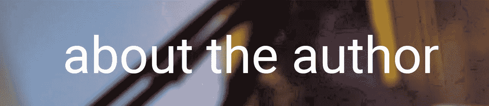

# PHP — P55:文件分离

> 原文：<https://blog.devgenius.io/php-p55-file-separation-c3e848295e8d?source=collection_archive---------5----------------------->

包含、要求、要求一次和包含一次。你可能在别人的代码中在文件的顶部看到过这些，但是它们中的每一个是什么意思呢？我们稍后会逐一查看。现在，我们只是试图分裂我们的文件，因为它是相当大的最后一次。

 [## PHP — P54:继承链

### 在上一篇文章中，我简单地提到了你不能一次扩展多个类。但是父类本身可以…

blog.devgenius.io](/php-p54-inheritance-chain-3cb62edcb373) 

我们想慢慢开始，把每个类分成它自己的单独文件。这些文件中的每一个都将在需要时包含在内。在大多数情况下，这些关键字都有相同的功能，即包含一个文件:

*   需要
*   需要一次
*   包括
*   包含一次

有些在失败时调用特定类型的错误，其他的检查文件是否已经被包含。在本文的剩余部分，我们将使用 require_once 辅助函数。

当我们查看我们现有的[代码](https://github.com/dinocajic/php-7-youtube-tutorials/blob/master/54%20Class%20Inheritance%20Part%202.php)时，你可以看到它有 6 个不同的类别:车辆、汽车、动物、哺乳动物、狗和德国牧羊犬。这些类中的每一个都有自己的文件，并在必要的地方包含在内。

第一类是车辆类。我们将创建一个名为 Vehicle.php 的新文件，并将我们的类移到那里。*在这篇文章中，我们不打算浏览子目录。*

我们的 Vehicle.php 文件现在只包含车辆类别。接下来，我们将创建 Car.php 文件并将我们的汽车类移到那里。

汽车类和车辆类的主要区别在于汽车类继承自车辆类。因为它们现在在不同的文件中，所以汽车类不能访问汽车类。换句话说，PHP 不会知道如何*扩展 Vehicle* 。

我们如何在汽车类中辨别车辆来自哪里？这就是我们需要文件来确保汽车类可以看到汽车类的地方。只要 Vehicle.php 和 Car.php 文件在同一个目录中，您就可以将以下代码添加到 Car.php 文件的顶部:

*require_once('文件名')；*

require _ once(' vehicle . PHP ')；

require_once 语句添加在类声明之前。你通常想把它放在开始的 php 标签之后， *<？php* 。

当 PHP 现在查看 Car 类时，它将知道如何扩展 Vehicle 类，因为 Vehicle 类包含在文件的顶部。

接下来，我们将抓住我们的动物类，并将其移动到 Animal.php。因为它没有扩展任何东西，这就完成了移动。

接下来是哺乳动物类。让我们创建 Mammal.php 文件并将哺乳动物类移入其中。既然哺乳动物延伸到动物，我们必须要求 _ 一旦我们的 Animal.php 文件。

往下走，下一节课是狗。狗类将被放置在 Dog.php 文件。如果你想知道文件是否需要和类一样命名，答案是否定的。一旦我们开始讨论 PHP 框架，我们将进入这个领域。

Dog 类扩展了哺乳动物，所以我们需要包含 Mammal.php 文件。

最后，我们需要将 GermanShepherd 类移到它自己的文件 GermanShepherd 中。它扩展了 Dog，所以我们需要 _once 我们的 Dog.php 文件。

查看我们的原始代码，唯一留下的代码是 Car 和 GermanShepherd 类上的代码实例化和一些方法调用。

照原样运行代码是行不通的。PHP 不知道 Car 类是什么，GermanShepherd 也是一样。我们必须告诉它那些类在哪里，以便它知道如何理解代码。我们通过包括 Car.php 和 GermanShepherd.php 的文件来做到这一点。

思考上述问题的最佳方式是，PHP 将把每个类的所有代码放在一个文件中来构造我们的原始文件。当我们确实需要 _ once(“car . php”)时，想象一下 PHP 只是进入 Car.php 类，获取所有的内容并粘贴到调用代码的文件的顶部。

管理我们的代码现在变得容易多了。另外，你还可以很好地分离逻辑。

 [## dinocajic/PHP-7-YouTube-教程

### PHP 7.x YouTube 教程的代码。

github.com](https://github.com/dinocajic/php-7-youtube-tutorials) 

Dino Cajic 目前是 [LSBio(寿命生物科学公司)](https://www.lsbio.com/)、[绝对抗体](https://absoluteantibody.com/)、 [Kerafast](https://www.kerafast.com/) 、 [Everest BioTech](https://everestbiotech.com/) 、 [Nordic MUbio](https://www.nordicmubio.com/) 和 [Exalpha](https://www.exalpha.com/) 的 IT 负责人。他还担任我的自动系统的首席执行官。他有十多年的软件工程经验。他拥有计算机科学学士学位，辅修生物学。他的背景包括创建企业级电子商务应用程序、执行基于研究的软件开发，以及通过写作促进知识的传播。

你可以在 [LinkedIn](https://www.linkedin.com/in/dinocajic/) 上联系他，在 [Instagram](https://instagram.com/think.dino) 或 [Twitter](https://twitter.com/dino_cajic) 上关注他，或者[订阅他的媒体出版物](https://dinocajic.medium.com/subscribe)。

阅读 Dino Cajic(以及 Medium 上成千上万的其他作家)的每一个故事。你的会员费直接支持迪诺·卡吉克和你阅读的其他作家。你也可以在媒体上看到所有的故事。