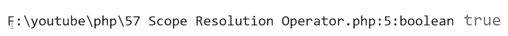

# PHP — P57:范围解析操作符

> 原文：<https://blog.devgenius.io/php-p57-scope-resolution-operator-19c50ca607d4?source=collection_archive---------11----------------------->

在 PHP 中，作用域解析操作符或双冒号::，允许您访问[常量](https://dinocajic.medium.com/php-7-x-p14-constants-54f58d89c753)，静态属性和方法，以及被覆盖的属性和方法。我们在以前的文章中创建了几个常量，但是我们从来没有真正访问过它们。

 [## PHP — P56:方法覆盖

### PHP 面向对象的原则允许方法重载和方法覆盖。

dinocajic.medium.com](https://dinocajic.medium.com/php-p56-method-overriding-6ae3784b42c9) 

例如，如果要访问类外的常数，可以在实例化的对象，甚至是类名后添加双冒号操作符。如果您正在访问类内部的常量或被覆盖的属性或方法，您可以使用 *self* 、 *parent* 或 *static* 关键字。我们将在本文中讨论*自身*和*父*；我们将在下一篇文章中讨论*静态*。

*Self* 用于访问类自身内部的常量，而 *parent* 用于访问继承的常量，或者被覆盖的属性或方法。

*重述*:我们有以下几个类:

*   德国牧羊人
*   [狗](https://github.com/dinocajic/php-7-youtube-tutorials/blob/master/Dog.php)
*   [哺乳动物](https://github.com/dinocajic/php-7-youtube-tutorials/blob/master/Mammal.php)
*   [动物](https://github.com/dinocajic/php-7-youtube-tutorials/blob/master/Animal.php)
*   [汽车](https://github.com/dinocajic/php-7-youtube-tutorials/blob/master/Car.php)
*   [车辆](https://github.com/dinocajic/php-7-youtube-tutorials/blob/master/Vehicle.php)

每个类都有自己的文件。如果您需要复习，请点击上面的链接查看课程。

## 父母

我们将首先创建一个新文件并安装 GermanShepherd 类。

窥视我们的 GermanShepherd 类内部，我们可以看到它有两个常量: *HAS_HEART* 和 *HAS_TAIL* 。实际上， *HAS_TAIL* 常量位于 Dog 类中， *HAS_HEART* 常量位于 Animal 类中。通过继承，它们在 GermanShepherd 类中可用。

 [## PHP — P53:类继承

### 谁会想到 PHP 支持继承？自从面向对象程序设计成为一种…

blog.devgenius.io](/php-p53-class-inheritance-e743de094a06)  [## PHP — P54:继承链

### 在上一篇文章中，我简单地提到了你不能一次扩展多个类。但是父类本身可以…

blog.devgenius.io](/php-p54-inheritance-chain-3cb62edcb373) 

让我们试着 *var_dump()* 我们的*有 _ 心*不变。

运行上面的应用程序，我们得到 *true* 。

我们不必为了调用对象而实例化它。我们要做的就是使用类名，后跟双冒号，然后是常量名。再看我们的[车类](https://github.com/dinocajic/php-7-youtube-tutorials/blob/master/Car.php)，有三个常量:*有 _ 大灯*、*有 _ 尾灯*、*有 _ 转向灯*。

让我们在不实例化汽车对象的情况下调用*HAS _ heads*常量，看看这是否可行。

转储上述常量会产生以下结果: *true* 。这是因为常量属于类，而不属于对象。

一个经常使用的例子是银行账户。在 BankAccount 类中有一个名为 *NUMBER_OF_ACCOUNTS* 的常量。每次打开一个银行账户，属于该银行账户的金额就为该对象保存下来。那钱是属于物品的。因为银行需要知道总共有多少个银行账户，所以账户的数量增加。账户数常量属于类，不属于对象。

让我们看看我们还可以用双冒号操作符做什么。在上一篇文章中，我们介绍了在 GermanShepherd 类中覆盖 Dog *walk()* 方法的[方法覆盖](https://dinocajic.medium.com/php-p56-method-overriding-6ae3784b42c9)方法。

如果我们想显示“我是一只会走路的德国牧羊犬”以及从 Dog *walk()* 方法返回的任何内容，会怎么样？这里我们可以使用 *parent* 关键字来访问父类中的 *walk()* 方法。

首先，我们将把 *walk()* 方法改为 *echo* out 字符串，然后返回 Dog *walk()* 方法输出。

运行代码给我们以下输出:*我是一只会走路的德国牧羊犬我是一只会走路的狗。*

浏览代码，确保它已经在你的头脑中固化:

*   GermanShepherd 类被实例化。
*   调用 *$gs_dog- > walk()* 方法。
*   PHP 进入 GermanShepherd 类中的 *walk()* 方法，并看到一个 *echo* 语句。它 *echo 的*出来了“我是一只行走的德国牧羊犬。”
*   接下来，PHP 会看到 *parent::walk()* 的返回语句。
*   PHP 进入父类 Dog，执行 Dog 类中的 *walk()* 语句，返回“我是一只走狗”。

你通常不会这么做。这只是一个例子来告诉你它是有效的。

## 自己

我们如何从类内部访问常量？用*自带的*关键字。假设我们想要访问 GermanShepherd *bark()* 方法中的 *HAS_HEART* 常量。我们可以用 *self::HAS_HEART* 调用来显示内容。

为了查看结果，让我们实例化 GermanShepherd 类并调用 *bark()* 方法。

我们将得到以下输出: *Has Heart: true。大声吠叫。*

同样，您可能已经注意到 *HAS_HEART* 常量并不存在于 GermanShepherd 类中；它生活在动物类中。只要有适当的继承链，GermanShepherd 就可以访问它。

把*自我*想象成*$这个*在常量层面上的替代。假设一个常量存在于我们的 GermanShepherd 类中。如果是的话， *self* 会在那里调用它。Parent 会跳过它，开始在我们的父类中查找。

 [## dinocajic/PHP-7-YouTube-教程

### PHP 7.x YouTube 教程的代码。

github.com](https://github.com/dinocajic/php-7-youtube-tutorials) 

迪诺·卡希奇目前是 [LSBio(寿命生物科学公司)](https://www.lsbio.com/)、[绝对抗体](https://absoluteantibody.com/)、 [Kerafast](https://www.kerafast.com/) 、[珠穆朗玛生物科技](https://everestbiotech.com/)、[北欧 MUbio](https://www.nordicmubio.com/) 和 [Exalpha](https://www.exalpha.com/) 的 IT 负责人。他还担任我的自动系统的首席执行官。他有十多年的软件工程经验。他拥有计算机科学学士学位，辅修生物学。他的背景包括创建企业级电子商务应用程序、执行基于研究的软件开发，以及通过写作促进知识的传播。

你可以在 [LinkedIn](https://www.linkedin.com/in/dinocajic/) 上联系他，在 [Instagram](https://instagram.com/think.dino) 上关注他，或者[订阅他的媒体出版物](https://dinocajic.medium.com/subscribe)。

阅读 Dino Cajic(以及 Medium 上成千上万的其他作家)的每一个故事。你的会员费直接支持迪诺·卡吉克和你阅读的其他作家。你也可以在媒体上看到所有的故事。