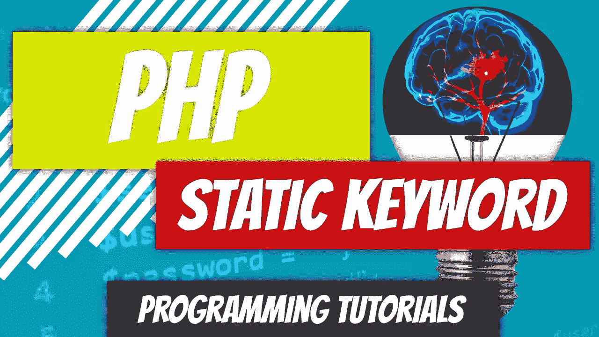

# PHP — P58:静态关键字

> 原文：<https://blog.devgenius.io/php-p58-static-keyword-da0b92d45b3c?source=collection_archive---------6----------------------->

静态方法是属于类而不属于对象的方法。属于对象的方法有时被称为实例方法。类似于我们在上一篇文章中访问常量而不必实例化类的方法，我们也可以访问静态方法而不必实例化。

 [## PHP — P57:范围解析操作符

### 在 PHP 中，作用域解析操作符或双冒号::，允许你访问常量、静态属性和…

blog.devgenius.io](/php-p57-scope-resolution-operator-19c50ca607d4) 

为了访问这些静态方法，我们将使用类名，然后是范围解析操作符，最后是静态方法名。

*class name::static _ method()*

给你一点计算机科学术语:静态方法存储在堆内存的一个独立部分。实例方法存储在堆栈内存中。

大多数时候，程序员会从架构的角度选择创建静态方法和属性，比如当一个人试图实现一个 Singleton 时。*别担心，我们不会在这里讨论设计模式*。

静态方法的创建类似于实例方法，除了将*静态*关键字附加到声明中。

*公共静态函数 getNumberOfBankAccount()*

静态属性前面也有 *static* 关键字。

*静态$ name*

在我们的例子中，我们将看看一个对象被实例化了多少次。我们不想在类外存储变量。如果我们不使用*静态*，每次对象被实例化时，它将读取 1。为了将它从对象中分离出来，我们将使它*保持静态。*

*重述*:我们有一个没有任何静态方法或属性的 [GermanShepherd](https://github.com/dinocajic/php-7-youtube-tutorials/blob/master/GermanShepherd.php) 类。

让我们从创建一个新文件开始，该文件将测试我们的 GermanShepherd 类。我们现在要做的就是计算这个类被实例化的次数。在我们的文件中，让我们包含 GermanShepherd 类并创建 5 个 GermanShepherd 对象。

在我们继续之前，我们可以在上面的文件中创建一个变量，并记录我们每次实例化一个类的时间。这很容易出错，对可伸缩性也不好。让我们以正确的方式来做这件事，并在 GermanShepherd 类中创建我们的静态属性。

在 GermanShepherd 类中创建$*num _ of _ dogs _ created*static*int*并初始化为 0。

即使我们有 5 个实例，初始化为 0 只发生在第一个对象的创建过程中。它不会每次都被重置。

我们如何更新 *$num_of_dogs_created* 。你说得对，我们可以在每次类被实例化时手动更新它。

那能行吗？会的。但是很乱，我们什么都没解决。这几乎和文件中有变量一样糟糕。我们不要那样做。

解决这个问题的一个选择是在我们的构造函数中增加增量。

但是，我们也想谈谈方法。如果我们想在类之外增加 *$num_of_dogs_created* 而不直接调用静态属性会怎样？记住为什么要使用访问器和赋值器。我们可以创建一个方法来更新它，然后调用这个静态方法。

因为我们在同一个类中调用静态属性，我们可以使用 *self* 关键字从我们的*update _ num _ of _ dogs _ created()*方法中访问它。然后，我们从构造函数中调用静态方法。你可能已经注意到的一件事是，我们在双冒号操作符后面使用了美元符号；这和使用 *$this* 关键字时有一点不同，在这里你去掉了对象操作符后面的美元符号。

让我们试一试，看看我们会得到什么。

我们得到*创建的实例数:5* ，因为这是我们创建的对象数。

如果我们愿意，可以在类外部调用该方法来再次递增它。

遍历代码:

*   我们实例化每个 GermanShepherd 类，并且每次递增静态属性 *$num_of_dogs_created* 。
*   回显 *$num_of_dogs_created* 并显示 *5。*
*   再次调用*update _ num _ of _ dogs _ created()*方法。它将静态属性 *$num_of_dogs_created* 增加 1。
*   下一个*回显*语句显示 *6。*

 [## dinocajic/PHP-7-YouTube-教程

### PHP 7.x YouTube 教程的代码。

github.com](https://github.com/dinocajic/php-7-youtube-tutorials) 

迪诺·卡伊奇目前是 [LSBio(生命周期生物科学公司)](https://www.lsbio.com/)、[绝对抗体](https://absoluteantibody.com/)、 [Kerafast](https://www.kerafast.com/) 、[珠穆朗玛生物](https://everestbiotech.com/)、[北欧 MUbio](https://www.nordicmubio.com/) 和 [Exalpha](https://www.exalpha.com/) 的 IT 主管。他还担任我的自动系统的首席执行官。他有十多年的软件工程经验。他拥有计算机科学学士学位，辅修生物学。他的背景包括创建企业级电子商务应用程序、执行基于研究的软件开发，以及通过写作促进知识的传播。

你可以在 [LinkedIn](https://www.linkedin.com/in/dinocajic/) 上联系他，在 [Instagram](https://instagram.com/think.dino) 上关注他，或者[订阅他的媒体出版物](https://dinocajic.medium.com/subscribe)。

[*阅读迪诺·卡吉克(以及媒体上成千上万其他作家)的每一个故事。你的会员费直接支持迪诺·卡吉克和你阅读的其他作家。你也可以在媒体上看到所有的故事。*](https://dinocajic.medium.com/membership)