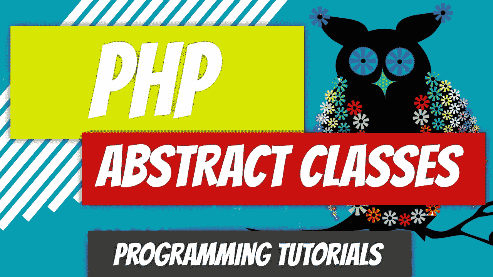
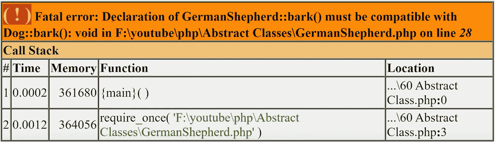

# PHP — P60:抽象类

> 原文：<https://blog.devgenius.io/php-p60-abstract-classes-e7912ee3be7c?source=collection_archive---------11----------------------->

[抽象类](https://www.php.net/manual/en/language.oop5.abstract.php)代表抽象概念。在上一篇文章中，我们创建了各种从其父类继承属性和方法的类。

 [## PHP — P59: Self 关键字

### 对于静态成员，我们不使用$this 关键字，而是使用 self。这个和范围解析操作符给了我们访问…

blog.devgenius.io](/php-p59-self-keyword-ae01f24e73b1) 

再看动物阶级层次，动物阶级本身就是一个抽象的概念。我们可以含糊地说动物，但是什么类型的动物呢？狗可能是一个足够狭隘的概念，但 GermanShepherd 绝对是一个具体的类，而不是抽象的。

抽象类是以单词*抽象*开头的类。如果一个类包含至少一个抽象方法，它必须被声明为抽象的。如果抽象类内部的方法被定义为抽象的，则只能声明方法签名。方法本身不能有任何实现。

所有标记为抽象的方法都必须在继承期间在子类中实现。您将被要求原样复制方法签名，例如可见性修饰符、签名等。

*复习*:看看下面几节课。这些是我们将要修改的。

*   [动物](https://github.com/dinocajic/php-7-youtube-tutorials/blob/master/Animal.php)
*   [哺乳动物](https://github.com/dinocajic/php-7-youtube-tutorials/blob/master/Mammal.php)
*   [狗](https://github.com/dinocajic/php-7-youtube-tutorials/blob/master/Dog.php)
*   [德国牧羊人](https://github.com/dinocajic/php-7-youtube-tutorials/blob/master/GermanShepherd.php)

让我们创建一个新文件，并引入我们的 GermanShepherd 类进行测试。

我们知道这不需要任何修改。在你的电脑上运行它，看看结果。我们现在可以开始修改了。

我们的狗类代表了一个抽象的概念。我们把它改成一个抽象类吧。

我们在类声明前添加了*抽象*关键字。为什么我们将这个类声明为抽象类？因为我们想确保它永远不会被实例化。现在就去试试吧。您将得到一个错误。Dog 类只需要继承，不需要实例化。

回顾到目前为止的代码，

*   我们的 GermanShepherd 类是一个具体的类。
*   Dog 类现在是一个抽象类。
*   目前，Dog 类中没有抽象方法。

运行上面的示例代码应该会得到完全相同的结果。

更进一步，让我们将两个方法修改为 Dog 类中的抽象方法: *bark()* 和 *walk()* 。请记住，我们的抽象方法只能是声明，所以我们需要删除花括号之间的内容。您可以声明将返回什么类型的值。

运行上面的示例代码，我们会得到下面的错误。

我们得到这个的原因是因为我们已经在 GermanShepherd 类中实现了 *bark()* 方法，但是我们没有指定所有的东西，主要是 *void* 的返回类型。

向上移动到我们的哺乳动物类，我们可以修改 walk()方法，因为它是一个抽象概念。我们还需要对类本身进行修改，并将其声明为抽象的。

walk()方法是一个很好的实验例子。考虑到哺乳动物类现在有了方法的抽象声明，它现在可以在抽象狗类中实现。是的，只要继承抽象声明，就可以在抽象类中实现这些抽象方法。还可以通过添加自己的抽象声明将其传递给 GermanShepherd 类。

如果我们从 Dog 类中移除抽象方法声明，并将其留在哺乳动物类中，它仍然可以工作。该声明通过[继承](https://dinocajic.medium.com/php-p54-inheritance-chain-3cb62edcb373)传递给 GermanShepherd 类。我们唯一会得到错误的时候是我们从 GermanShepherd 类中移除了 *walk()* 方法。

真的是这样。我认为我们涵盖了您在开发生涯中可能会接触到的大多数抽象概念。我们还没有触及动物类，因为我们将在下一篇文章中看到它。

 [## dinocajic/PHP-YouTube-教程

### PHP YouTube 教程的代码。

github.com](https://github.com/dinocajic/php-7-youtube-tutorials) 

迪诺·卡伊奇目前是 [LSBio(生命周期生物科学公司)](https://www.lsbio.com/)、[绝对抗体](https://absoluteantibody.com/)、 [Kerafast](https://www.kerafast.com/) 、[珠穆朗玛生物](https://everestbiotech.com/)、[北欧 MUbio](https://www.nordicmubio.com/) 和 [Exalpha](https://www.exalpha.com/) 的 IT 主管。他还担任我的自动系统的首席执行官。他有十多年的软件工程经验。他拥有计算机科学学士学位，辅修生物学。他的背景包括创建企业级电子商务应用程序、执行基于研究的软件开发，以及通过写作促进知识的传播。

你可以在 [LinkedIn](https://www.linkedin.com/in/dinocajic/) 上联系他，在 [Instagram](https://instagram.com/think.dino) 上关注他，[订阅他的博客](https://www.dinocajic.com/)，或者[订阅他的媒体出版物](https://dinocajic.medium.com/subscribe)。

阅读 Dino Cajic(以及 Medium 上成千上万的其他作家)的每一个故事。你的会员费直接支持迪诺·卡吉克和你阅读的其他作家。你也可以在媒体上看到所有的故事。