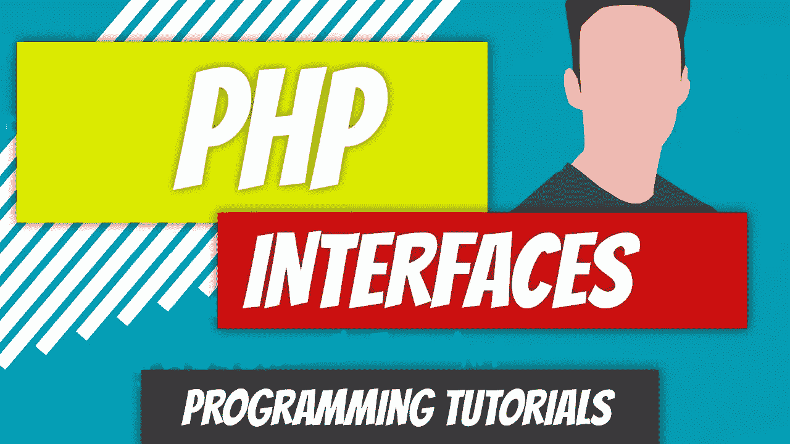
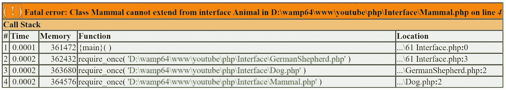
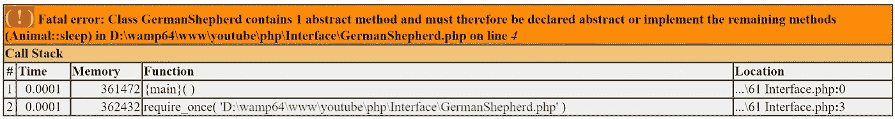

# PHP — P61:接口

> 原文：<https://blog.devgenius.io/php-p61-interface-dcf5b00b803c?source=collection_archive---------9----------------------->

接口的主题。接口类似于抽象类，但也有一些不同。使用抽象类，您可以创建方法声明和实现的方法。然后，子类可以继承抽象类，并重写或实现其方法。使用接口，您只能定义功能。你实际上不能实现任何东西。

最大的区别是子类只能扩展一个抽象类，但可以实现多个接口。当谈到接口时，你会听到契约这个术语，意思是一旦你实现了它，你就有义务定义在接口中声明的每个方法。

我们的哺乳动物类是一个抽象类的完美例子。所有的哺乳动物都有一些相同的方法，用同样的方式来做，所以在那里实现这些方法是个好主意。我认为 Animal 类是一个很好的接口候选。为什么？因为尽管所有的动物都有某些相似的特征，但它们都因动物而异。

 [## PHP — P60:抽象类

### 抽象类代表抽象概念。抽象类是以单词 Abstract 开头的类。

blog.devgenius.io](/php-p60-abstract-classes-e7912ee3be7c) 

因此，您应该强制子类实现这些方法。接口以关键字 *interface* 开始，接口内的方法都是抽象的。你不必使用*抽象*关键字。要实现这个接口，您需要使用*实现*关键字，而不是*扩展*关键字。

*回顾*:回顾上一篇文章中的以下类。动物类是我们将要修改的类。

*   [动物](https://github.com/dinocajic/php-7-youtube-tutorials/blob/master/60%20Abstract%20Classes/Animal.php)
*   [哺乳动物](https://github.com/dinocajic/php-7-youtube-tutorials/blob/master/60%20Abstract%20Classes/Mammal.php)
*   [狗](https://github.com/dinocajic/php-7-youtube-tutorials/blob/master/60%20Abstract%20Classes/Dog.php)
*   [德国牧羊人](https://github.com/dinocajic/php-7-youtube-tutorials/blob/master/60%20Abstract%20Classes/GermanShepherd.php)

因为我们在[上一篇文章](/php-p60-abstract-classes-e7912ee3be7c)中花了大量时间关注抽象类，所以这篇文章应该很容易。我们将首先创建一个文件，该文件实例化我们的 GermanShepherd 类，然后调用我们的 *bark()* 和 *sleep()* 方法。

*bark()* 方法是一个存在于 GermanShepherd 类内部的方法。德国牧羊犬扩展狗。狗延伸哺乳动物。哺乳动物是动物的延伸，这就是我们的*睡眠()*方法所在。

为了简单起见，我已经从我们的动物类中移除了所有其他方法，我们只剩下 *sleep()* 方法。

当调用上面的代码时，我们得到的结果是“大声吠叫”和“我在睡觉”,因为我们通过的能级小于 40。

要将 Animal 类更改为接口，我们必须将*类*关键字替换为*接口*关键字，并删除 *sleep()* 声明。

如果我们再次运行我们的代码，我们将得到第一个错误，指出我们不能扩展我们的接口。

我们需要在我们的哺乳动物类中进行修改，因为哺乳动物类目前扩展了动物类。 *extends* 关键字只能用于类。要实现 Animal 接口，我们必须使用 *implements* 关键字。

如果我们再次刷新代码，就会得到下一个错误。

我们必须在继承链的某处实现我们的 *sleep()* 方法。我们将在 GermanShepherd 类中实现它。

现在我们已经在 GermanShepherd 类中实现了 *sleep()* 方法，我们可以刷新代码并得到以下结果:“大声吠叫”后面跟着“我是一只正在睡觉的德国牧羊犬”

这就是界面。没有疯狂。我鼓励你练习的另一个方法是实现多个接口。例如，假设您有两个额外的接口，您也想在 GermanShepherd 中实现:ServiceDog 和 PoliceDog。语法应该是这样的。

GermanShepherd 类直接实现 ServiceDog 和 PoliceDog 接口，通过继承间接实现 Animal 类契约。

 [## dinocajic/PHP-YouTube-教程

### PHP YouTube 教程的代码。

github.com](https://github.com/dinocajic/php-7-youtube-tutorials) 

迪诺·卡伊奇目前是 [LSBio(生命周期生物科学公司)](https://www.lsbio.com/)、[绝对抗体](https://absoluteantibody.com/)、 [Kerafast](https://www.kerafast.com/) 、[珠穆朗玛生物](https://everestbiotech.com/)、[北欧 MUbio](https://www.nordicmubio.com/) 和 [Exalpha](https://www.exalpha.com/) 的 IT 主管。他还担任我的自动系统的首席执行官。他有十多年的软件工程经验。他拥有计算机科学学士学位，辅修生物学。他的背景包括创建企业级电子商务应用程序、执行基于研究的软件开发，以及通过写作促进知识的传播。

你可以在 [LinkedIn](https://www.linkedin.com/in/dinocajic/) 上联系他，在 [Instagram](https://instagram.com/think.dino) 上关注他，[订阅他的博客](https://www.dinocajic.com/)，或者[订阅他的媒体出版物](https://dinocajic.medium.com/subscribe)。

阅读 Dino Cajic(以及 Medium 上成千上万的其他作家)的每一个故事。你的会员费直接支持迪诺·卡吉克和你阅读的其他作家。你也可以在媒体上看到所有的故事。