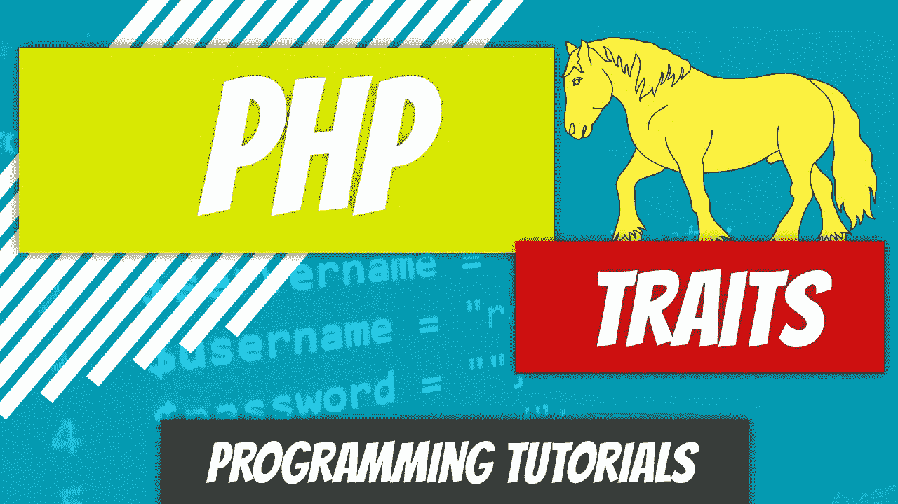
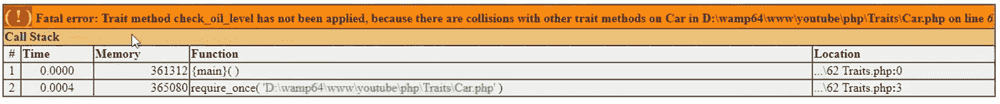

# PHP — P62:特性

> 原文：<https://blog.devgenius.io/php-p62-traits-6b55c6f73659?source=collection_archive---------15----------------------->



支持多重继承的编程语言存在一个基本问题。PHP 不是这些语言中的一种，但是无论如何，让我们从头到尾看一遍，以便您理解这个问题。

假设有一个包含特定方法的父类，例如 drive。有两个子类，1 类和 2 类，它们都扩展了父类。他们继承驱动方法并覆盖它。

现在，PHP 不支持我将要告诉你的内容，因为这是一个多重继承的问题。另一个类别，类别 3，扩展了类别 1 和类别 2。它如何知道使用哪种驱动方法？它将继承哪种方法？一班的那个或者二班的那个。

这就是多重继承的问题。有时，您应该从一个以上的类进行扩展。到目前为止，我们可以实现多个方法，但是我们不能扩展多个类的功能。特质可以解决这个问题。就像抽象类一样，您不能实例化特性，但是您可以继承它们。

*重述*:我们已经有一段时间没有上汽车课了。让我们看看将要做的事情。

*   [车](https://github.com/dinocajic/php-7-youtube-tutorials/blob/master/Car.php)
*   [车辆](https://github.com/dinocajic/php-7-youtube-tutorials/blob/master/Vehicle.php)

首先，让我们创建测试文件。

我们的 Car 类扩展了 Vehicle 类，这意味着它继承了 Vehicle 类的所有属性和方法。Car 类本身有一些常量、属性和方法。除了几个方法，如*关闭()*和*关闭()*之外，大多数方法都只是获取和设置。

如果我们退后一步，开始思考每辆汽油动力汽车都有什么，那就是发动机和变速器。我们将创建单独的引擎和变速器类，而不是把所有的东西都加载到我们的 Car 类中。为什么选择发动机和变速器？我们可以在一辆车内浏览所有内容，但我们只选择了这些作为简单的示例。

实际上，汽车中的任何物体都可以有自己的属性类。想想汽车里的一个座位。它代表一个特定的对象。它有特定的细节，比如尺寸和材料类型，所以它需要成为自己独立的物体。我们想使用这个对象并在 Car 类中实现它。即使从一个座位继承属性是没有意义的，即使我们继承了，我们也不能*扩展*多个类。为了向我们自己证明这一点，让我们试一试。

如果我们想扩展引擎类，我们不能这样做:

```
class Car extends Vehicle, Engine { … }
```

您的编辑器将自动突出显示该引擎，并指出它的语法不正确。那么我们能做什么呢？首先让我们给 Engine 类添加一个方法，并将该类改为 Trait，因为从技术上讲，引擎是汽车的一个特征。

让我们为我们的传输特性做同样的事情。

发动机和变速器特征具有相同的方法名称，*检查油位()*。发动机特征方法返回“发动机机油油位良好”，变速器特征方法返回“变速器机油油位良好”

太好了，我们现在如何在汽车类中使用这些特性？与*一起使用*关键字。让我们像往常一样，从简单的开始，通过实现变速器特性和检查变速器油位来建立这一点。

我们应该得到以下响应:“变速器油位良好。”

我们仍然可以像平常一样通过调用方法名来调用 Vehicle 父类中的方法。

```
echo $subaru->getYear(); // example from Parent class
```

让我们进入下一步，将我们的引擎特征添加到汽车类中。

```
use Transmission, Engine;
```

我们得到以下错误:*特征方法‘检查 _ 油位 _ 液位’将不被应用，因为它与‘传输’冲突如果你仍然想尝试一下，刷新你的页面，你会得到下面的错误。*



我们如何解决这个问题？我们必须告诉 PHP 我们想要使用哪个 *check_oil_level()* 方法。我们如何做到这一点？使用特殊的语法。一旦你使用了这两个特征，添加花括号并使用*代替*关键字。我想用这个方法*而不是*这个另外的方法。

现在当我们调用 *check_oil_level()* 时，PHP 知道要调用哪个方法。太好了，这解决了一个问题。但是如果我们也想检查我们的机油呢？您只需在 Car 类中重命名其中一个。我们的变速器 *check_oil_level()* 将被用作默认设置。我们的机油检查将命名为*check _ Engine _ oil _ level()*。

现在调用我们的方法会产生正确的结果。说到特质就是这样。如果您开始收到错误，很可能是由于方法名冲突，现在您知道如何重新定义了。

[](https://github.com/dinocajic/php-7-youtube-tutorials) [## dinocajic/PHP-YouTube-教程

### PHP YouTube 教程的代码。

github.com](https://github.com/dinocajic/php-7-youtube-tutorials) 

迪诺·卡伊奇目前是 [LSBio(生命周期生物科学公司)](https://www.lsbio.com/)、[绝对抗体](https://absoluteantibody.com/)、 [Kerafast](https://www.kerafast.com/) 、[珠穆朗玛生物](https://everestbiotech.com/)、[北欧 MUbio](https://www.nordicmubio.com/) 和 [Exalpha](https://www.exalpha.com/) 的 IT 主管。他还担任我的自动系统的首席执行官。他有十多年的软件工程经验。他拥有计算机科学学士学位，辅修生物学。他的背景包括创建企业级电子商务应用程序、执行基于研究的软件开发，以及通过写作促进知识的传播。

你可以在 [LinkedIn](https://www.linkedin.com/in/dinocajic/) 上联系他，在 [Instagram](https://instagram.com/think.dino) 上关注他，[订阅他的博客](https://www.dinocajic.com/)，或者[订阅他的媒体出版物](https://dinocajic.medium.com/subscribe)。

阅读 Dino Cajic(以及 Medium 上成千上万的其他作家)的每一个故事。你的会员费直接支持迪诺·卡吉克和你阅读的其他作家。你也可以在媒体上看到所有的故事。