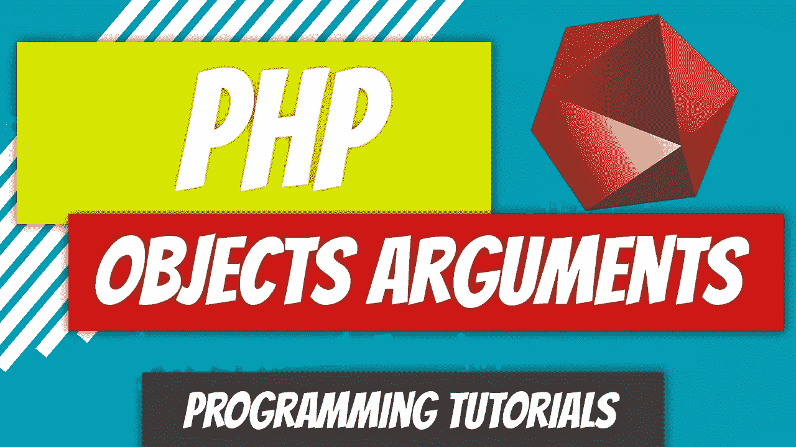

# PHP — P63:对象作为参数。依赖注入和多态介绍

> 原文：<https://blog.devgenius.io/php-p63-objects-as-arguments-dependency-injection-and-polymorphism-intro-2155d0391d04?source=collection_archive---------1----------------------->



我们已经看到了将许多不同的数据类型作为参数传递给方法，但是还没有看到将对象作为参数传递给方法。

[](/php-7-x-p36-function-arguments-f0b4c131ad1b) [## PHP — P36:函数参数

### 参数是我们调用函数时传递给函数的数据。

blog.devgenius.io](/php-7-x-p36-function-arguments-f0b4c131ad1b) 

我们将使用继承的类键入 hint，这是 PHP 中多态性的概述。我们还将把对象作为参数传递给构造函数。然后，构造函数将在类中设置属性。这被称为[依赖注入](https://stackify.com/dependency-injection/#:~:text=Dependency%20injection%20is%20a%20programming,inversion%20and%20single%20responsibility%20principles.)。我们将在后面详细探讨这两个主题，但这是一个很好的概述。让我们从上一篇文章停止的地方继续，以汽车类为例。

[](/php-p62-traits-6b55c6f73659) [## PHP — P62:特征

### 支持多重继承的编程语言有一个基本问题。PHP 不是那种…

blog.devgenius.io](/php-p62-traits-6b55c6f73659) 

*回顾*:回顾以下文件，因为我们将从这里开始。

*   [汽车](https://github.com/dinocajic/php-7-youtube-tutorials/blob/master/62%20Traits/Car.php)
*   [发动机](https://github.com/dinocajic/php-7-youtube-tutorials/blob/master/62%20Traits/Engine.php)
*   [变速器](https://github.com/dinocajic/php-7-youtube-tutorials/blob/master/62%20Traits/Transmission.php)
*   [车辆](https://github.com/dinocajic/php-7-youtube-tutorials/blob/master/62%20Traits/Vehicle.php)

我们的汽车类扩展了汽车类，并使用了几个特征:发动机和变速器。这篇文章是关于将对象作为参数传递的，所以让我们发挥创造力。

首先，让我们创建几个额外的类:兰博基尼和法拉利。这些类中的每一个都需要汽车类。

我们现在可以创建我们的测试类并实例化这些对象。

你觉得上面的代码行得通吗？我们没有给我们的兰博基尼和法拉利类添加任何构造函数，但是我们将参数传递给构造函数。信不信由你，它真的会起作用。为什么？因为我们已经在 Car 父类中定义了构造函数参数。如果我们的子类中没有构造函数，它会自动将参数传递给我们的父类。让我们快速看一下我们的汽车类构造函数。

我们现在能做什么？还记得我们刚刚看到的遗传和特征吗？我们可以访问父类中的所有属性和方法(只要它们不是私有的)。

太好了。我们还没有传递任何对象作为参数。沉住气。那不是一个有趣的介绍吗？没有吗？向前看。好吧。

我们要做的是创建一个驱动程序类。我们的驱动程序类中的第一个方法是 *drive()* 方法，因为驱动程序应该能够*驾驶()*汽车。我们可以把汽车对象作为参数传递给它，然后我们可以使用各种不同的汽车方法来帮助我们驾驶汽车。我们将在汽车类中重点介绍的两种方法是 *turnOn()* 方法和 *drive()* 方法。

我们现在可以返回到我们的测试类并实例化该对象。

哇哦。刚刚发生了什么？我想我们已经指定必须将汽车类型对象作为参数传递给 *drive()* 方法。它在 *drive()* 声明中。

```
public function drive( **Car $car** )
```

这是你的多态性课程。因为我们的兰博基尼和法拉利级别都扩展了汽车级别，所以从技术上讲，它们都是汽车！你猜怎么着？由于汽车扩展了车辆类别，从技术上讲，兰博基尼和法拉利也是车辆！您想知道我们是否可以修改我们的声明如下:

```
public function drive( **Vehicle $vehicle** )
```

答案是肯定的！你绝对可以。你仍然可以将 *$lamborghini_diablo* 或 *$ferrari_f355* 作为参数传递给 *drive()* 方法。如果我们将 *$ferrari_f355* 传递给我们的 *drive()* 方法，我们得到如下结果: *Ferrari F355 已经开启。我在开车。*

现在让我们以不同的方式来做这件事。还记得我们创建 *int、string 等类属性的时候吗？*类型？只要看看汽车类，你就会看到所有不同的属性。我们如何初始化这些属性？从构造函数。当实例化对象时，我们会将参数传递给构造函数，然后构造函数会用作为参数传递的值来初始化这些属性。这个概念和我们在驱动程序课上要做的一样。我们将指定我们将有一个基于汽车的属性，我们将通过构造函数传递一个汽车参数，并将它赋给我们的汽车属性。记住，Car 只是一种类似于 *int* 或 *string* 的数据类型。

我现在不想在这里失去你。请记住，一旦通过我们的构造函数初始化了 *$car* 属性，我们就可以访问我们所有的汽车属性和方法，比如 *turnOn()* 和 *drive()* 。因为我们知道我们必须将一个汽车类型的对象传递给我们的构造函数，并且它必须被分配给我们的 *$car* 属性，我们可以在预期我们将访问那些汽车方法的情况下创建方法。因此，让我们在驱动程序类中重新创建我们的 *drive()* 方法。

你明白这是怎么回事了吗？让我们在测试文件中运行一个例子，然后遍历代码。

是时候进行一次彻底的代码演练了。

*   PHP 进入测试类，需要兰博基尼、法拉利和驱动程序类。
*   实例化了一个新的兰博基尼对象，它的类型是 Car。
*   因为兰博基尼类不包含构造函数，所以调用父构造函数，并将三个参数传递给父构造函数:1999，兰博基尼，暗黑破坏神。
*   一个新的 Ferrari 对象被实例化，它的类型也是 Car。
*   由于 Ferrari 类不包含构造函数，所以调用父构造函数，并将三个参数传递给父构造函数:1996，Ferrari，F355。
*   创建了一个新的驱动程序，并将$ferrari_f355 对象作为参数传递给构造函数。
*   Driver 类用刚刚传递给它的$ferrari_f355 对象初始化了自身的$car 属性。$car 属性现在可以访问$ferrari_f355 中的所有方法。
*   调用 drive()方法。
*   PHP 进入 drive()方法。它看到它调用了$car 属性中的 3 个不同的方法，从技术上讲，这是$ferrari_355 对象。
*   PHP 执行 turnOn()、drive()和 turnOff()方法。
*   在测试文件中创建一个新的驱动程序，并将$lamborghini_diablo 对象作为参数传递给构造函数。
*   Driver 类用刚刚传递给它的$lamborghini_diablo 对象初始化了自身内部的$car 属性。$car 属性现在可以访问$lamborghini_diablo 中的所有方法。
*   调用 drive()方法。
*   PHP 进入 drive()方法。它看到自己调用了 3 个不同的方法，都位于$car 属性中，从技术上来说是$lamborghini_diablo 对象。
*   PHP 执行 turnOn()、drive()和 turnOff()方法。

这种通过构造函数传递参数并将其赋给一个属性的过程称为依赖注入。

只要你把参数在代码中的流动可视化，我相信你会理解依赖注入。简单主题的复杂名称。

[](https://github.com/dinocajic/php-7-youtube-tutorials) [## dinocajic/PHP-7-YouTube-教程

### PHP 7.x YouTube 教程的代码。

github.com](https://github.com/dinocajic/php-7-youtube-tutorials) 

迪诺·卡伊奇目前是 [LSBio(生命周期生物科学公司)](https://www.lsbio.com/)、[绝对抗体](https://absoluteantibody.com/)、 [Kerafast](https://www.kerafast.com/) 、[珠穆朗玛生物](https://everestbiotech.com/)、[北欧 MUbio](https://www.nordicmubio.com/) 和 [Exalpha](https://www.exalpha.com/) 的 IT 主管。他还担任我的自动系统的首席执行官。他有十多年的软件工程经验。他拥有计算机科学学士学位，辅修生物学。他的背景包括创建企业级电子商务应用程序、执行基于研究的软件开发，以及通过写作促进知识的传播。

你可以在 [LinkedIn](https://www.linkedin.com/in/dinocajic/) 上联系他，在 [Instagram](https://instagram.com/think.dino) 上关注他，[订阅他的博客](https://www.dinocajic.com/)，或者[订阅他的媒体出版物](https://dinocajic.medium.com/subscribe)。

阅读 Dino Cajic(以及 Medium 上成千上万的其他作家)的每一个故事。你的会员费直接支持迪诺·卡吉克和你阅读的其他作家。你也可以在媒体上看到所有的故事。