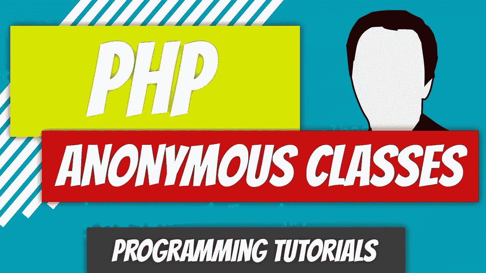

# PHP — P64:匿名类

> 原文：<https://blog.devgenius.io/php-p64-anonymous-classes-4d26c9e7281a?source=collection_archive---------10----------------------->



匿名类是没有名字的类。如果您一直在阅读本系列文章，那么这应该不是一个陌生的概念。回想一下匿名函数。

[](/php-7-x-p39-anonymous-functions-75f6f99fa571) [## PHP — P39:匿名函数

### 匿名函数是没有名字的函数。

blog.devgenius.io](/php-7-x-p39-anonymous-functions-75f6f99fa571) 

匿名类可以赋给变量，也可以作为参数传递。它们使用关键字 *Class* ，并用 *new* 关键字实例化。它们可以传递构造函数参数，从它们的父类继承，并实现接口。换句话说，他们可以做普通班级能做的一切事情。

*回顾*:回顾上一篇文章中的代码。

[](https://github.com/dinocajic/php-7-youtube-tutorials/tree/master/63%20ObjectArguments) [## PHP-YouTube-教程/63 对象参数

### PHP YouTube 教程的代码。为 dinocajic/PHP-YouTube-tutorials 开发做贡献，创建一个…

github.com](https://github.com/dinocajic/php-7-youtube-tutorials/tree/master/63%20ObjectArguments) 

最后，我们创建了下面的测试文件，并将不同的车辆传递给 Driver 类。

兰博基尼和法拉利类都是空类，是汽车类的延伸。

汽车类扩展了车辆类。法拉利和兰博基尼类都继承了汽车和车辆类的属性和方法。兰博基尼和法拉利类在上面的代码中被实例化，并被传递给驱动程序类。

考虑到兰博基尼和法拉利的类都是空白的，我们可以很容易地利用匿名类。以下语法用于生成匿名类。

```
$obj = new Class() { ... }
```

你实际上使用了 Class 关键字。我们不会在这里指定兰博基尼或者法拉利。没关系，匿名的。让我们来处理我们的$兰博基尼对象。

```
$lamborghini_diablo = new Lamborghini(1999, "Lamborghini", "Diablo");
```

我们传递了三个参数，所以我们的语法应该是这样的。

```
$obj = new Class($x, $y, $z) { ... }
```

我知道。直接进入更高级的领域。我们这样做是为了改变我们的例子。如果不是现在，很快就会有完美的感觉。

我们的兰博基尼类也扩展了 Car，所以我们也可以用我们的语法模仿它。

```
$obj = new Class($x, $y, $z) extends ClassName { ... }
```

现在我们已经有了语法，让我们看看如何替换$lamborghini_diablo 和$ferrari_f355 对象实例化。

再次运行代码将产生完全相同的结果。这看起来可能有点奇怪，因为我们将参数传递给了匿名类构造函数，但是请记住，这是传递给 Car 类构造函数的。匿名类没有构造函数，所以它只是在继承链上向上移动。Car 类接受三个必需的参数。

接下来，为什么我们需要将匿名类分配给$lamborghini_diablo 变量，然后将该变量传递给驱动程序构造函数？我们可以直接将匿名类传递给构造函数。

没什么区别。我们正在创建一个对象，并把它赋给一个变量。我们只是跳过变量赋值这一步，将匿名类作为参数发送。如果你仍然很难想象这一点，看看更简单的东西。

```
function add($a, $b) {
  return $a + $b;
}$a = 3;
$b = 5;echo add($a, $b);
```

为什么我们需要将 3 赋给$a，将 5 赋给$b。我们可以将它们作为参数传递给 *add* 函数。

```
function add($a, $b) {
  return $a + $b;
}echo add(3, 5);
```

类似的概念。

我知道当你在网上阅读匿名课程时，这似乎是一个超级复杂的主题。你可能会问自己，“就这样？”没错。就是这样。没有比我们刚才看到的更复杂的了。

让我们看最后一个例子来巩固这个概念。我们将在匿名类中创建一个方法，然后从驱动程序类中调用它。

我知道看起来很吓人，但真的不是。让我们浏览一下代码。

*   名为 *whatAmIDriving()* 的新方法被添加到驱动程序类中。无论*$ car->getdriverveicle()*方法返回什么，该方法都将回显。请记住，我们将为$car 属性分配一个对象，该$car 属性将可以访问所有的对象方法，包括这个名为*getdriverveicle()*的新方法。
*   一个新的驱动程序对象被实例化并被分配给变量$dino。
*   在驱动程序对象的实例化期间，匿名类被传递给驱动程序对象。
*   这个匿名类扩展了 Car 类并有一个方法。方法名为 *getDriverVehicle()* 。这可能会让一些人感到困惑。该方法引用$this- >年、$this- >制造和$this- >模型。记住我们正在扩展汽车类。
*   这个匿名类及其新方法被分配给$car 属性，我们可以调用$car 对象中的任何方法，包括我们新传递的*getdriverveicle()*方法。

从头到尾走几遍，就会明白了。如果你仍然需要帮助，请联系我，我会很乐意尝试不同的解释。

[](https://github.com/dinocajic/php-7-youtube-tutorials) [## dinocajic/PHP-YouTube-教程

### PHP YouTube 教程的代码。

github.com](https://github.com/dinocajic/php-7-youtube-tutorials) 

迪诺·卡伊奇目前是 [LSBio(生命周期生物科学公司)](https://www.lsbio.com/)、[绝对抗体](https://absoluteantibody.com/)、 [Kerafast](https://www.kerafast.com/) 、[珠穆朗玛生物](https://everestbiotech.com/)、[北欧 MUbio](https://www.nordicmubio.com/) 和 [Exalpha](https://www.exalpha.com/) 的 IT 主管。他还担任我的自动系统的首席执行官。他有十多年的软件工程经验。他拥有计算机科学学士学位，辅修生物学。他的背景包括创建企业级电子商务应用程序、执行基于研究的软件开发，以及通过写作促进知识的传播。

你可以在 [LinkedIn](https://www.linkedin.com/in/dinocajic/) 上联系他，在 [Instagram](https://instagram.com/think.dino) 上关注他，[订阅他的博客](https://www.dinocajic.com/)，或者[订阅他的媒体出版物](https://dinocajic.medium.com/subscribe)。

阅读 Dino Cajic(以及 Medium 上成千上万的其他作家)的每一个故事。你的会员费直接支持迪诺·卡吉克和你阅读的其他作家。你也可以在媒体上看到所有的故事。