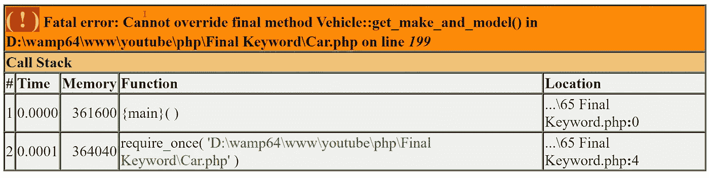
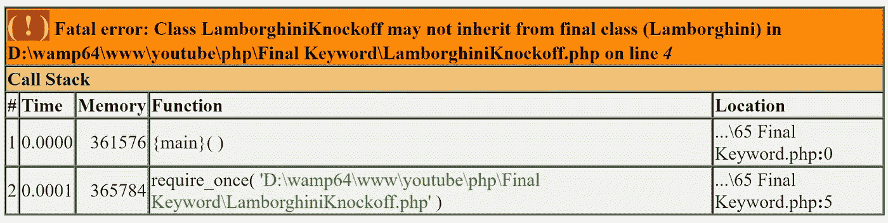

# PHP — P65:最终关键字

> 原文：<https://blog.devgenius.io/php-p65-final-keyword-420a51344e?source=collection_archive---------7----------------------->

final 关键字可以作为方法和类的前缀。如果在父类中给一个方法加前缀，并且子类从父类继承这些方法，final 关键字会阻止子类重写该方法。如果类本身以 final 为前缀，那么任何其他类都不能扩展该类。

*回顾*:回顾我们在上一篇文章中停止的地方。

 [## PHP-YouTube-教程/64 个匿名类

### PHP YouTube 教程的代码。为 dinocajic/PHP-YouTube-tutorials 开发做贡献，创建一个…

github.com](https://github.com/dinocajic/php-7-youtube-tutorials/tree/master/64%20Anonymous%20Classes)  [## PHP — P64:匿名类

### 匿名类是没有名字的类。它们使用关键字类，并用 new 关键字进行实例化。

blog.devgenius.io](/php-p64-anonymous-classes-4d26c9e7281a) 

*最终*关键词并不是一个复杂的概念。在介绍段落中，我们几乎涵盖了你需要知道的所有内容，但是让我们通过几个例子来看一下。

我们将关注的两个类是汽车和车辆。Vehicle 类有一个 *get_make_and_model()* 方法，该方法返回一个包含实例化对象的品牌和型号的字符串。

如您所见，它目前只显示品牌和型号，但我还想显示年份。我们可以在我们的车辆类中进行修改，或者在我们的汽车类中覆盖它。让我们在后面工作，并在 Car 类中覆盖它。*记住，我们的汽车类继承自汽车类。这就是为什么我们可以重写方法。*

使用与前面相同的示例，我们将创建一种特定类型的汽车，在本例中是一辆兰博基尼。

然后，我们将兰博基尼传递给驱动程序类。Driver 类有一个 *drive()* 方法，该方法从 Car 类调用 *turnOn()* 和*turnOn()*方法。正是这些方法调用了*get _ make _ and _ model()*helper 方法。他们现在将从自己的类中访问它，而不是从 Vehicle 类中访问，因为它存在于 Car 中。

如果你在逻辑上有困难，重新阅读以前的文章，你会看到我们是如何做到这一点的。实际上，您需要理解的是， *get_make_and_model()* 方法现在存在于 Car 类中，而 *turnOn()* 和*turnOn()*方法调用它。他们不再访问 Vehicle*get _ make _ and _ model()*方法，因为它被覆盖了。运行代码将产生预期的结果，即显示年份、品牌和型号。

完美。到目前为止，我们还没有触及 *final* 关键字。这只是一个回顾。如果您想了解更多关于重写方法的内容，请查看我关于该主题的文章。

 [## PHP — P56:方法覆盖

### PHP 面向对象的原则允许方法重载和方法覆盖。

blog.devgenius.io](/php-p56-method-overriding-6ae3784b42c9) 

如果我们不想让 *get_make_and_model()* 方法被覆盖怎么办？这很简单。只需在方法的[可见性修饰符](/php-p51-visibility-modifiers-b277591e7c0b)前添加关键字 *final* 。

如果我们再次运行我们的代码，我们会得到下面的错误。

它声明我们不能覆盖最终的方法 *Vehicle::get_make_and_model()，*，这正是我们所期望的。

那么，如果我们真的需要这一年，我们能做些什么呢？好吧，我们要么在车辆类中修改这个方法，要么在汽车类中创建一个完全不同的方法，比如*get _ year _ make _ and _ model()*。我们还必须修改调用 *get_make_and_model()* 方法的其他 Car 方法，以便它们现在调用*get _ year _ make _ and _ model()*方法。

太好了。到目前为止，我们已经看到了将 *final* 关键字添加到方法中，但是如果我们想要将 *final* 关键字添加到类本身中会怎么样呢？为了说明这个概念，让我们重新创建我们的兰博基尼类，并将其传递给驱动程序。在上一篇文章中，我们已经把它去掉了，因为我们关注的是匿名类。

为了简单起见，它只是一个扩展 Car 的空类。你可以假装它拥有兰博基尼的所有特征。

运行代码会产生预期的结果:打开兰博基尼，驱动它，然后关闭它。

现在，如果一些公司决定要仿制兰博基尼怎么办？他们想轻易地继承兰博基尼家族的一切，并将其推向市场。他们没有扩建汽车，而是扩建了兰博基尼。

你猜怎么着？它的工作原理和兰博基尼一模一样。公司成功了。兰博基尼如何保护自己？通过在类名前面包含 *final* 关键字。

这就自动打破了兰博基尼山寨类。

兰博基尼山寨版现在唯一能做的就是从汽车类本身继承，并尝试以一种更加困难的方式重新创建兰博基尼。

总之， *final* 关键字在一个方法前面意味着你不能覆盖那个方法，在一个类前面意味着你不能扩展那个类。

 [## dinocajic/PHP-7-YouTube-教程

### PHP 7.x YouTube 教程的代码。

github.com](https://github.com/dinocajic/php-7-youtube-tutorials) 

迪诺·卡伊奇目前是 [LSBio(生命周期生物科学公司)](https://www.lsbio.com/)、[绝对抗体](https://absoluteantibody.com/)、 [Kerafast](https://www.kerafast.com/) 、[珠穆朗玛生物](https://everestbiotech.com/)、[北欧 MUbio](https://www.nordicmubio.com/) 和 [Exalpha](https://www.exalpha.com/) 的 IT 主管。他还担任我的自动系统的首席执行官。他有十多年的软件工程经验。他拥有计算机科学学士学位，辅修生物学。他的背景包括创建企业级电子商务应用程序、执行基于研究的软件开发，以及通过写作促进知识的传播。

你可以在 [LinkedIn](https://www.linkedin.com/in/dinocajic/) 上联系他，在 [Instagram](https://instagram.com/think.dino) 上关注他，[订阅他的博客](https://www.dinocajic.com/)，或者[订阅他的媒体出版物](https://dinocajic.medium.com/subscribe)。

阅读 Dino Cajic(以及 Medium 上成千上万的其他作家)的每一个故事。你的会员费直接支持迪诺·卡吉克和你阅读的其他作家。你也可以在媒体上看到所有的故事。