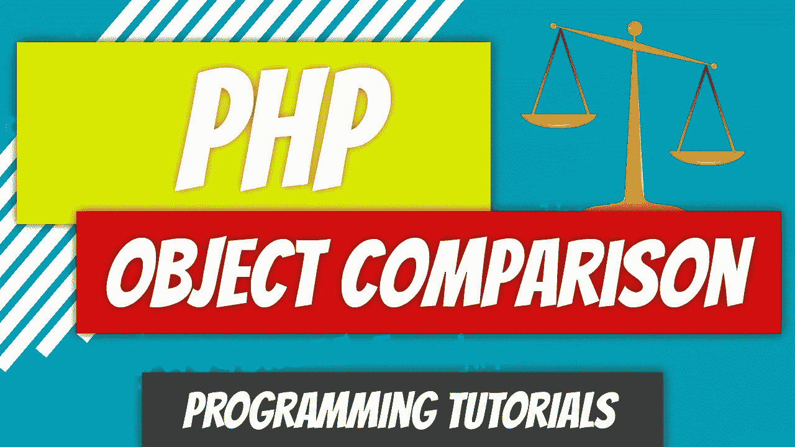

# PHP — P66:对象比较

> 原文：<https://blog.devgenius.io/php-p66-object-comparison-a2e84a8e3e13?source=collection_archive---------15----------------------->

PHP 允许你用比较和标识操作符来比较对象。当使用比较操作符时，PHP 检查两个对象是否有相同的属性和值，以及它们是否是同一个类的实例。使用 identity 操作符，可以检查对象变量是否指向同一个类的同一个实例。

*回顾*:回顾上一篇文章中的代码。

 [## php-youtube-tutorials/65 最终关键字

### PHP YouTube 教程的代码。为 dinocajic/PHP-YouTube-tutorials 开发做贡献，创建一个…

github.com](https://github.com/dinocajic/php-7-youtube-tutorials/tree/master/65%20Final%20Keyword)  [## PHP — P65:最终关键字

### final 关键字可以作为方法和类的前缀。如果在父类中给一个方法加前缀，而子类…

blog.devgenius.io](/php-p65-final-keyword-420a51344e) 

除了兰博基尼级别，我们还将重现曾经的法拉利级别。

这两个类都扩展了 Car 类。唯一的区别是他们的名字。现在是时候进行一些测试了。简明扼要。

我们将创建两个兰博基尼对象，*$兰博基尼 _1* 和*$兰博基尼 _2* 。它们将用完全相同的构造函数参数进行实例化。然后我们将创建*$兰博基尼 _3* ，并将其设置为等于*$兰博基尼 _2* 。让我们看看比较这三个对象时得到的结果。在这些测试中，我们将使用比较运算符(==)和标识运算符(===)。

*   *var _ dump($ Lamborghini _ 1 = = $ Lamborghini _ 1)*产生**真**。这是意料之中的，因为我们看到的是同一个物体。但是，接下来让我们看一下恒等运算符，看看我们是否得到相同的结果。
*   *var _ dump($ Lamborghini _ 1 = = = $ Lamborghini _ 1)*产生**真**。这是另一个预期的结果。这两个对象实际上是同一个对象，所以这当然是真的。
*   *var _ dump($ Lamborghini _ 1 = = $ Lamborghini _ 2)*产生**真**。毕竟，这两个对象都是使用相同的构造函数参数实例化的，所以理性会认为它们是相等的。但是它们是相同的吗？接下来让我们来看看。
*   *var _ dump($兰博基尼 _ 1 = = = $兰博基尼 _2 )* 产量**假**。这两个物体不一样，因为它们不是同一个物体。变量指向内存中的不同区域。
*   *var _ dump($兰博基尼 _ 2 = = = $兰博基尼 _3 )* 收益率**真**。这很有意思。它们有不同的变量名，但它们实际上指向内存中的同一个区域，使它们完全相同。当你把一个变量赋给另一个对象时，它不是在复制这个对象，它只是赋给这个对象的内存位置一个引用。这意味着如果你修改了 *$lamborghini_3* 对象中的一个属性，你也会修改 *$lamborghini_2* ，因为它们指向内存中的同一个对象。让我们看一个例子。

我们正在修改 *$lamborghini_3* 对象的年份，并使用 *var_dump* 来显示 *$lamborghini_2* 对象的年份。对于 *$lamborghini_2* ，结果应该是实例化的 1999 还是 1998？答案是 1998 年。记住，*$兰博基尼 _2* 和*$兰博基尼 _3* 都指向内存中的同一个对象。

让我们看另一个不同类的例子。我们将创建一个 Ferrari 对象，它的构造函数参数与我们的兰博基尼对象相同，看看我们能否欺骗 PHP 认为它是同一个类。

而我们得到的结果是……假的。PHP 足够聪明，知道这是两个不同的对象，尽管它们都扩展了 Car 类。类名不同，所以 PHP 眼中的对象也不同。

 [## dinocajic/PHP-YouTube-教程

### PHP YouTube 教程的代码。

github.com](https://github.com/dinocajic/php-7-youtube-tutorials) 

Dino Cajic 目前是 [LSBio(寿命生物科学公司)](https://www.lsbio.com/)、[绝对抗体](https://absoluteantibody.com/)、 [Kerafast](https://www.kerafast.com/) 、[珠穆朗玛生物](https://everestbiotech.com/)、[北欧 MUbio](https://www.nordicmubio.com/) 和 [Exalpha](https://www.exalpha.com/) 的 IT 负责人。他还担任我的自动系统的首席执行官。他有十多年的软件工程经验。他拥有计算机科学学士学位，辅修生物学。他的背景包括创建企业级电子商务应用程序、执行基于研究的软件开发，以及通过写作促进知识的传播。

你可以在 [LinkedIn](https://www.linkedin.com/in/dinocajic/) 上联系他，在 [Instagram](https://instagram.com/think.dino) 上关注他，[订阅他的博客](https://www.dinocajic.com/)，或者[订阅他的媒体出版物](https://dinocajic.medium.com/subscribe)。

阅读 Dino Cajic(以及 Medium 上成千上万的其他作家)的每一个故事。你的会员费直接支持迪诺·卡吉克和你阅读的其他作家。你也可以在媒体上看到所有的故事。