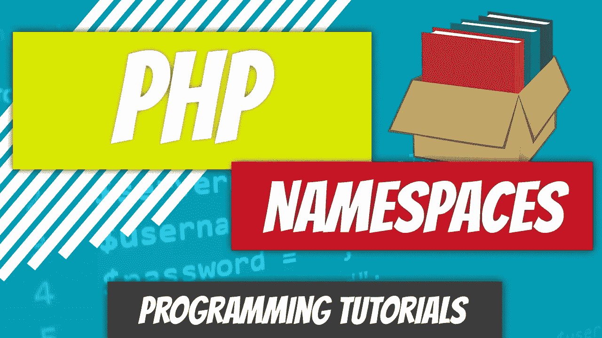

# PHP — P68:名称空间

> 原文：<https://blog.devgenius.io/php-p68-namespaces-1dd68050d73d?source=collection_archive---------8----------------------->

许多编程语言中都使用了名称空间。如果你熟悉 Java，你可能听说过术语包。包是 Java 中的一个名称空间。该软件包允许开发人员将相似的代码组合在一起。从最简单的意义上来说，包是一个文件夹或目录。

 [## PHP — P67:父构造函数

### 在过去的几个教程中，我们已经调用了父构造函数，但并没有深入讨论它的细节。如果…

blog.devgenius.io](/php-p67-parent-constructor-ec8e41b9a6a9) 

名称空间使程序员能够在不同的上下文中重用类名。从非编程角度看待名称空间最简单的方法是通过人们如何命名的约定。我的父母给我起名叫迪诺。

虽然世界上可能有成千上万个迪诺，但将我定义为我家族命名空间的一部分的是姓 Cajic。那么这如何转化为编程和 PHP 呢？

可以有两个同名的文件，但它们不能在同一个目录中。你为什么会关心这个？您可以避免将同名或同名的文件放在同一个目录中。

如果你在大型项目中使用第三方代码，很有可能会有一些命名冲突。这个怎么解决？你会为所有东西创建单独的目录并将文件放入这些目录中吗？

如果您的框架要求您将特定类型的代码放在特定的目录中，该怎么办？如果你正在自动加载你的类呢？名称空间通过虚拟目录解决了这个问题。你可以有两个文件，有完全相同的类名，但是有不同的虚拟目录，PHP 会分别对待它们。

在接下来的两篇文章中，我们将研究如何定义名称空间和子名称空间。

 [## dinocajic/PHP-YouTube-教程

### PHP YouTube 教程的代码。

github.com](https://github.com/dinocajic/php-7-youtube-tutorials) 

迪诺·卡伊奇目前是 [LSBio(生命周期生物科学公司)](https://www.lsbio.com/)、[绝对抗体](https://absoluteantibody.com/)、 [Kerafast](https://www.kerafast.com/) 、[珠穆朗玛生物](https://everestbiotech.com/)、[北欧 MUbio](https://www.nordicmubio.com/) 和 [Exalpha](https://www.exalpha.com/) 的 IT 主管。他还担任我的自动系统的首席执行官。他有十多年的软件工程经验。他拥有计算机科学学士学位，辅修生物学。他的背景包括创建企业级电子商务应用程序、执行基于研究的软件开发，以及通过写作促进知识的传播。

你可以在 [LinkedIn](https://www.linkedin.com/in/dinocajic/) 上联系他，在 [Instagram](https://instagram.com/think.dino) 上关注他，[订阅他的博客](https://www.dinocajic.com/)，或者[订阅他的媒体出版物](https://dinocajic.medium.com/subscribe)。

阅读 Dino Cajic(以及 Medium 上成千上万的其他作家)的每一个故事。你的会员费直接支持迪诺·卡吉克和你阅读的其他作家。你也可以在媒体上看到所有的故事。