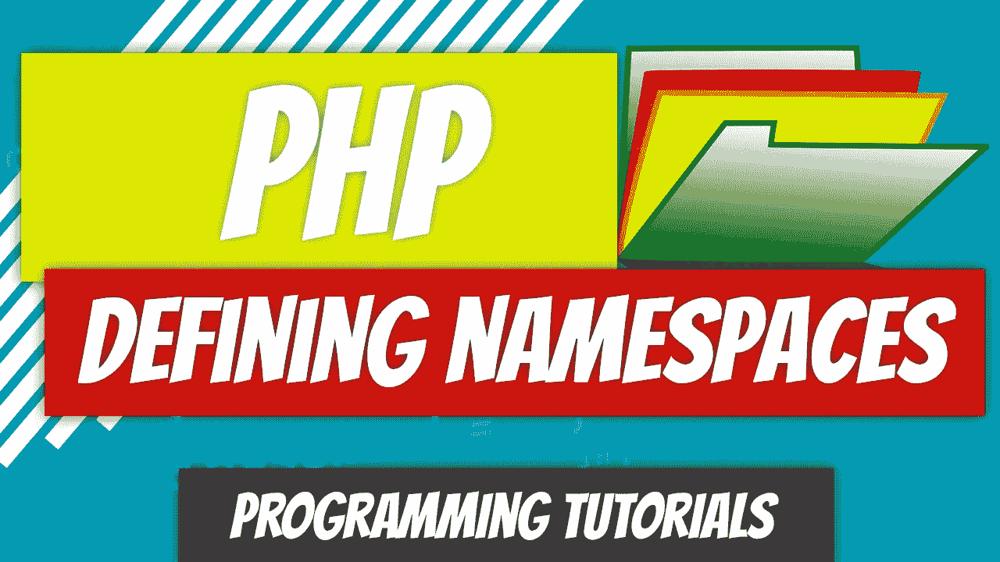
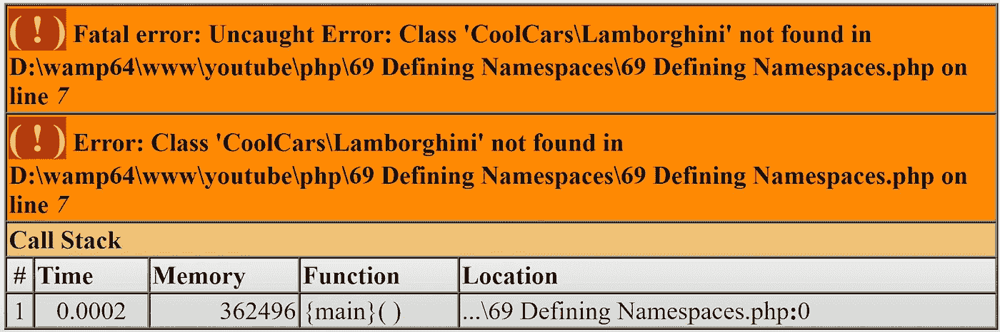

# PHP — P69:定义名称空间

> 原文：<https://blog.devgenius.io/php-p69-defining-namespaces-5a8e0a4bfdc0?source=collection_archive---------7----------------------->



定义名称空间非常简单。在文件的顶部，就在开始的 PHP 标签之后，使用 namespace 关键字，后面是您选择的虚拟目录。这个虚拟目录可以作为单个目录，也可以是几个子目录。我们还将看到使用 *use* 关键字。还记得 use 关键字吗？是的，它又回来了。

*回顾*:回顾之前的文章和代码。我们将在先前代码的基础上进行构建。

[](https://github.com/dinocajic/php-7-youtube-tutorials/tree/master/67%20Parent%20Constructor) [## php-youtube-tutorials/67 父构造函数

### PHP YouTube 教程的代码。为 dinocajic/PHP-YouTube-tutorials 开发做贡献，创建一个…

github.com](https://github.com/dinocajic/php-7-youtube-tutorials/tree/master/67%20Parent%20Constructor) [](/php-p67-parent-constructor-ec8e41b9a6a9) [## PHP — P67:父构造函数

### 在过去的几个教程中，我们已经调用了父构造函数，但并没有深入讨论它的细节。如果…

blog.devgenius.io](/php-p67-parent-constructor-ec8e41b9a6a9) 

让我们从创建测试文件开始。

代码打印出 1999 年的兰博基尼 Murcielago。

到目前为止，我们还没有定义任何名称空间。这种情况很快就会改变。如果你打开我们现有的任何代码，你会注意到任何地方都没有*名称空间*关键字，这意味着没有定义名称空间。如果是这样的话，*名称空间*关键字将位于开始的 *<之后。php* 标签。

定义名称空间非常简单。让我们为上面的测试代码做点什么吧。我将定义 CoolCars 名称空间。

真的就这么简单…而且我们已经破解了密码。我们的编辑自动行动起来，说兰博基尼类是未定义的。



果不其然，如果我们试图运行代码，我们会得到一个错误。但是发生了什么？我们定义了 CoolCars 名称空间，该文件中的代码属于该名称空间(虚拟目录)。

我们所有没有定义名称空间的其他文件从技术上来说都位于全局空间中。这就好像我们创建了一个名为 CoolCars 的子目录，其中包含了我们的测试文件，其他的都在这个目录之外。

当我们试图 *require_once("兰博基尼")*时，PHP 正在查看 CoolCars 虚拟目录的内部。因为兰博基尼当前位于全局命名空间内，所以它在那里找不到它。

有什么快速的方法可以解决这个问题？只需在兰博基尼类中添加一个反斜杠。它告诉 PHP 在全局目录中查找。

测试我们的代码得到了我们想要的结果:1999 兰博基尼 Murcielago。似乎是一种不太好的方式。还有别的办法吗？当然有。让我们将兰博基尼添加到 CoolCars 名称空间中。

我们又破译了密码。我想你知道接下来会发生什么。首先，我们可以将\附加在汽车前面要加长的地方。

```
class Lamborghini extends \Car
```

或者，我们可以将 Car 添加到 CoolCars 名称空间中。

我们还没完呢。Car 类扩展了 Vehicle 类，并使用了 Transmission 和 Engine 特征。它们都必须添加到同一个名称空间中。

既然所有的东西都在同一个名称空间中，如果我们刷新代码，PHP 不会抱怨，并且会显示所需的输出。

如果我们从测试代码中删除 CoolCars 名称空间会怎么样？我们的结构现在看起来像这样。

兰博基尼类与我们的测试代码不在同一个名称空间中。快速解决方法:在实例化过程中，在兰博基尼类的前面添加 CoolCars 名称空间。

还有一个办法。总有另一种方法。我们将利用我们的 *use* 关键字使它变得更简洁。在文件的顶部，我们可以说这个文件将使用 CoolCars \兰博基尼类。

它只是说这个文件将使用 CoolCars 名称空间中的兰博基尼类。这已经取代了我们在实例化期间的名称空间\类调用。我们现在可以像以前一样只使用我们的兰博基尼类。

这是一个很好的停止点。在下一篇文章中，我们将研究子名称空间。

[](https://github.com/dinocajic/php-7-youtube-tutorials) [## dinocajic/PHP-YouTube-教程

### PHP YouTube 教程的代码。

github.com](https://github.com/dinocajic/php-7-youtube-tutorials) 

Dino Cajic 目前是 [LSBio(寿命生物科学公司)](https://www.lsbio.com/)、[绝对抗体](https://absoluteantibody.com/)、 [Kerafast](https://www.kerafast.com/) 、 [Everest BioTech](https://everestbiotech.com/) 、 [Nordic MUbio](https://www.nordicmubio.com/) 和 [Exalpha](https://www.exalpha.com/) 的 IT 负责人。他还担任我的自动系统的首席执行官。他有十多年的软件工程经验。他拥有计算机科学学士学位，辅修生物学。他的背景包括创建企业级电子商务应用程序、执行基于研究的软件开发，以及通过写作促进知识的传播。

你可以在 [LinkedIn](https://www.linkedin.com/in/dinocajic/) 上联系他，在 [Instagram](https://instagram.com/think.dino) 上关注他，[订阅他的博客](https://www.dinocajic.com/)，或者[订阅他的媒体出版物](https://dinocajic.medium.com/subscribe)。

阅读 Dino Cajic(以及 Medium 上成千上万的其他作家)的每一个故事。你的会员费直接支持迪诺·卡吉克和你阅读的其他作家。你也可以在媒体上看到所有的故事。