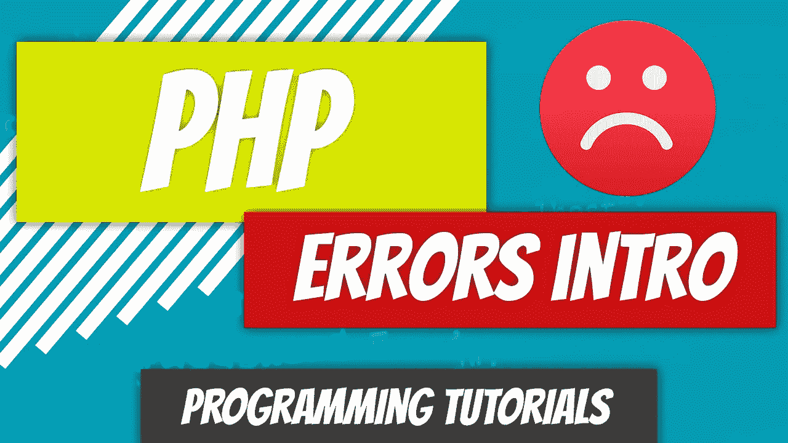

# PHP — P72:错误介绍

> 原文：<https://blog.devgenius.io/php-p72-errors-intro-83e7b58700d5?source=collection_archive---------17----------------------->

在我们开始研究如何处理 PHP 中的错误之前，我想先谈几个初学者容易混淆的话题。bug 通常是程序员编写的代码中的错误，它产生一个结果，而这个结果是不正确的。

例如，假设我们正在创建一个幂函数。如果我们向幂函数发送两个参数，比如 2 和 3，我们可能会期望幂函数将 2 提高到 3 的幂。如果您得到 8，则函数按预期执行。如果得到的不是 8，比如 23，那么这个函数就有一个 bug。

这种类型的错误被称为语义错误。代码通过了编译或解释，可以运行，但是产生了错误的结果。错误也可能是灾难性的，它会终止程序，就像忘记分号一样。这种错误称为语法错误。它不会通过编译或解释。

代码执行时可能会引发异常。例如，假设代码正在从数据库中检索一些数据。由于电源故障，托管代码的服务器失去了与数据库服务器的连接。代码没有问题。是停电了。因此抛出了一个异常。

这些异常可以被捕获和处理。这些异常不一定是像停电这样的灾难性事件。您可以指定函数必须只接受正整数值。如果传递的是负数，则会引发并处理异常。

在接下来的两篇文章中，我们将研究如何引发和处理异常。我知道我鼓吹 MVP 模型，但是错误处理会让你的生活更轻松。我将在日志文件中抛出错误，但是为了抛出错误，我们首先必须知道如何生成这些错误。

 [## dinocajic/PHP-YouTube-教程

### PHP YouTube 教程的代码。

github.com](https://github.com/dinocajic/php-7-youtube-tutorials) 

迪诺·卡伊奇目前是 [LSBio(生命周期生物科学公司)](https://www.lsbio.com/)、[绝对抗体](https://absoluteantibody.com/)、 [Kerafast](https://www.kerafast.com/) 、[珠穆朗玛生物](https://everestbiotech.com/)、[北欧 MUbio](https://www.nordicmubio.com/) 和 [Exalpha](https://www.exalpha.com/) 的 IT 主管。他还担任我的自动系统的首席执行官。他有十多年的软件工程经验。他拥有计算机科学学士学位，辅修生物学。他的背景包括创建企业级电子商务应用程序、执行基于研究的软件开发，以及通过写作促进知识的传播。

你可以在 [LinkedIn](https://www.linkedin.com/in/dinocajic/) 上联系他，在 [Instagram](https://instagram.com/think.dino) 上关注他，[访问他的博客](https://www.dinocajic.com/)，或者[订阅他的媒体出版物](https://dinocajic.medium.com/subscribe)。

阅读 Dino Cajic(以及 Medium 上成千上万的其他作家)的每一个故事。你的会员费直接支持迪诺·卡吉克和你阅读的其他作家。你也可以在媒体上看到所有的故事。