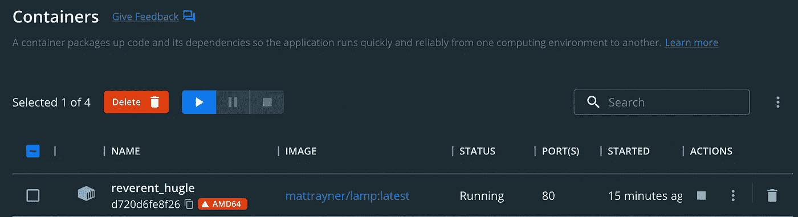

# PHP — P77:文件上传基础

> 原文：<https://blog.devgenius.io/php-p77-basics-of-file-uploading-ba377da3d072?source=collection_archive---------14----------------------->


PHP 初学者最容易误解的话题之一。有人如何上传文件？当你点击上传时会发生什么？它通向哪里？让我们揭开这个过程的神秘面纱，用 PHP 处理文件。比你想象的简单。

# 配置

如果您使用代码示例附带的 docker 容器，那么首先需要做一件事，那就是更改权限。我们在这里要做的事情并不建议在您的生产服务器上使用，但是它确实为我们提供了一种快速简单的方法来上传文件。

[](https://github.com/dinocajic/php-youtube-tutorials) [## GitHub-dinocajic/PHP-YouTube-tutorials:PHP YouTube 教程的代码

### PHP YouTube 教程的代码确保你已经安装了 Docker。克隆回购。运行以下命令…

github.com](https://github.com/dinocajic/php-youtube-tutorials) 

像平常一样运行 docker 命令来启动 docker 容器。

```
docker run -i -t -p "80:80" -v ${PWD}/app:/app -v ${PWD}/mysql:/var/lib/mysql mattrayner/lamp:latest
```

打开 Docker Dashboard 并点击您刚刚启动的 Docker 容器。



单击 CLI 按钮打开终端。


导航到`var/www`文件夹:`cd var/www`

执行`chmod`功能:`chmod -R 777 html`

现在，您可以将文件上传到该目录。

# HTML 表单

是时候创建我们的表单了。这是用户将与之交互的表单。您已经看到了文件选择器按钮，它允许用户选择一个文件，然后单击上传按钮来处理上传。

表单本身有几个需要分析的地方。

*   有一种新型的`input type`，那就是`file`。谁能想到呢。这就是给我们的按钮，当点击时，允许我们浏览我们的计算机上的文件。


*   `method`仍然设置为`post`，我们将创建一个`upload.php`文件来处理我们的文件上传。
*   另外增加的是`enctype=”multipart/form-data”`。这告诉 PHP 我们将要上传文件。如果省略`enctype`，文件上传将无法进行。

到目前为止很简单。接下来让我们创建我们的`upload.php`文件，这将允许文件被上传。

# 正在处理文件上传

如果您还记得我们以前的文章，我们提到过`$_FILES`预定义变量。让我们通过将内容转储到我们的`uploads.php` 文件中来看看当我们单击 submit 时它包含了什么。

```
var_dump($_FILES);**array** *(size=1)*
  'file_name' => 
    **array** *(size=5)*
      'name' => string '75-Get-vs-Post.jpg' *(length=18)*
      'type' => string 'image/jpeg' *(length=10)*
      'tmp_name' => string '/tmp/phpFMpvdR' *(length=14)*
      'error' => int 0
      'size' => int 133821
```

点击提交后，我们看到`$_FILES`只是一个数据数组。它用我们的`input name="file_name"`创建了一个名为`file_name`的密钥。该键获得一个数据数组:`name, type, tmp_name, error, size`。所以如果你`echo $_FILES['file_name']['name']`你就会得到`75-Get-vs-Post.jpg`。

*   `name`给出了您刚刚上传的文件的原始名称。
*   `type`给出了文件类型。在这种情况下，我上传了一个图像，所以它知道这是一个图像，并存储其类型。
*   `tmp_name`是人们迷路的地方。我的文件放在哪里？嗯，在这种情况下，它进入`/tmp`目录。它还会获得一个随机的临时名称`phpFMpvdR`。这很重要，因为我们以后必须将这个文件移动到一个可访问的目录中。
*   `error`将返回一个布尔值:如果没有错误，返回`0`，如果有错误，返回`1`。
*   `size`给出图像的大小。这是`bytes`中的尺寸。

我们已经有了上传文件所需的所有数据。我们可以用一行代码做到这一点，但是为了可读性，我们将它分成 3 行代码。

我们有一个临时文件位置。我们需要将它移动到我们当前的目录中，并希望它与我们原来的文件名完全相同。我们使用`move_uploaded_file`函数将文件从临时位置移动到当前目录。去你的目录，你会在那里看到它。

如果我们想把它移到像`uploads/`这样的子目录中呢？我们只需要创建目录并把它附加到我们的`target_file`名中。

和成功。我们的文件现在被上传到我们的`uploads`子目录中。

```
var/
   www/
      html/
         76-file-uploads/
            index.html
            upload.php
            uploads/
                some-image.jpg
```

# 摘要

说到上传文件就是这样。其他一切都只是错误处理和验证。例如，当文件太大时会发生什么？如何限制用户只能上传 PDF？接下来我们将看看更高级的表单处理。你不应该让你的文件处理暴露在外。

[](https://github.com/dinocajic/php-youtube-tutorials) [## GitHub-dinocajic/PHP-YouTube-tutorials:PHP YouTube 教程的代码

### PHP YouTube 教程的代码确保你已经安装了 Docker。克隆回购。运行以下命令…

github.com](https://github.com/dinocajic/php-youtube-tutorials) 

迪诺·卡伊奇目前是 [LSBio(生命周期生物科学公司)](https://www.lsbio.com/)、[绝对抗体](https://absoluteantibody.com/)、 [Kerafast](https://www.kerafast.com/) 、[珠穆朗玛生物](https://everestbiotech.com/)、[北欧 MUbio](https://www.nordicmubio.com/) 和 [Exalpha](https://www.exalpha.com/) 的 IT 主管。他还担任我的自动系统的首席执行官。他有十多年的软件工程经验。他拥有计算机科学学士学位，辅修生物学。他的背景包括创建企业级电子商务应用程序、执行基于研究的软件开发，以及通过写作促进知识的传播。

你可以在 [LinkedIn](https://www.linkedin.com/in/dinocajic/) 上联系他，在 [Instagram](https://instagram.com/think.dino) 上关注他，或者[订阅他的媒体出版物](https://dinocajic.medium.com/subscribe)。

[*阅读迪诺·卡吉克(以及媒体上成千上万其他作家)的每一个故事。你的会员费直接支持迪诺·卡吉克和你阅读的其他作家。你也可以在媒体上看到所有的故事。*](https://dinocajic.medium.com/membership)