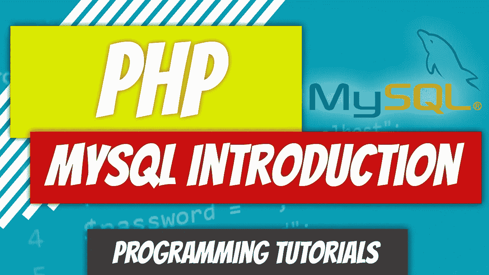
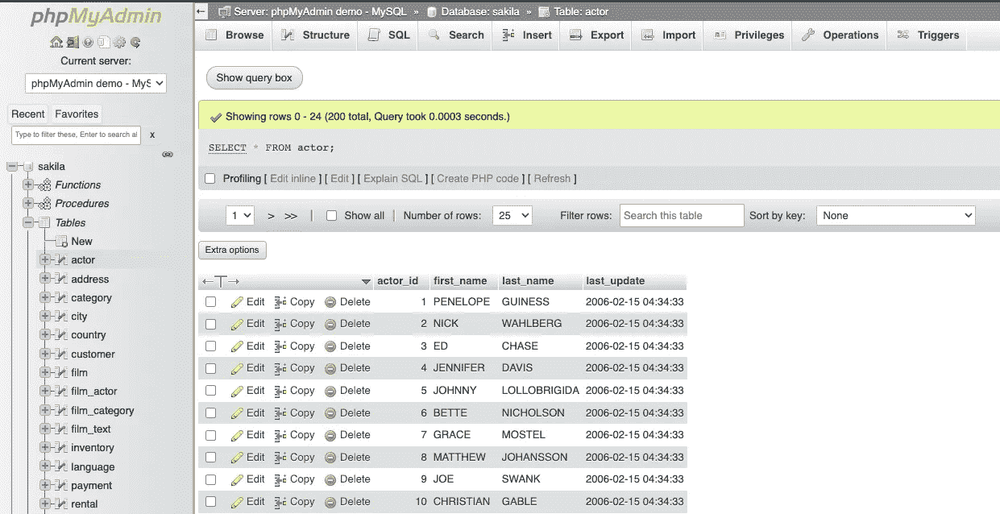

# PHP — P82: MySQL 简介

> 原文：<https://blog.devgenius.io/php-p82-mysql-introduction-8153280e16a8?source=collection_archive---------14----------------------->

在大多数编程语言中，当你到达某一点时，你会问自己，“我如何保存数据？”我考虑是否接下来处理会话和 cookies，但是意识到在进入这些主题之前先处理数据持久性更有意义。

# 什么是 MySQL？

它是一个运行在服务器上的 Oracle 分布式数据库系统。它使用 SQL 语法，并与 PHP 结合在一起，学习一个而不学习另一个并不常见。

如果您是编程新手，并且一直在关注本系列，那么您无疑会问自己，“我是否只是硬编码所有内容”以及“用户提交的数据是否以某种方式集成到代码中？”我们去过那里。下一个逻辑进展是“数据必须存储在 CSV 文件中。我们可以抓取 CSV 文件来提取数据。”最后，你意识到有一个数据库。

数据库由表组成，每个表都有列和行。简单地说，把数据库想象成一个 Excel 工作簿。工作簿中的每个工作表代表一个表。当您查看工作表时，您会看到列标题，如 first_name，在该列标题下是包含个人名字的行。我有目的地尽量不在 Excel 中使用术语“表格”，但它确实是这么叫的。当你格式化它时，你点击“格式化表格”您的表格有标题和数据行。这是你应该充分接触的东西。

您可以使用 phpMyAdmin 之类的应用程序，这些应用程序允许您直观地查看数据库。它确实看起来像一个 Excel 数据表。

# SQL 语法

MySQL 数据库使用 SQL 语法来:

*   将数据插入表格
*   从表中读取数据
*   更新表中的数据
*   从表中删除数据

我们将深入研究如何做到这一点，但是一个简单的方法是:`SELECT * FROM table;`其中`table`是某个特定表的名称。这个特定的实例将返回表中的所有行。

如果你很难理解 SQL，那么在你的头脑中一定要有一个 Excel 表格的图像。例如，让我们看看如何在 excel 表格中执行这些操作。

*   将数据插入表中:打开 excel 表，转到表的底部，添加必需的字段。
*   从表中读取数据:打开 excel 表，开始从表中读取数据。
*   更新表格中的数据:打开 excel 表，在表格中找到要编辑的条目，并对必填字段进行更改。
*   从表中删除数据:打开 excel 表，找到要删除的行，右键单击行号，然后单击“删除行”

我希望你能看到一种模式的出现。这些步骤有一个算法方法。例如，假设我们想读取`authors`表的内容。

*   打开 excel 表:建立与数据库的连接。接下来我们将看看如何以编程方式连接到数据库。
*   开始从`authors`表中读取数据:执行命令`SELECT * FROM authors;`从`authors`表中获取完整的数据列表供您查看。

# 后续步骤

在接下来的几篇文章中，我们将学习如何以编程方式连接到数据库，创建我们自己的数据库和表，对这些表执行操作，并以某种安全性结束，因为这是您将面临的最常被利用的攻击之一。我们还将了解“规范化”数据，这意味着将数据分散到多个表中，以便节省空间和提高可维护性。

Dino Cajic 目前是 [Absolute Biotech](http://absolutebiotech.com/) 的 IT 主管，该公司是 [LSBio(寿命生物科学公司)](https://www.lsbio.com/)、 [Absolute 抗体](https://absoluteantibody.com/)、 [Kerafast](https://www.kerafast.com/) 、 [Everest BioTech](https://everestbiotech.com/) 、 [Nordic MUbio](https://www.nordicmubio.com/) 和 [Exalpha](https://www.exalpha.com/) 的母公司。他还担任我的自动系统的首席执行官。他拥有计算机科学学士学位，辅修生物学，并拥有十多年的软件工程经验。他的背景包括创建企业级电子商务应用程序、执行基于研究的软件开发，以及通过写作促进知识的传播。

你可以在 [LinkedIn](https://www.linkedin.com/in/dinocajic/) 上联系他，在 [Instagram](https://instagram.com/think.dino) 上关注他，或者[订阅他的媒体出版物](https://dinocajic.medium.com/subscribe)。

阅读 Dino Cajic(以及 Medium 上成千上万的其他作家)的每一个故事。你的会员费直接支持迪诺·卡吉克和你阅读的其他作家。你也可以在媒体上看到所有的故事。