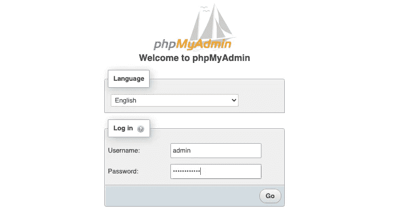
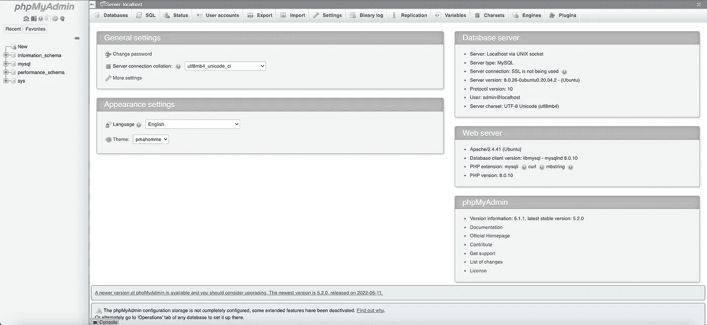
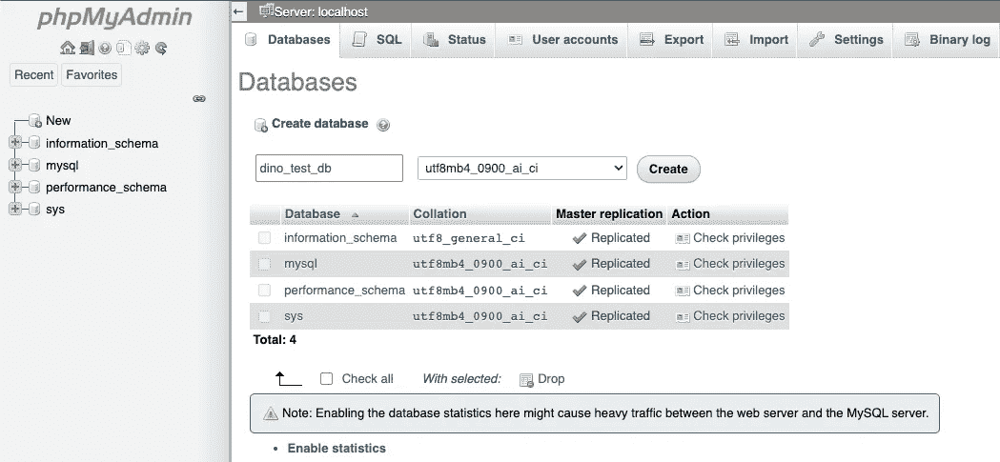
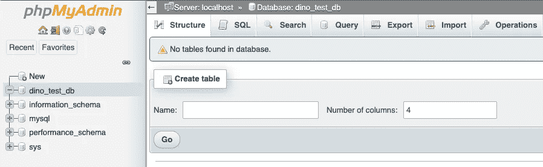
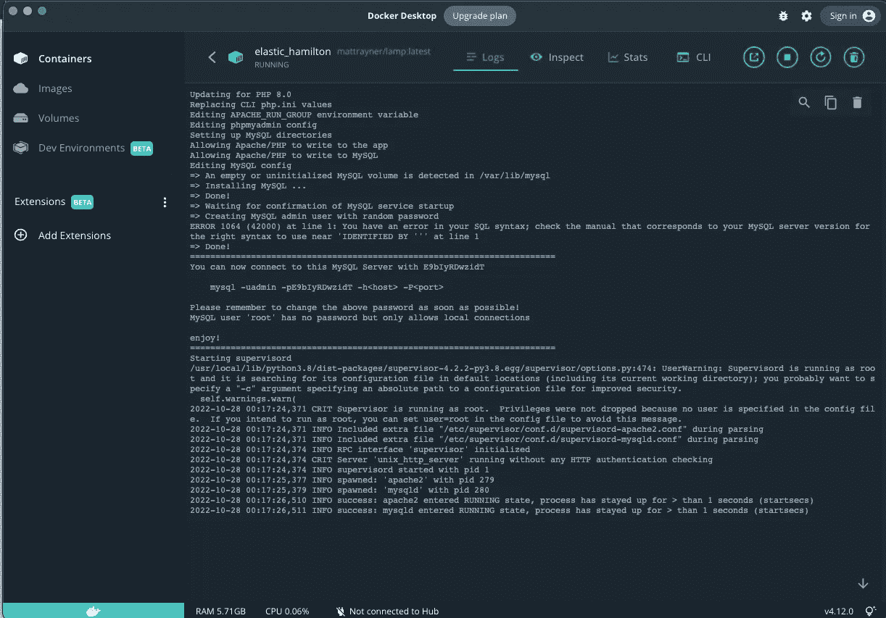
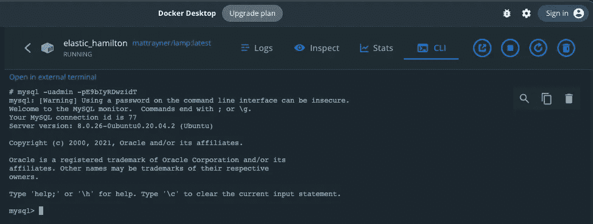

# PHP — P83: MySQL 数据库连接

> 原文：<https://blog.devgenius.io/php-p83-mysql-db-connection-8a34c4056863?source=collection_archive---------5----------------------->


读取或插入数据的第一步是建立与服务器/数据库的连接。这是一个相当简单的过程，不会改变。步骤总是一样的。一旦你连接到它，你就可以每次都重复使用代码。您唯一需要修改的是您的服务器、用户名、密码和数据库名称。

# 创建数据库

我假设你正在跟随这个系列。我们有一个 Docker 容器，这个容器有传统的 LAMP 设置(Linux、Apache、MySQL 和 PHP)。它还附带了 phpMyAdmin

当您第一次运行 docker 容器时，它会为您生成一个用户名和密码。

```
docker run -i -t -p "80:80" -v ${PWD}/app:/app -v ${PWD}/mysql:/var/lib/mysql mattrayner/lamp:latest
```

您应该看到类似这样的带有您自己的唯一密码的内容。

```
====================================================================
You can now connect to this MySQL Server with OOwfvsr2soGWmysql -uadmin -pE9bIyRDwzidT -h<host> -P<port>Please remember to change the above password as soon as possible!
MySQL user 'root' has no password but only allows local connectionsenjoy!
```

这将是我们可以用来访问 phpMyAdmin 的用户名/密码。

*   `admin`
*   `E9bIyRDwzidT`

如果你看不到它，很可能是因为你以前做过，并且你的目录中已经有一个`mysql`文件夹。删除`mysql`目录，再次运行 docker 命令。**记住，这只是针对测试环境。如果您正在生产环境中工作，请不要删除任何内容。我强烈建议您不要在生产环境中进行实验。**

## 通过 phpMyAdmin 创建数据库

转到您的本地主机 phpMyAdmin 安装。对我来说，它是`http://0.0.0.0/phpmyadmin`。



输入您的凭据，然后单击“开始”。您将进入 phpMyAdmin 主站点。



点击`Databases`选项卡，输入数据库名称。我进入了`dino_test_db`。点击`Create`按钮创建数据库。



您将被重定向到您的数据库，在那里您可以开始添加表。在本教程中，我们不会这样做。



## 通过服务器创建数据库

如果您没有 phpMyAdmin 的访问权限，您可以登录到您的容器并执行一个脚本。你已经被提供如何做这件事。首先，访问 Docker 并点击你的容器。



接下来，复制到 mysql 脚本的连接。对我来说是:

```
mysql -uadmin -pE9bIyRDwzidT
```

单击 CLI 选项卡并粘贴脚本。



您已连接到 MySQL 服务器。要查看您目前拥有哪些数据库，请键入:`show databases;`

```
mysql> show databases;
+--------------------+
| Database           |
+--------------------+
| dino_test_db       |
| information_schema |
| mysql              |
| performance_schema |
| sys                |
+--------------------+
5 rows in set (0.00 sec)mysql>
```

这是我们刚刚通过 phpMyAdmin 创建的数据库。要创建新的数据库，请键入:`create database dino_test_db_2;`

```
mysql> create database dino_test_db_2;
Query OK, 1 row affected (0.00 sec)mysql> show databases;
+--------------------+
| Database           |
+--------------------+
| dino_test_db       |
| dino_test_db_2     |
| information_schema |
| mysql              |
| performance_schema |
| sys                |
+--------------------+
6 rows in set (0.00 sec)mysql>
```

就是这样。您已经创建了一个没有 phpMyAdmin 的数据库。

## 通过 PHP 脚本创建数据库

是的。还有另一种方法可以做到这一点。我不建议你经常这么做，因为你可能会忘记删除脚本。但绝对管用。

我们只是像之前一样运行`CREATE DATABASE db_name`脚本。我们将它传递给`query`方法。如果查询正确执行，它将返回`true`。数据库创建成功。

不要被我们刚刚讲述的内容弄得不知所措。我们刚刚讨论了三种不同的方法来做同样的事情:创建数据库。

# 连接到服务器

是时候连接到您的服务器了。我们将用面向对象的方法来做这件事。也有一个过程化的方法，但是我们知道 OOP PHP，所以我们就这样做。在连接到数据库之前，您需要这样做。

我们将使用`mysqli`类来创建`$connection`对象。`mysqli`构造函数期望在实例化时有 3 个参数传递给它。

*   服务器名称。在大多数情况下，如果你的 MySQL 数据库在同一个服务器上，这将是`localhost`。
*   用户名。我们知道这是`admin`。
*   密码。我们也知道密码是什么:`E9bIyRDwzidT`。

仅此而已。您将检查`$connection->connect_error`属性是否有任何连接错误。如果有一个错误，你杀死脚本。如果没有错误，您应该会得到一条`Connection established successfully`消息。

# 连接到数据库

现在我们已经创建了一个数据库，我们可以连接到它。我们只需要稍微修改一下我们的脚本。

`mysqli`构造函数也可以接受数据库名。我们会把它作为最后一个论点。运行代码，您会看到您将得到`Connection established successfully`消息。

这就是全部了。


Dino Cajic 目前是 [Absolute Biotech](http://absolutebiotech.com/) 的 IT 负责人，该公司是 [LSBio(寿命生物科学公司)](https://www.lsbio.com/)、 [Absolute 抗体](https://absoluteantibody.com/)、 [Kerafast](https://www.kerafast.com/) 、 [Everest BioTech](https://everestbiotech.com/) 、 [Nordic MUbio](https://www.nordicmubio.com/) 和 [Exalpha](https://www.exalpha.com/) 的母公司。他还担任我的自动系统的首席执行官。他拥有计算机科学学士学位，辅修生物学，并拥有十多年的软件工程经验。他的背景包括创建企业级电子商务应用程序、执行基于研究的软件开发，以及通过写作促进知识的传播。

你可以在 [LinkedIn](https://www.linkedin.com/in/dinocajic/) 上联系他，在 [Instagram](https://instagram.com/think.dino) 上关注他，或者[订阅他的媒体出版物](https://dinocajic.medium.com/subscribe)。

阅读 Dino Cajic(以及 Medium 上成千上万的其他作家)的每一个故事。你的会员费直接支持迪诺·卡吉克和你阅读的其他作家。你也可以在媒体上看到所有的故事。