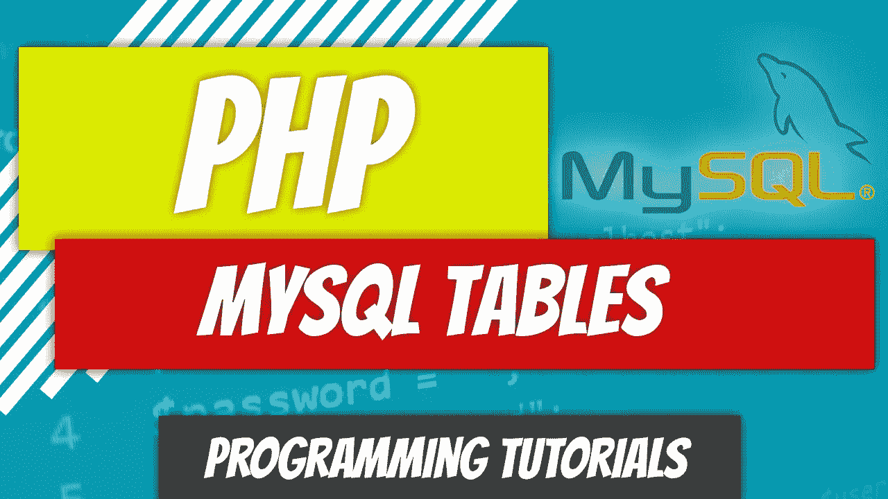
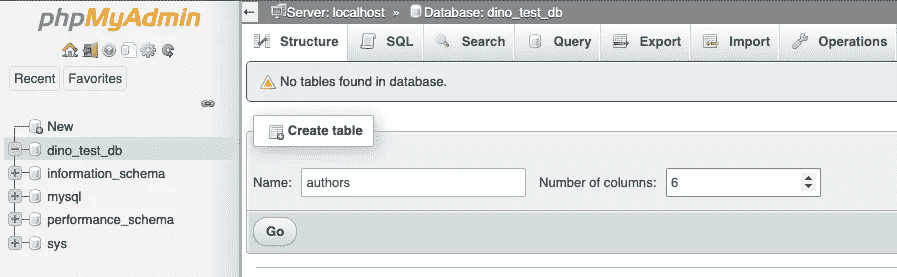
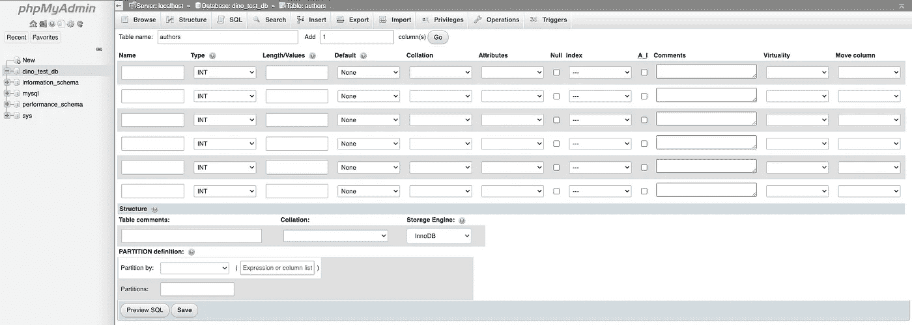
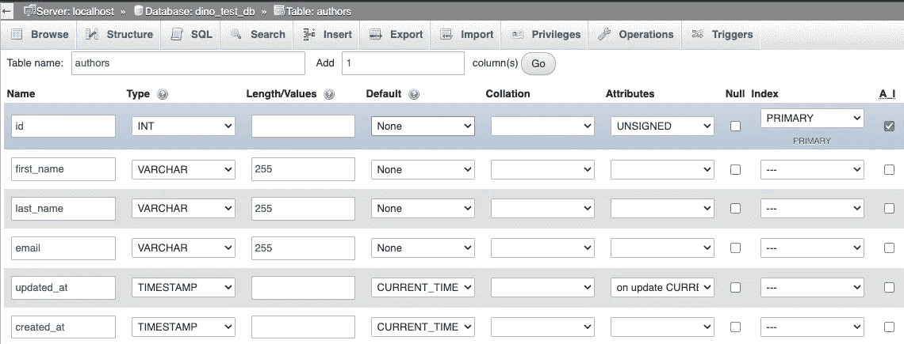
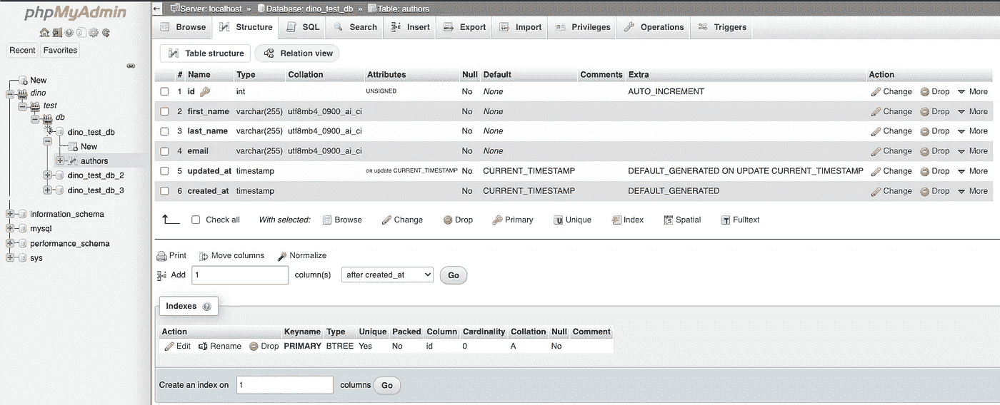
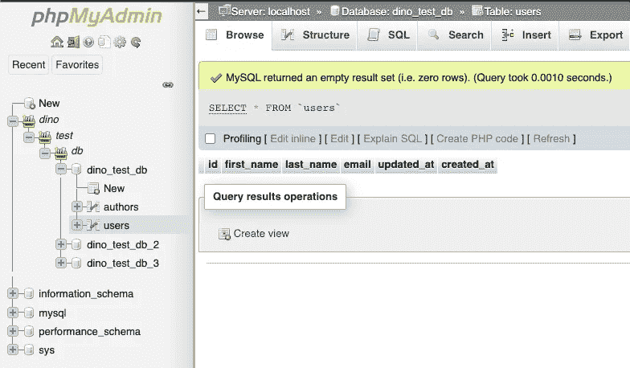

# PHP — P84: MySQL 表格

> 原文：<https://blog.devgenius.io/php-p84-mysql-tables-83b203d28ff7?source=collection_archive---------6----------------------->



在上一篇文章中，我们介绍了如何创建一个数据库并建立到它的连接。现在是时候更深入一步了。是时候创建一些表了。如果您还记得前面的类比，可以将数据库视为 Excel 工作簿，将表格视为工作簿中的工作表。

[](/php-p83-mysql-db-connection-8a34c4056863) [## PHP — P83: MySQL 数据库连接

### 读取或插入数据的第一步是建立与服务器/数据库的连接。这是一个相当…

blog.devgenius.io](/php-p83-mysql-db-connection-8a34c4056863) 

桌子既是艺术又是科学。架构师必须决定在不损失可读性的情况下，他们希望数据库规范化到什么程度。我们将在本文中介绍表的基础知识，并将在下一篇文章中介绍数据规范化。

# 创建您的第一个表格

我们将从 phpMyAdmin 方法开始。访问 phpMyAdmin。对我来说是`[http://0.0.0.0/phpmyadmin](http://0.0.0.0/phpmyadmin.)`。选择数据库并创建表。我们将创建的第一个表将存储图书作者信息。我们将该表命名为`authors`。它是复数，因为它将容纳多个作者。我们想要存储作者的名字、姓氏和电子邮件地址。我们还将存储一个惟一的标识符，叫做`id`。我们为什么需要这个？想象一下，如果人们没有社会安全号码。国税局不会知道哪个约翰·史密斯刚刚提交了他们的税款。顺便说一句，这可能不是个坏主意。`id`对每个人都是独一无二的。因此，如果在`authors`表中有 100 个约翰·史密斯的作者，我们将知道哪个是哪个。

大多数表格都有标准的`updated_at`和`created_at`字段。这些时间戳显示作者的创建时间和条目的最后更新时间。如果我们更改某个作者的姓氏，`created_at`字段将保持不变，但`updated_at`字段将被修改。

我们需要 6 个字段来存储:

*   `id`
*   `first_name`
*   `last_name`
*   `email`
*   `updated_at`
*   `created_at`



你会看到大量的信息需要填写。这是有一些标准化的，但是如何选择填写完全取决于你自己。您需要理解现有的数据类型。例如，如果您选择`INT`作为`first_name`字段的数据类型，您将无法存储除整数值之外的任何数据。所以这不是一个好的数据类型。一个`VARCHAR`会比`first_name`好得多。



目前，让我们像这样填写这些字段。



`id`字段是:

*   一个`INT`数据类型意味着它将是一个整数，这就是我们想要的。
*   因为在这个例子中我们不想要负的整数值。
*   因为我们希望它成为我们的主键。我们稍后将讨论主键和外键，但是主键必须是唯一的。我们不能有两个相同的整数值。
*   `A.I.`或自动增量。我们希望在插入新记录时自动给 ID 加 1。如果第一条记录是 1，那么下一条记录将是 2。

`first_name`、`last_name`和`email`字段是:

*   `VARCHAR`数据类型
*   最大字符长度为`255`个字符

`updated_at`字段是:

*   一个`TIMESTAMP`，其格式如下:`YYYY-MM-DD HH:MM:SS`。时间戳示例如下:`2022–01–01 00:00:01`
*   它的缺省值被设置为`CURRENT_TIMESTAMP`，这意味着当你向数据库中添加 a 记录时，它会自动插入时间戳。
*   它还具有`on update CURRENT_TIMESTAMP`属性。这只是说明每次记录被更新时，就像电子邮件被更改一样，时间戳也会被更新。

除了`on update CURRENT_TIMESTAMP`之外，`created_at`字段与`updated_at`字段完全相同。更新这个字段的时间戳是没有意义的，因为我们只想知道这个记录实际上是什么时候创建的。

点击底部的`Save`按钮创建新的表格。



您可以通过单击 insert 按钮从 phpMyAdmin 自动插入数据。键入名字、姓氏和电子邮件来添加数据。就这么简单。但是，我们希望通过编程来实现这一点，我们将在下一篇文章中介绍。

# 以编程方式创建表

你知道我们会到这里的。让我们通过 PHP 创建一个表。在上一篇文章中，我们以编程方式创建了一个数据库。我们可以很容易地用桌子达到同样的目的。

让我们创建一个名为`users`的新表，它与我们的`authors`表、`first_name`、`last_name`、`email`具有相同的字段。

```
CREATE TABLE users (
    id INT(11) UNSIGNED AUTO_INCREMENT PRIMARY KEY,
    first_name VARCHAR(255),
    last_name VARCHAR(255),
    email VARCHAR(50),
    updated_at TIMESTAMP DEFAULT CURRENT_TIMESTAMP 
               ON UPDATE CURRENT_TIMESTAMP,
    created_at TIMESTAMP DEFAULT CURRENT_TIMESTAMP
)
```

我们创建 SQL 脚本，并将其传递给实例化的`mysqli`对象中的`query`方法。如果一切正常，并且确实如此，它就创建了这个表。您可以通过重新访问 phpMyAdmin 并看一看来验证它是否是创建的。



它就在那里。暂时就这样了。下次我们真正开始向这些表添加数据时再见。您将希望熟悉 MySQL 中的各种数据类型。您可以在此获得完整列表:

 [## MySQL :: MySQL 8.0 参考手册::11 种数据类型

### MySQL 支持几种类型的 SQL 数据类型:数字类型、日期和时间类型、字符串(字符和字节)…

dev.mysql.com](https://dev.mysql.com/doc/refman/8.0/en/data-types.html) [](https://github.com/dinocajic/php-youtube-tutorials) [## GitHub-dinocajic/PHP-YouTube-tutorials:PHP YouTube 教程的代码

### PHP YouTube 教程的代码确保你已经安装了 Docker。克隆回购。运行以下命令…

github.com](https://github.com/dinocajic/php-youtube-tutorials) 

Dino Cajic 目前是 [Absolute Biotech](http://absolutebiotech.com/) 的 IT 主管，该公司是 [LSBio(寿命生物科学公司)](https://www.lsbio.com/)、 [Absolute 抗体](https://absoluteantibody.com/)、 [Kerafast](https://www.kerafast.com/) 、 [Everest BioTech](https://everestbiotech.com/) 、 [Nordic MUbio](https://www.nordicmubio.com/) 和 [Exalpha](https://www.exalpha.com/) 的母公司。他还是 [MyAutoSystem](https://myautosystem.com/) 的首席执行官。他拥有计算机科学学士学位，辅修生物学，并拥有十多年的软件工程经验。他的背景包括创建企业级电子商务应用程序、执行基于研究的软件开发，以及通过写作促进知识的传播。

你可以在 [LinkedIn](https://www.linkedin.com/in/dinocajic/) 上联系他，在 [Instagram](https://instagram.com/think.dino) 上关注他，或者[订阅他的媒体出版物](https://dinocajic.medium.com/subscribe)。

阅读迪诺·卡吉克(以及媒体上成千上万的其他作家)的每一个故事。你的会员费直接支持迪诺·卡吉克和你阅读的其他作家。你也可以在媒体上看到所有的故事。