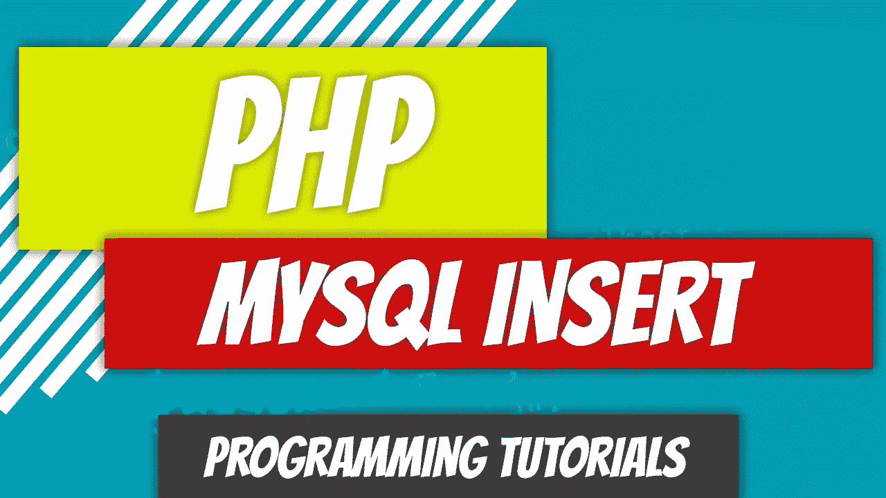
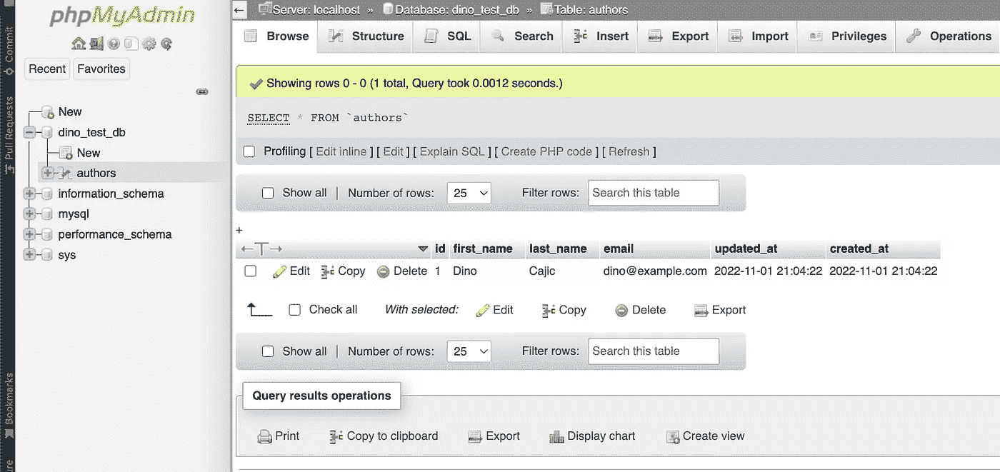

# PHP — P85: MySQL Insert

> 原文：<https://blog.devgenius.io/php-p85-mysql-insert-51a9e3bfedd3?source=collection_archive---------12----------------------->



我们有自己的数据库连接、数据库和表。我们只需要开始添加一些数据。这是一个基本的功能，你需要不断地做。每次提交表单时，数据会被放在哪里？是通过电子邮件发送还是存储在数据库中？

让我们用正确的方法来做这件事:面向对象的方法。本文中我们的任务是连接到一个数据库，并将一个作者插入到我们的`authors`表中。

如果您需要回顾我们是如何走到这一步的，请查看之前的两篇文章。

[](/php-p83-mysql-db-connection-8a34c4056863) [## PHP — P83: MySQL 数据库连接

### 读取或插入数据的第一步是建立与服务器/数据库的连接。这是一个相当…

blog.devgenius.io](/php-p83-mysql-db-connection-8a34c4056863) [](/php-p84-mysql-tables-83b203d28ff7) [## PHP — P84: MySQL 表格

### 在上一篇文章中，我们介绍了如何创建一个数据库并建立到它的连接。是时候走一步了…

blog.devgenius.io](/php-p84-mysql-tables-83b203d28ff7) 

# 步骤 1:创建数据库连接

为了与我们的面向对象原则保持一致，我们将把我们的脚本移到一个类中。

看起来事情很多，但其实很简单。类别`DB`包含以下内容:

*   一个`Database`命名空间。只是我编的一个虚拟目录。怎么会？正如你所见。放置单词 namespace 和任何你想要的东西。完成了。
*   因为我们现在在一个虚拟目录中，我们必须告诉 PHP 我们将使用`mysqli`。
*   这个班被命名为`DB`。
*   设置了所需的属性，即服务器、用户名、密码和数据库。
*   还有一个附加属性，`$_connection`。一旦我们实例化了我们的`mysqli`对象，我们将把它存储在那里。
*   `connect`方法只是使用我们的属性来建立到数据库的连接。intsantiated `mysqli`对象存储在`$_connection`属性中。
*   当调用`DB`构造函数时，它将调用`connect`方法，以便建立到数据库的连接，然后将返回保存实例化的`mysqli`对象的`$_connection`属性。
*   该类拥有一个`insert`方法。`insert`方法期望一个查询被传递给它。它执行查询，如果一切正常，则返回`Inserted Successfully`。它预期的`sql`脚本将很快被覆盖。
*   `close`方法只是关闭一个到数据库的连接。

我们可以这样测试我们的连接:

```
require_once("DB.php");

use Database\DB;$db = new DB;
$db->close();
```

如果你没有任何错误，你就做对了。

# 步骤 2:创建插入 SQL 脚本

插入的语法非常简单。

```
INSERT INTO table_name (first_column, second_column, ...)
VALUES (value_for_first_column, value_for_second_column, ...);
```

语法可以分为:

*   `table_name`是表名，比如`authors`，数据将被放入其中。
*   `first_column`、`second_column`为栏目标题，如`first_name`、`last_name`、`email`。
*   `value_for_first_column`、`value_for_second_column`是将被插入到您刚刚概述的列标题中的列值。比如你的`first_name`用`Dino`，你的`last_name`用`Cajic`。

让我们创建一个测试文件，并将 SQL 脚本传递给我们的`insert`方法。

```
require_once("DB.php");

use Database\DB;$sql = "INSERT INTO authors (first_name, last_name, email) 
        VALUES ('Dino', 'Cajic', 'dino@example.com')";$db = new DB;
$db->insert( $sql );
$db->close();
```

您刚刚成功地插入了您的第一个作者记录。但是，让我们更进一步，引入一个`Author`对象。

# 步骤 3:创建作者对象

对象将包含作者的信息。随着我们的进展，我们将在这个对象的基础上进行构建。现在，我们只是让它在`authors`表中插入一个作者。

浏览代码的时间到了:

*   `Author`实际上是将作者的详细信息插入数据库，所以它需要访问`DB`。
*   它现在唯一需要的方法是`insert`方法。它将接受一个数据数组，其中应该包含`first_name`、`last_name`和`email`。
*   然后，`insert`方法为`INSERT`语句构造`SQL`查询，连接到`DB`，并将其插入到`authors`表中。

我们现在不做任何检查。我们只想假装所有的数据都是完美的。我们稍后会添加一些检查。

我们的测试文件现在看起来像这样:

我们创建了一个包含必要信息的数组`data`。实例化`Author`并将`$data`传递给`insert`方法。还有维奥拉，很管用。

# 一些最后的清理

我们的`DB::insert`语句在一切正常时返回一个`Inserted Successfully`字符串，或者在插入失败时返回一个错误。让我们向用户提供反馈。

我们将`$db->insert($sql)`响应设置为存储在`$status`变量和`Author::insert`方法末尾的`echo`变量中。当我们重新加载页面时，我们应该会看到`Inserted Successfully`。检查你的`authors`表。你在这里。



# 然后

仅仅对于`INSERT`声明来说有点过分，但是我想确保我们有一个基础，可以在接下来的几篇文章中建立。这也是对我们在以前的文章中漫无目的地研究的各种不同功能的一个很好的回顾，比如一般的名称空间和面向对象编程。

最后一点，这不是做这件事的正确方法。这使我们暴露于许多弱点。我们将在下一篇文章中研究如何收紧雨势。

[](https://github.com/dinocajic/php-youtube-tutorials/tree/master/app) [## PHP-YouTube-教程/应用程序

### PHP YouTube 教程的代码。在…上创建一个帐户，为 dinocajic/PHP-YouTube-tutorials 开发做贡献

github.com](https://github.com/dinocajic/php-youtube-tutorials/tree/master/app) 

Dino Cajic 目前是 [Absolute Biotech](http://absolutebiotech.com/) 的 IT 主管，该公司是 [LSBio(寿命生物科学公司)](https://www.lsbio.com/)、 [Absolute 抗体](https://absoluteantibody.com/)、 [Kerafast](https://www.kerafast.com/) 、 [Everest BioTech](https://everestbiotech.com/) 、 [Nordic MUbio](https://www.nordicmubio.com/) 和 [Exalpha](https://www.exalpha.com/) 的母公司。他还担任我的自动系统的首席执行官。他拥有计算机科学学士学位，辅修生物学，并拥有十多年的软件工程经验。他的背景包括创建企业级电子商务应用程序、执行基于研究的软件开发，以及通过写作促进知识的传播。

你可以在 [LinkedIn](https://www.linkedin.com/in/dinocajic/) 上联系他，在 [Instagram](https://instagram.com/think.dino) 上关注他，或者[订阅他的媒体出版物](https://dinocajic.medium.com/subscribe)。

阅读迪诺·卡吉克(以及媒体上成千上万的其他作家)的每一个故事。你的会员费直接支持迪诺·卡吉克和你阅读的其他作家。你也可以在媒体上看到所有的故事。