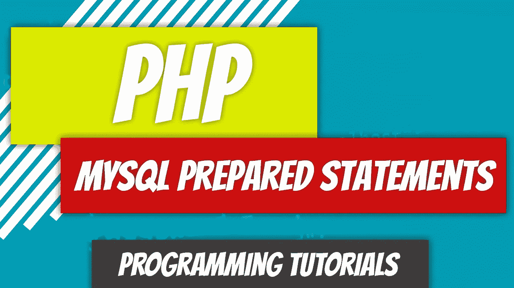

# PHP——P86:MySQL Insert 和准备好的语句

> 原文：<https://blog.devgenius.io/php-p86-mysql-insert-with-prepared-statements-57f37daeb109?source=collection_archive---------7----------------------->



我们之前的 MySQL insert 语句有一个很大的缺陷:它容易受到 SQL 注入攻击。精心准备的声明几乎消除了这种担忧。你告诉 SQL 服务器你打算做什么，然后给它数据。例如，您可以告诉服务器您计划插入数据。如果你发送一个伪装在你的`insert`语句中的`delete`语句，那是没有意义的，也不会产生与没有准备好的语句相同的效果。

[](/php-p85-mysql-insert-51a9e3bfedd3) [## PHP — P85: MySQL Insert

### 我们有自己的数据库连接、数据库和表。我们只需要开始添加一些数据。这是一个…

blog.devgenius.io](/php-p85-mysql-insert-51a9e3bfedd3) [](https://medium.com/geekculture/cybersecurity-p9-sql-injections-471de647e8d7) [## 网络安全— P9: SQL 注入

### 当攻击者注入一段 SQL 脚本以便…

medium.com](https://medium.com/geekculture/cybersecurity-p9-sql-injections-471de647e8d7) 

# 概述

我们的`Author`类有一个 insert 语句，它接受数据并将其插入到`authors`表中。

# 准备的声明

让我们来看一下准备好的 insert 语句的结构。

```
INSERT INTO authors (first_name, last_name, email) VALUES (?, ?, ?)
```

这些问号不是偶然的。这是预准备语句的语法。据说我们有三个字段，`first_name`、`last_name`和`email`，每个字段都将接收一些数据。用三个问号来表示将有数据绑定到这三个字段是很重要的。

步骤很简单:

*   连接到数据库
*   准备查询
*   将变量(数据)绑定到查询
*   执行查询
*   关闭连接

让我们一次消化一行代码。

*   `$data`数组作为参数传递。`$data`数组有以下三个键:`first_name`、`$last_name`和`$email`。
*   创建将被准备的`$sql`语句。此时它只是一个字符串。这只是为了一些清晰和与下面的代码分离，这样它就不会变得太忙。
*   实例化`DB`对象。`DB`对象实例化`mysqli`对象并将其存储在`$_connection`属性中。我们将获取它并将其本地存储在我们的`$mysqli`变量中。
*   `prepare`方法是`mysqli`对象的一部分。我们将把`SQL`字符串传递给它，这样它就可以准备它了。一旦准备好了，它就返回一个新对象，我们将把这个对象存储为一个`statement`。
*   在这个`statement`对象中，我们可以使用`bind_param`方法。`bind_param`方法不属于`mysqli`对象。小心那个陷阱。
*   `bind_param`方法期望的第一个参数是将要绑定的变量的类型。因为我们绑定了 3 个变量，它需要知道它们的类型。`sss`表示将有三个字符串被绑定。
*   接下来的参数是将要绑定的变量。这是通过`$data`数组发送的数据。
*   最后，我们调用属于`statement`对象的`execute`方法。
*   我们现在有两个“打开”的对象我们需要关闭`statement`对象和`$db`对象。我们可以通过$db 对象来实现，因为我们有一个声明`$db->_connection->close();`的`close()`方法。

# 完整的代码

下面你可以找到三个相互作用的文件。我们的`DB`类中的`insert`方法可以被移除，因为我们现在正在使用预准备语句。我会暂时保留它，但最终可能会删除它。


Dino Cajic 目前是 [Absolute Biotech](http://absolutebiotech.com/) 的 IT 负责人，该公司是 [LSBio(寿命生物科学公司)](https://www.lsbio.com/)、 [Absolute 抗体](https://absoluteantibody.com/)、 [Kerafast](https://www.kerafast.com/) 、 [Everest BioTech](https://everestbiotech.com/) 、 [Nordic MUbio](https://www.nordicmubio.com/) 和 [Exalpha](https://www.exalpha.com/) 的母公司。他还担任我的自动系统的首席执行官。他拥有计算机科学学士学位，辅修生物学，并拥有十多年的软件工程经验。他的背景包括创建企业级电子商务应用程序、执行基于研究的软件开发，以及通过写作促进知识的传播。

你可以在 [LinkedIn](https://www.linkedin.com/in/dinocajic/) 上联系他，在 [Instagram](https://instagram.com/think.dino) 上关注他，或者[订阅他的媒体出版物](https://dinocajic.medium.com/subscribe)。

阅读 Dino Cajic(以及 Medium 上成千上万的其他作家)的每一个故事。你的会员费直接支持迪诺·卡吉克和你阅读的其他作家。你也可以在媒体上看到所有的故事。