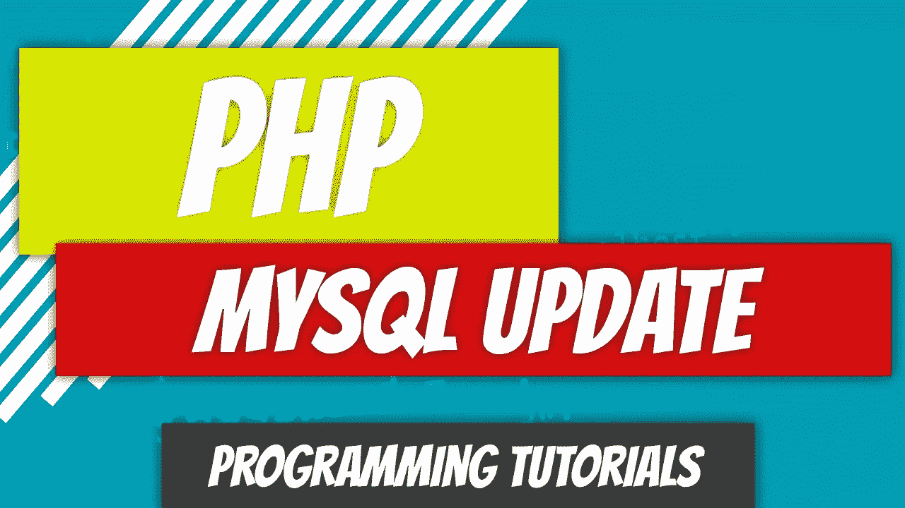

# PHP — P89: MySQL 更新(上传并打补丁)

> 原文：<https://blog.devgenius.io/php-p89-mysql-update-put-and-patch-3d917804d8fb?source=collection_archive---------11----------------------->



MySQL 发展的下一个逻辑步骤是更新现有资源。我们将介绍 PUT 和 PATCH 之间的区别，并彻底解决这个问题。这真的是一个简单的概念，我不知道为什么人们会觉得如此困惑。

[](/php-p88-mysql-select-d7a633e736b) [## PHP — P88: MySQL 选择

### 我们已经完成了插入过程，在 authors 表中插入了一些记录。现在怎么办？一个…

blog.devgenius.io](/php-p88-mysql-select-d7a633e736b) 

# 放置与修补

让我们看看我们的`authors`桌。它包含以下字段:

*   `id`
*   `first_name`
*   `last_name`
*   `email`

如果我们用`PUT`请求更新一个资源，我们需要发送所有的字段。这意味着如果我们更新了`email`，我们需要发送`id`、`first_name`、`last_name`和`email`。

如果我们用`PATCH`请求更新一个资源，我们只需要发送我们正在更新的字段。这意味着如果我们更新`email`，我们需要发送`email`和标识符(通常是`id`)。

# 我们可以用柱子吗？

实际上，我们没有办法发送`PUT`或`PATCH`请求。我们只能以`method`的形式指定`POST`或`GET`请求。如果我们想发送上传和补丁请求，我们需要变得有创造性。

```
<form method="post">
  <input type="hidden" name="_method" value="put">
  ... 
</form>
```

然后，服务器端脚本需要解密传入的请求。例如:

```
if ( $_POST['_method'] == 'put' ) 
{
  // Do something with the put request
}
```

这同样适用于`DELETE`请求。

# 概述计划

在更新资源之前，我们首先需要检索资源。让我们就更新我们的资源需要做些什么制定一个计划。

*   基于`id`检索资源。
*   在窗体中显示资源域。
*   允许用户更新表格字段并点击`Update`按钮。
*   将数据发送到一个`route`文件，该文件将引导数据。
*   该信息与`id`一起被发送到服务器，服务器将在那里更新资源。

根据这些信息，我们可以判断这将是一个`put`请求。

# 基于 id 检索资源

我们需要检索一个将要更新的资源。我们有来自上一篇文章的`select`陈述。这将派上用场了。

`select`方法返回一个数据数组，所以我们的`$update_author`现在包含一个数据数组。

```
/app/87 MySQL Update/SelectAuthor.php:8:
**array** *(size=6)*
  'id' => string '1' *(length=1)*
  'first_name' => string 'Dino' *(length=4)*
  'last_name' => string 'Cajic' *(length=5)*
  'email' => string 'dino@example.com' *(length=16)*
  'updated_at' => string '2022-11-03 21:56:16' *(length=19)*
  'created_at' => string '2022-11-03 21:56:16' *(length=19)*
```

# 在窗体中显示资源域

接下来，我们需要在表单中回显这些数据。

我们添加了两个隐藏字段。第一个是我们的`_method`，第二个是我们的`id`。即使我们可能只需要更新`first_name`，我们也要将所有数据传递给我们的`update.php`文件。

# 路线文件

`index.php?page=author`是做什么的？`index.php`文件将作为我们的`route`文件。`page`参数告诉服务器提供哪个文件。在这种情况下，它是`author`。我们也在传递`put`方法。让我们看看我们如何能把所有这些都弄明白。

目前还没有检查如果用户从 url 中移除参数`page`会发生什么，这没关系。也没有检查如果`$_POST`被操作并且`put`请求被移除会发生什么。再说一遍，没关系。我们关注的是更新功能，这已经有些过头了。

我们只需要将`$_POST`传递给`update`方法，这样我们就可以更新资源了。

# 向我们的 Author 类添加更新功能

一旦我们收到了`$_POST`数组，我们就可以从中提取细节来更新我们的资源。

虽然我们可以不准备就更新资源，但是准备语句、绑定参数和安全地更新资源也一样容易。

如果失败，我们将存储错误细节，如果更新失败，我们将返回`false`。

# 路线清理

因为我们的`update`方法返回`true`或`false`，我们可以用它来返回我们的表单。

如果更新成功，它会将我们重定向回我们的表单，否则，应用程序将终止。不是看起来最干净的代码，但它服务于它的目的。

# 补丁怎么样？

没什么大不了的。让我们创建另一个只更新电子邮件地址的表单。

我们回显了`first_name`和`last_name`，但没有发送出去。我们只是发送`id`和`email`字段。现在是时候修改我们的路由文件了。

最后要做的事情是在我们的`Author`类中创建我们的`update_email`方法。

该脚本除了只更新电子邮件地址之外，几乎完全相同。

# 最后润色

让我们在我们的 route 文件中添加一个`page`检查，检查我们的 URL 中是否有页面参数。如果没有，我们将显示两个页面的链接。

仅此而已。集成了更新功能。没有改变`DB`类。完整的代码可以在下面看到。我们在这里一举两得:查看更新功能并确定 put 和 patch 之间的区别。

[](https://github.com/dinocajic/php-youtube-tutorials) [## GitHub-dinocajic/PHP-YouTube-tutorials:PHP YouTube 教程的代码

### PHP YouTube 教程的代码确保你已经安装了 Docker。克隆回购。运行以下命令…

github.com](https://github.com/dinocajic/php-youtube-tutorials) 

Dino Cajic 目前是 [Absolute Biotech](http://absolutebiotech.com/) 的 IT 主管，该公司是 [LSBio(寿命生物科学公司)](https://www.lsbio.com/)、 [Absolute Antibody](https://absoluteantibody.com/) 、 [Kerafast](https://www.kerafast.com/) 、 [Everest BioTech](https://everestbiotech.com/) 、 [Nordic MUbio](https://www.nordicmubio.com/) 和 [Exalpha](https://www.exalpha.com/) 的母公司。他还担任我的自动系统的首席执行官。他拥有计算机科学学士学位，辅修生物学，并拥有十多年的软件工程经验。他的背景包括创建企业级电子商务应用程序、执行基于研究的软件开发，以及通过写作促进知识的传播。

你可以在 [LinkedIn](https://www.linkedin.com/in/dinocajic/) 上联系他，在 [Instagram](https://instagram.com/think.dino) 上关注他，或者[订阅他的媒体出版物](https://dinocajic.medium.com/subscribe)。

阅读 Dino Cajic(以及 Medium 上成千上万的其他作家)的每一个故事。你的会员费直接支持迪诺·卡吉克和你阅读的其他作家。你也可以在媒体上看到所有的故事。