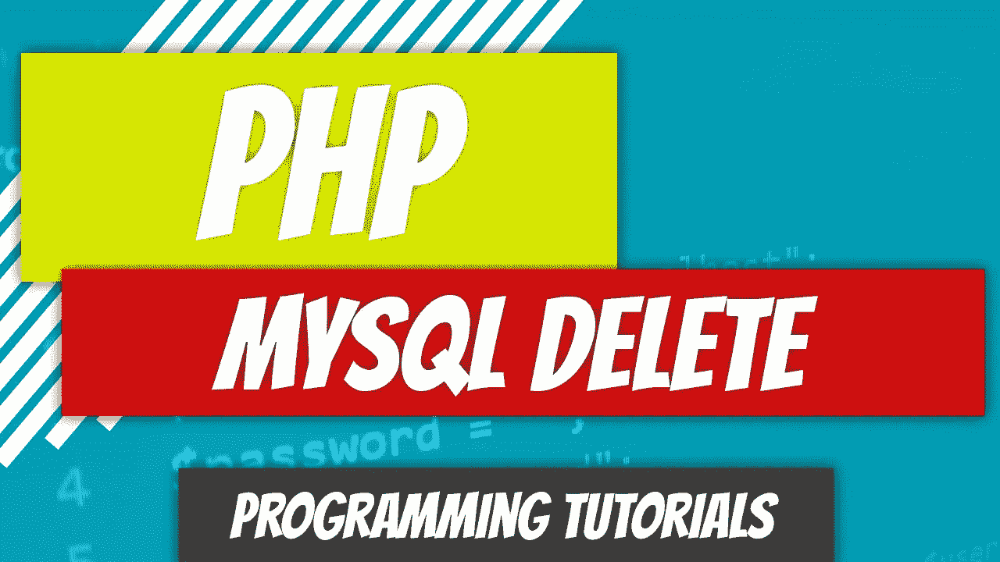
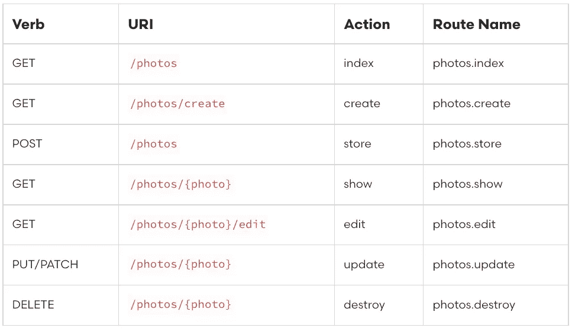
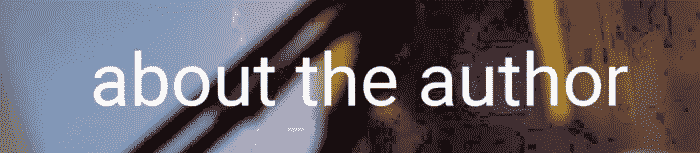

# PHP — P90: MySQL 删除

> 原文：<https://blog.devgenius.io/php-p90-mysql-delete-ec6f3a969591?source=collection_archive---------12----------------------->

最后一个操作是删除操作。就像我们的更新功能一样，没有`delete`方法。我们可以提交一个隐藏的值为`delete`的`method`。我们可以使用`post`并指定一个值，但是我们是为 Laravel 构建的。Laravel 接受各种请求，可以轻松处理。这是他们文档中的一个列表。

[https://laravel . com/docs/9 . x/controllers # actions-handled-by-resource-controller](https://laravel.com/docs/9.x/controllers#actions-handled-by-resource-controller)

如你所见，如果我们想删除一张照片，我们需要提供`{photo}`资源。在我们的例子中，我们需要提供作者的`id`。

# 以前的代码审查

确保您使用的是最新的代码。

*   [Author.php](https://github.com/dinocajic/php-youtube-tutorials/blob/master/app/87%20MySQL%20Update/Author.php)
*   [DB.php](https://github.com/dinocajic/php-youtube-tutorials/blob/master/app/87%20MySQL%20Update/DB.php)
*   [UpdateAuthorEmail.php](https://github.com/dinocajic/php-youtube-tutorials/blob/master/app/87%20MySQL%20Update/UpdateAuthorEmail.php)
*   [UpdateEntireAuthor.php](https://github.com/dinocajic/php-youtube-tutorials/blob/master/app/87%20MySQL%20Update/UpdateEntireAuthor.php)
*   【index.php】

index.php 的档案里有我们的路线。我们将为删除功能添加一个新的路由。我们还将创建一个名为`DeleteAuthor.php`的新文件，它将调用`Author::delete`方法。

# 概述删除计划

在我们的更新功能中，我们不允许用户选择作者进行更新；我们硬编码了 id，这样用户只能用`id = 1`更新作者。删除后，我们想做一点不同的事情。

*   获取所有作者
*   显示作者列表，并在作者的详细信息旁边有一个删除链接。
*   一旦点击了删除链接，信息就被定向到`index.php`路由文件，然后该文件调用`Author::delete`方法。
*   删除后，用户将被重定向回删除页面。

要使这成为一个真正的 MVCish 框架，我们唯一缺少的是控制器。我们的路由文件就像控制器一样。我们不打算在这里讨论这个，只是给你一个有趣的事实。

# 获取所有作者

我们创建了检索所有作者的`select_all`方法。非常简单。

# 显示所有作者

现在我们有了所有的作者，我们需要显示他们。我们可以通过几种不同的方式做到这一点:

*   显示允许用户删除作者的链接。这使用了一个`get`请求。
*   使用表单删除作者。我们将使用它，因为我们可以提交模拟的`delete`请求。

我们循环遍历我们的每个作者，并将他们包装在一个表单中。`_method`值被设置为`delete`。我们有一个隐藏的`id`字段，当我们按下`Delete`按钮时，我们将提交该字段。

# 向 index.php 文件添加路线

我已经从我们的`index.php`文件中删除了`put`和`patch`请求，这样我们可以只关注`delete`请求。

脚本将检查`delete`请求是否通过。如果是，它将把`$_POST`发送给我们的`delete`方法。我们还没有创建我们的`delete`方法，但是接下来会这样做。如果删除成功，将返回`true`或`false` : `true`。

# 向作者添加删除方法

这个难题的最后一步是从`authors`表中移除资源。我们将再次使用准备好的语句。

sql 已经准备好，并且在脚本执行之前将`id`绑定到脚本。如果没有错误，则返回`true`。`DB`类没有变化。

我们结束了。在下一篇文章中，我们将组合所有的 MySQL 脚本来创建一个大的资源文件。我们将能够:

*   查看所有作者
*   查看单个作者
*   更新特定作者
*   添加新作者
*   删除作者

 [## GitHub-dinocajic/PHP-YouTube-tutorials:PHP YouTube 教程的代码

### PHP YouTube 教程的代码确保你已经安装了 Docker。克隆回购。运行以下命令…

github.com](https://github.com/dinocajic/php-youtube-tutorials) 

Dino Cajic 目前是 [Absolute Biotech](http://absolutebiotech.com/) 的 IT 负责人，该公司是 [LSBio(寿命生物科学公司)](https://www.lsbio.com/)、 [Absolute 抗体](https://absoluteantibody.com/)、 [Kerafast](https://www.kerafast.com/) 、 [Everest BioTech](https://everestbiotech.com/) 、 [Nordic MUbio](https://www.nordicmubio.com/) 和 [Exalpha](https://www.exalpha.com/) 的母公司。他还担任我的自动系统的首席执行官。他拥有计算机科学学士学位，辅修生物学，并拥有十多年的软件工程经验。他的背景包括创建企业级电子商务应用程序、执行基于研究的软件开发，以及通过写作促进知识的传播。

你可以在 [LinkedIn](https://www.linkedin.com/in/dinocajic/) 上联系他，在 [Instagram](https://instagram.com/think.dino) 上关注他，或者[订阅他的媒体出版物](https://dinocajic.medium.com/subscribe)。

阅读 Dino Cajic(以及 Medium 上成千上万的其他作家)的每一个故事。你的会员费直接支持迪诺·卡吉克和你阅读的其他作家。你也可以在媒体上看到所有的故事。