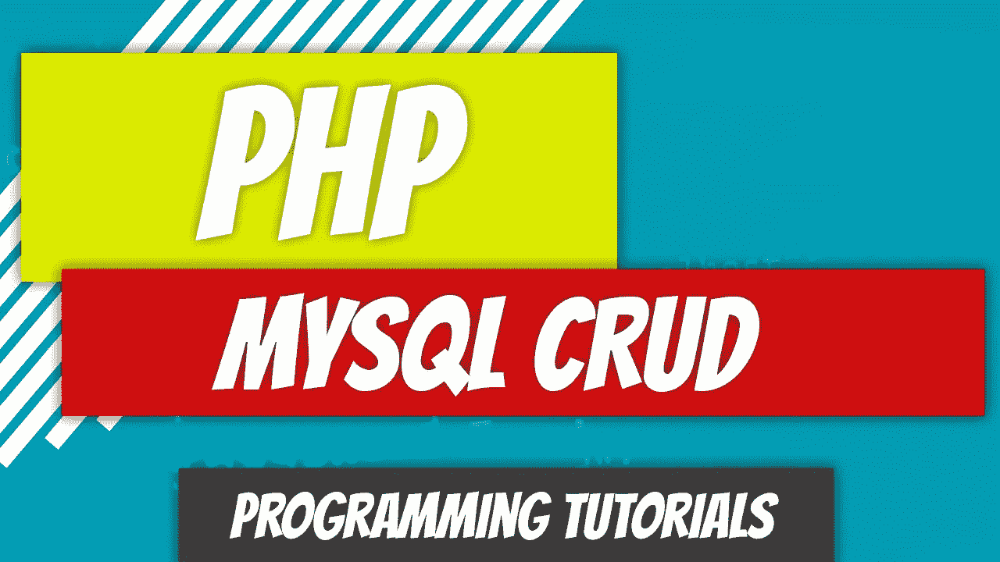
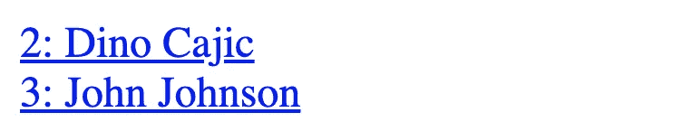
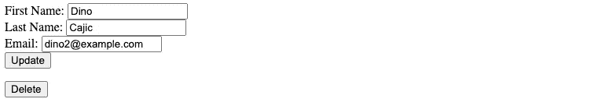

# PHP — P91: MySQL CRUD

> 原文：<https://blog.devgenius.io/php-p91-mysql-crud-1988f82072f5?source=collection_archive---------6----------------------->

什么是 CRUD 操作？创建、读取、更新、删除。这就是我们在过去几篇文章中所创造的。拼图的最后一块是将它们组合成一个知道如何管理我们的`authors`表的文件。如果您直接进入这篇文章，我建议您先阅读这篇文章之前的文章。你不需要，但会有帮助的。

*   [MySQL 简介](https://medium.com/dev-genius/php-p82-mysql-introduction-8153280e16a8)
*   [MySQL 数据库连接](https://medium.com/dev-genius/php-p83-mysql-db-connection-8a34c4056863)
*   [MySQL 表](https://medium.com/dev-genius/php-p84-mysql-tables-83b203d28ff7)
*   [MySQL 插入](https://medium.com/dev-genius/php-p85-mysql-insert-51a9e3bfedd3)
*   [包含准备好的语句的 MySQL Insert](https://medium.com/dev-genius/php-p86-mysql-insert-with-prepared-statements-57f37daeb109)
*   [MySQL 用准备好的语句插入多条记录](https://medium.com/p/php-p87-mysql-insert-multiple-records-with-prepared-statements-c5c7bcfb42a3)
*   [MySQL 选择](https://medium.com/dev-genius/php-p88-mysql-select-d7a633e736b)
*   [MySQL 更新(上传 vs 补丁)](https://medium.com/dev-genius/php-p89-mysql-update-put-and-patch-3d917804d8fb)
*   [MySQL 删除](https://medium.com/dev-genius/php-p90-mysql-delete-ec6f3a969591)

# 概述

回顾前几篇文章中的代码。我们已经建立了大部分操作，但可能需要在这里和那里调整一些东西。

*   [插入](https://github.com/dinocajic/php-youtube-tutorials/tree/master/app)
*   [选择](https://github.com/dinocajic/php-youtube-tutorials/tree/master/app/86%20MySQL%20Select)
*   [更新](https://github.com/dinocajic/php-youtube-tutorials/tree/master/app/87%20MySQL%20Update)
*   [删除](https://github.com/dinocajic/php-youtube-tutorials/tree/master/app/88%20Delete)

# 路线文件

在前面的文章中，我们使用路由文件来路由到各种不同的文件。我们在这里也可以这样做。因为我们结合了面向对象和非面向对象的原则，所以现有的代码会有点乱，但有时你会得到这样的结果。这将是创建作者控制器和视图的最佳时机，但出于篇幅原因，我们将忽略这一点。相反，我们的路由文件(index.php)将使用`header`函数来移动用户。我们将在下一篇文章中讨论 AuthorController。

到目前为止，我们的路由文件所做的就是检查是否存在`page` url 参数。如果没有，它将显示链接以查看所有作者。链接指向`index.php`，通过`authors`的`page`论证。一旦再次点击`index.php`，就会出现`page`参数，并将用户导向`ViewAll.php`页面。

这只是第一阶段。该文件将继续增长。

# 作者类别

Author 类现在看起来像一个正确的文件。我们已经添加了之前创建、读取、更新和删除作者的所有方法。

# 查看全部

“查看全部”页面尚未创建。它的全部目的是显示数据库中的所有作者。

这将只显示所有作者的名和姓，并将他们的名字包装在一个链接中。链接指向`index.php`并传递作者的`id`和`page`参数。

# 显示

View All 显示所有的作者，但是如果我们需要查看个人的详细信息呢？这就是`Show.php`派上用场的地方。我们将显示作者的名字、姓氏和电子邮件。作者的详细信息将被添加到一个表单中，这样我们也可以在必要时更新它们。

如果`Show.php`中缺少`author_id`参数，我们将终止该应用程序。如果用户想要更新作者，他们可以在进行修改后单击 update 按钮。在我们开始更新之前，让我们看看我们的路线需要如何从 ViewAll 更新到 Show。换句话说，当用户点击`ViewAll.php`中的链接时，我们如何将数据传输到`Show.php`。

我们正在寻找设置为`author`的`page`参数，以及包含`author_id`参数的 url。如果是，用户被重定向到`Show.php`，并且`author_id`参数被传递。

# 更新作者

我们已经在以前的文章中定义了更新功能，所以移动它会非常简单。在这种情况下，我们将只移动`put`功能。

`Show.php`中的表单指向`index.php?page=author`并且`put`的`_method`隐藏值被传递给我们的 route。

首先我们检查`page`参数是否是作者。如果是，我们检查`_method`参数。请记住，它将跳过第一个`$page == author`检查，因为我们没有通过`url`中的`author_id`。这是一个 POST 请求。

一旦我们进入主题，我们将更新作者并将用户重定向回`Show`页面。

# 删除

删除功能也是内置的。问题是我们把删除按钮放在哪里？我将把它放在我们的展示页面上的“更新”按钮下。

让我们添加路线，以便完成删除过程。

该路线检查`_method`参数，类似于`update`，并确保它被设置为`delete`。一旦在`Author`类中调用了`delete`方法，用户就会被重定向回查看所有作者。

# 插入

最后但并非最不重要的是插入。我们需要两条路线:一条是创建，另一条是实际插入数据。我们的路由文件中的链接将指向一个创建页面。

`Create.php`文件只是一个 HTML，其中包含一个与我们的`Update.php`表单相同的空白表单，但是没有任何内容。

我们也没有通过隐藏的`_method`。这只是纯粹的`post`方法。让我们捕获它并将数据插入到我们的路由文件中。

就是这样。我们创建了所有的 CRUD 操作，并将它们添加到一个文件中。我们可以:

*   查看所有作者
*   点击作者查看个人作者
*   更新作者详细信息
*   删除作者
*   并插入作者

只剩下一些东西要清理，我很乐意送你去拉弗尔。

 [## GitHub-dinocajic/PHP-YouTube-tutorials:PHP YouTube 教程的代码

### PHP YouTube 教程的代码确保你已经安装了 Docker。克隆回购。运行以下命令…

github.com](https://github.com/dinocajic/php-youtube-tutorials) 

Dino Cajic 目前是 [Absolute Biotech](http://absolutebiotech.com/) 的 IT 负责人，该公司是 [LSBio(寿命生物科学公司)](https://www.lsbio.com/)、 [Absolute 抗体](https://absoluteantibody.com/)、 [Kerafast](https://www.kerafast.com/) 、 [Everest BioTech](https://everestbiotech.com/) 、 [Nordic MUbio](https://www.nordicmubio.com/) 和 [Exalpha](https://www.exalpha.com/) 的母公司。他还担任我的自动系统的首席执行官。他拥有计算机科学学士学位，辅修生物学，并拥有十多年的软件工程经验。他的背景包括创建企业级电子商务应用程序、执行基于研究的软件开发，以及通过写作促进知识的传播。

你可以在 [LinkedIn](https://www.linkedin.com/in/dinocajic/) 上联系他，在 [Instagram](https://instagram.com/think.dino) 上关注他，或者[订阅他的媒体出版物](https://dinocajic.medium.com/subscribe)。

阅读 Dino Cajic(以及 Medium 上成千上万的其他作家)的每一个故事。你的会员费直接支持迪诺·卡吉克和你阅读的其他作家。你也可以在媒体上看到所有的故事。