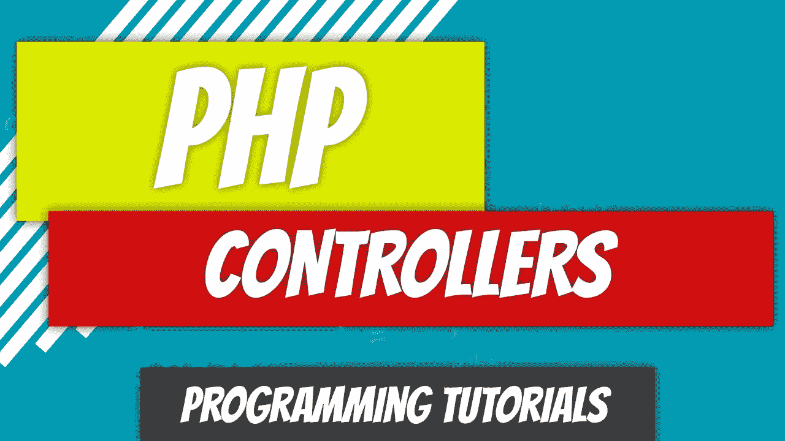
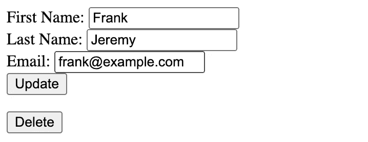
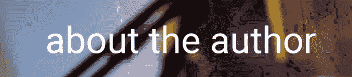

# PHP — P92:控制器

> 原文：<https://blog.devgenius.io/php-p92-controllers-bc2bde5ac017?source=collection_archive---------2----------------------->



我们已经超越了基本的 MySQL 功能。我确实想讨论规范化，并将在下一篇文章中讨论，但我认为我们需要引入控制器。当你开始学习 Laravel 时，它会简化概念，因为它是一个 MVC 框架。

[](/php-p91-mysql-crud-1988f82072f5) [## PHP — P91: MySQL CRUD

### 什么是 CRUD 操作？创建、读取、更新、删除。这就是我们在过去几篇文章中所创造的。的…

blog.devgenius.io](/php-p91-mysql-crud-1988f82072f5) 

# 什么是 MVC 框架？

MVC 代表模型、视图、控制器。我不打算进行严格的定义，比如什么，什么，商业逻辑。让我们说人话。

*   模型—与数据库交互的类。在我们之前的例子中，这是`Author`类。
*   视图 HTML 和 CSS。用户将会看到什么。
*   控制器——指导模型和视图之间通信的类。我们将从模型中获取数据，并将其发送给视图。一旦视图将所有东西混合在一起，它就会返回
*   路由—我们仍然需要路由文件。当请求进来时，它会将该请求定向到控制器，控制器会处理其余的。

# 这个计划

目前，我们的路由文件也是处理大多数控制器功能的文件。我们需要:

*   创建一个`AuthorController`
*   将某些数据从我们的`index.php`路由文件中移到我们的`AuthorController`中。

这就是我们的`index.php`文件现在的样子。我们在 Author 上执行基本的 CRUD 操作，因此我们需要创建一个控制器来处理这些操作。

我们还需要对每个视图做一些处理。目前，它与从数据库中检索数据并将其注入我们的 HTML 代码混合在一起。这不是视图的功能，所以我们需要一个一个地把它们移走。我们还将把我们的每个视图转换成类。在其他框架中，您可能不会这样做，但是有更多的背景逻辑需要考虑。

# AuthorController

为 AuthorController 生成基本框架的时间。它需要执行以下功能:

*   查看所有作者
*   显示单个作者
*   在准备更新的表单中显示单个作者
*   处理更新
*   显示空白表单以插入作者
*   插入作者
*   删除作者

现在我们只需要填充它。在此之前，让我们看看我们的文件夹结构。

```
Application/
    **index.php**
    Controllers/
       **AuthorController.php
       HomeController.php** Models/
       **Author.php**
    Views/
       author/
           **create.php
           edit.php
           index.php
           show.php** home/ **index.php**
```

## 基础准备

让我们从基础开始。我们的**index.php**文件做的第一件事是检查页面是否存在。如果不是，它会显示不同页面的链接。我们不希望这些页面出现在那里。

我们希望它们存储在自己的视图中。从这个角度来看，我们还需要一个控制器:`HomeController`。但是我们真的有吗？在 Laravel 中，您可以直接在路由文件中返回一个视图。我们将继续创建`HomeController`,因为它给了我们一个创建控制器的漂亮而简单的外观。

让我们采取一步一步的方法，看看没有控制器和有控制器。

创建包含 HomeView 类的`Application/Views/home/index.php`，我们的链接存储在`index`方法中。不管怎样，这都是需要的。

这个类非常简单。它只有一个返回两个链接的方法。

route 只是把`index`方法中返回的`HomeView`和`echos`取出来，这是两个链接。然后应用程序终止。

控制器是什么样子的？首先，我们需要一个`HomeController`。我们将在`Application/Controllers/HomeController.php`中创建它。

`index.php` route 文件需要指向`HomeController->index`方法。

我们并没有真的减少任何代码。我们只是移动了代码，实际上创造了更多的代码。有什么意义？这都是关于逻辑的分离。这不是路线应该做的:这是管制员应该做的。有时控制器似乎是不必要的。但是当我们进入`AuthorController`时，我们将很快看到控制器实际上有多少用途。

# 作者创建

第一个对作者来说很简单。这和我们刚才做的几乎一样。这是当用户想要添加新作者时将要显示的表单。我们需要做什么？

*   创建`Views/author/create.php`。
*   将代码添加到`Controllers/HomeController.php`
*   修改`index.php`以调用`create`

`AuthorController`需要回显 HTML。

最后一位是修改`index.php`路径文件。

# 作者索引

下一步是见所有的作者。让我们再一次仔细检查计划。我们当前的代码将检索过程和视图创建放在一个文件中。

那需要分开。首先，让我们创建`Views/author/index.php`文件。它将包含一个接受数据数组的函数。这些将是所有的作者。对每个作者进行循环，并生成最终的 HTML 输出。将返回 HTML。

`$authors`的说法从何而来？从`AuthorController`开始。

我们将我们的`Author`模型引入到`AuthorController`中，因为控制器与模型和视图都进行通信。`select_all`方法从`authors`表中返回所有作者。这些作者随后被作为参数发送给`IndexView->index`方法。由于`index`方法返回 HTML，我们可以只`echo`出信息。

最后一部分是修改`index.php`路线文件。

# 作者秀

一旦用户点击“查看所有作者”中的链接，他们就会看到单个作者。自从我们把显示和编辑合二为一后，我们还没有创建太多的视图。我们在这里把它分开。

那么当用户点击查看所有作者中的链接时会发生什么呢？

*   链接发送到`index.php`，带有两个参数:`page`和`author_id`。
*   将`author_id`传递给`AuthorController->show`方法。
*   该方法将从特定的`id`的`authors`表中检索作者的内容，并将其传递给`ShowView`。`ShowView`将生成 HTML。
*   方法`echos`输出返回的 HTML 内容。

首先，观点。它将接受一个作者，并为该作者生成要显示的内容。底部会有一个编辑作者的链接。链接不干净:它必须是`edit_author`,因为我们没有遵循 100%完美的 Laravel 命名约定。我们应该添加某种类型的附加参数，例如`type`，并声明`page`是`author`而`type`是`edit`。我不想再混淆这个话题了，所以我们就把它保持为`edit_author`。

`AuthorController->show`方法将调用这个视图并传递给它`$author`参数。

`show`方法也接收一个参数:它是`$id`。这是从哪里来的？这是从`index.php`路线文件传来的。

我们的路由文件开始看起来非常干净，我们的控制器也是如此。这是逻辑分离的一个巨大好处。你确切地知道特定类型的代码应该在哪里。

# 作者编辑

这几乎与 Show 相同，只是将显示一个表单。

`EditView`返回表单。它用从`$author`参数传递来的数据填充表单。

`edit`方法从`index.php`路径文件中接收`$id`。

我们已经(几乎)完成了视图。我们需要弄清楚在哪里添加`Delete`按钮，但是我们将在完成`store`和`update`方法后进行修改。

# 作者商店

当用户点击`Update`按钮更新特定用户时，数据被发送到服务器，目前正在路由文件中进行处理。提取数据并将其移动到`AuthorController`的时间到了。

`$author_details`参数从路由中传递。只是`$_POST`数组的内容。

# 作者删除

我们应该把按钮放在哪里？我们可以把它放在`ShowView`页或`EditView`页。我可以看到两者的论点，但是我会把它添加到`EditView`页面。



我知道，很可怕。但是我们来这里是为了功能性，而不是美观。当我们单击`Delete`时，我们的路由会将请求定向到`AuthorController->destroy`方法，这将依次删除作者并将用户重定向回查看所有作者页面。

`index.php`文件看起来仍然很简单。

# 作者商店

当用户输入作者信息并点击创建按钮时会发生什么？发送了`post`请求，我们捕获了它。这是我们需要做的最后一项修改。似乎有点悲伤。

`AuthorController`现在已经完成。

`index.php`路线文件也完成了。

# 摘要

我们做到了。我们创造了一个控制器！实际上是两个。感谢您通读这篇文章。我希望你能看到我们如何构建控制器的逻辑进展。我知道我在这里偷偷加入了 MVC 架构模式，但这似乎是我们的 CRUD MySQL 文章的下一个逻辑发展。下次见。



Dino Cajic 目前是 [Absolute Biotech](http://absolutebiotech.com/) 的 IT 负责人，该公司是 [LSBio(寿命生物科学公司)](https://www.lsbio.com/)、 [Absolute 抗体](https://absoluteantibody.com/)、 [Kerafast](https://www.kerafast.com/) 、 [Everest BioTech](https://everestbiotech.com/) 、 [Nordic MUbio](https://www.nordicmubio.com/) 和 [Exalpha](https://www.exalpha.com/) 的母公司。他还担任我的自动系统的首席执行官。他拥有计算机科学学士学位，辅修生物学，并拥有十多年的软件工程经验。他的背景包括创建企业级电子商务应用程序、执行基于研究的软件开发，以及通过写作促进知识的传播。

你可以在 [LinkedIn](https://www.linkedin.com/in/dinocajic/) 上联系他，在 [Instagram](https://instagram.com/think.dino) 上关注他，或者[订阅他的媒体出版物](https://dinocajic.medium.com/subscribe)。

阅读 Dino Cajic(以及 Medium 上成千上万的其他作家)的每一个故事。你的会员费直接支持迪诺·卡吉克和你阅读的其他作家。你也可以在媒体上看到所有的故事。