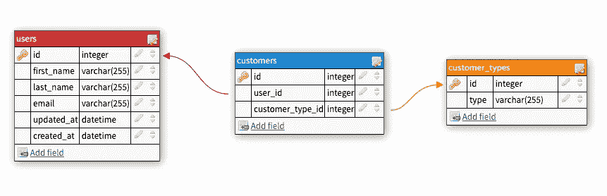
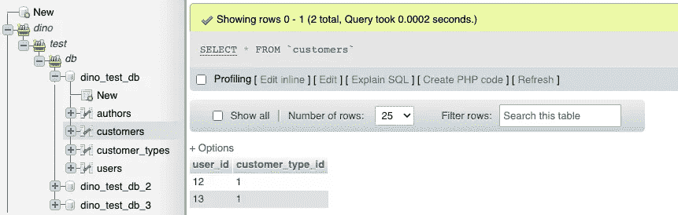

# PHP — P93: MySQL 规范化

> 原文：<https://blog.devgenius.io/php-p93-mysql-normalization-7e9a9809311e?source=collection_archive---------11----------------------->


我们将触及最后一个话题，今天就讲到 MySQL。最后一个话题是正常化。规范化一个数据库意味着什么？假设您有一个存储客户的表，其中有一个字段是`customer_type`，比如`direct`或`distributor`，这两个词会被不必要地输入数千次。为什么不为它们创建一个单独的表，只指定它们代表哪个数字呢？例如，如果`1`的`id`被设置为`distributor`，那么如果我们查看客户的`customer_type`并看到该值被设置为`1`，那么我们将自动知道该客户是经销商。

# 我们为什么要在乎？

它节省空间，有助于消除数据冗余，并使其更易于管理。空间/冗余很容易想象。什么更占空间？一万个`distributor`条目，还是一万个`1`条目？

我们还规范能加什么？换句话说，我们有什么选择？如果我们让用户添加他们想要的任何东西，他们会确保添加你能想到的每一种 distributor:

*   `Distributor`
*   `distributor`
*   `dist`
*   `dis`
*   `Dist`
*   `Distrib`

我需要继续吗？还有拼写错误:不要忘记拼写错误。

# 规范化的缺点

有几个问题。数据分布在多个表中，所以不容易看到。例如，您可以在`users`表中看到:

*   `first_name = Dino`
*   `last_name = Cajic`
*   `email = dino@example.com`
*   `customer_type_id = 1`

在`customer_types`表格中，您可以看到:

*   `id = 1`
*   `type = distributor`

这意味着你每次都必须访问`customer_types`表，看看`1`对`customer_type_id`意味着什么。

# 数据透视表

如果还不够复杂，还有数据透视表。数据透视表将从两个表中取出`id`并一起显示。在上面的例子中，我们在`users`表中有一个`customer_type_id`。这意味着我们假设我们的每个`users`都是一个`customer`，但事实可能并非如此。如果有些人是员工而不是顾客呢？

那时的结构会是什么样子？

对于`users`，

*   `id`
*   `first_name = Dino`
*   `last_name = Cajic`
*   `email = dino@example.com`

对于`customer_types`，

*   `id`
*   `type`

对于`customers`，

*   `user_id`
*   `customer_type_id`

这可能是一个很差的例子，但你得到了要点。当您访问您的`customers`表时，您会看到:

*   `user_id = 1`
*   `customer_type_id = 1`

那是什么意思？嗯，`user_id = 1`指向了`users`记录中`id = 1`所在的位置。这种情况下是为了`Dino | Cajic | dino@example.com`。`customer_type_id`指向`id = 1`所在的`customer_types`记录，设置为`distributor`。我们知道关于那个客户的所有信息:`Dino | Cajic | dino@example.com | distributor`。



# 创建我们的表

我将使用 phpMyAdmin 创建这三个表:既快又脏。如果您在创建表格时需要一些帮助，这里有我以前的一篇文章。

[](/php-p84-mysql-tables-83b203d28ff7) [## PHP — P84: MySQL 表格

### 在上一篇文章中，我们介绍了如何创建一个数据库并建立到它的连接。是时候走一步了…

blog.devgenius.io](/php-p84-mysql-tables-83b203d28ff7) 

`users`和`customers`工作台将为空。`customer_types`表将预先填入两条记录:`1 = distributor`和`2 = direct`。

让我们看看将用户/客户插入数据库的代码。

我们已经看过这段代码了。我们准备 insert 语句，并将其插入数据库。现在我们在`users`表中添加了一条新记录。对于`customers`我们需要的是`user_id`和`customer_type_id`。

这些步骤是:

*   将用户插入到`users`表中。
*   从`users`表中检索刚刚添加的`id`。
*   从`customer_types`表中检索特定的客户类型 id。
*   将这两个 id 添加到`customers`表中。

我们刚做了第一部分。接下来是拿到`insert_id`。这比你想象的要简单得多。`$statement`对象有一个`insert_id`属性，我们可以在插入后立即检索它。我们将把这段代码添加到上面的代码中。

太好了。接下来，我们需要确定这个用户是什么类型的客户。为了简单起见，我称它们为`distributor`。让我们从`customer_types`表中取出`id`，其中`type`是一个`distributor`。

太好了。我们现在有了`user_id`和`customer_type_id`。我们只需要将这两个字段插入到`customers`表中。

仅此而已。我们可以检查我们的表，看看它是否工作。



完整代码如下。

# 检索内容

我们如何检索这些内容？我知道你知道加盟店就在附近。我们将使用一个连接。我们必须连接每张桌子。我们先来看看代码。

更具体地说，让我们看看 SQL 语句。我们正在从`users`表中检索`users.first_name`、`users.last_name`和`users.email`。我们不必指定`users.xxx`，但是这里要明确的是，我们要指定。如果我们不关心客户的类型，我们可以消除所有的连接。但是，我们需要`customer_types.type`。我们如何从用户到达`customer_types`表？我们有一张`customers`桌子，可以让我们走这条路。

*   我们首先用`users` `id`字段在`users`和`customers`之间建立一个连接。将这两个表连接在一起。
*   现在，从`users`到`customer_types`没有直接链接，但是从`customers`到`customer_types`有链接。这个环节发生在`customer_types`上`id`。
*   一旦两个连接都建立起来，从`users`到`customer_types`就有一条直线，我们可以为那个特定的用户检索`type`。

```
/app/91 Normalization/TestSelect.php:27:
**array** *(size=4)*
  'first_name' => string 'Frank' *(length=4)*
  'last_name' => string 'Johnson' *(length=5)*
  'email' => string 'frank@example.com' *(length=16)*
  'type' => string 'distributor' *(length=11)*/app/91 Normalization/TestSelect.php:27:
**array** *(size=4)*
  'first_name' => string 'Dino' *(length=4)*
  'last_name' => string 'Cajic' *(length=5)*
  'email' => string 'dino@example.com' *(length=16)*
  'type' => string 'distributor' *(length=11)*
```

正常化就是这样。我强烈建议您研究联接以及左联接、内联接、全联接和右联接之间的区别。下次见。

[](https://github.com/dinocajic/php-youtube-tutorials) [## GitHub-dinocajic/PHP-YouTube-tutorials:PHP YouTube 教程的代码

### PHP YouTube 教程的代码确保你已经安装了 Docker。克隆回购。运行以下命令…

github.com](https://github.com/dinocajic/php-youtube-tutorials) 

Dino Cajic 目前是 [Absolute Biotech](http://absolutebiotech.com/) 的 IT 主管，该公司是 [LSBio(寿命生物科学公司)](https://www.lsbio.com/)、 [Absolute 抗体](https://absoluteantibody.com/)、 [Kerafast](https://www.kerafast.com/) 、[珠穆朗玛生物科技](https://everestbiotech.com/)、[北欧 MUbio](https://www.nordicmubio.com/) 和 [Exalpha](https://www.exalpha.com/) 的母公司。他还担任我的自动系统的首席执行官。他拥有计算机科学学士学位，辅修生物学，并拥有十多年的软件工程经验。他的背景包括创建企业级电子商务应用程序、执行基于研究的软件开发，以及通过写作促进知识的传播。

你可以在 [LinkedIn](https://www.linkedin.com/in/dinocajic/) 上联系他，在 [Instagram](https://instagram.com/think.dino) 上关注他，或者[订阅他的媒体出版物](https://dinocajic.medium.com/subscribe)。

阅读 Dino Cajic(以及 Medium 上成千上万的其他作家)的每一个故事。你的会员费直接支持迪诺·卡吉克和你阅读的其他作家。你也可以在媒体上看到所有的故事。