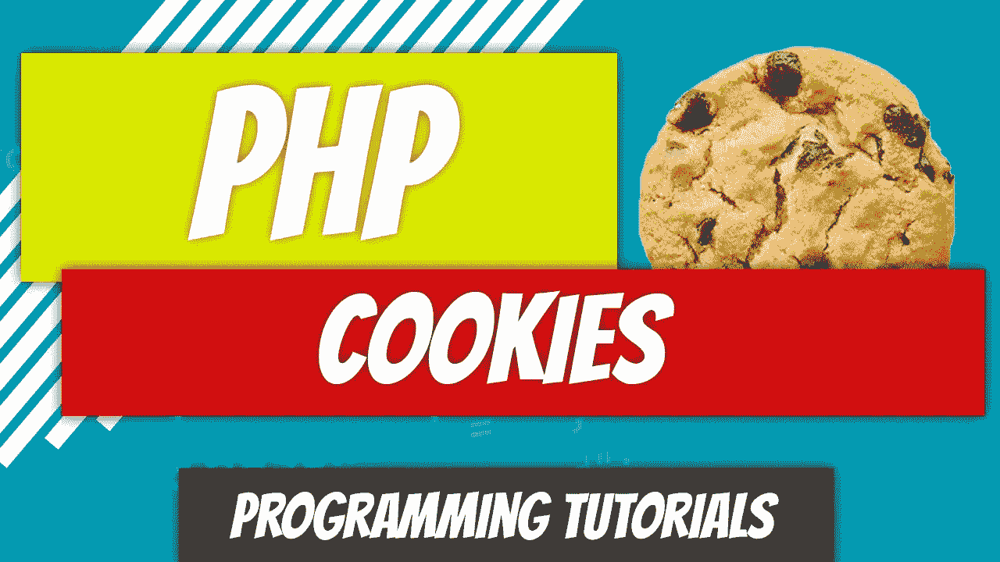
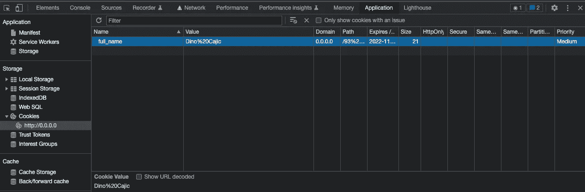
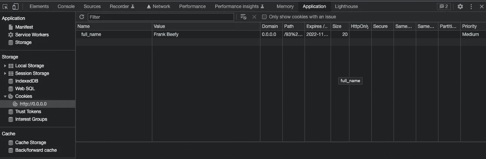
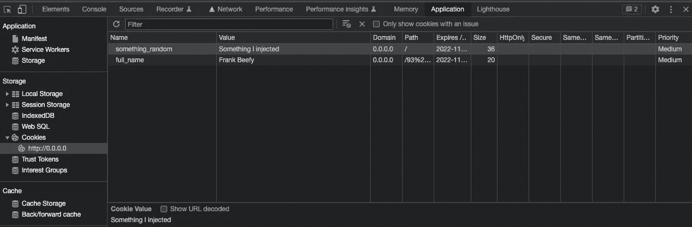

# PHP—P95:cookie

> 原文：<https://blog.devgenius.io/php-p95-cookies-8c87c1c74b8d?source=collection_archive---------7----------------------->



我已经没有话题可写了，所以这可能是我在过渡到 Laravel 之前关于 PHP 的最后一篇文章。既兴奋又悲伤。一旦你过了这个话题，任何你想学的 PHP 相关的东西都将变得微不足道。尽情探索额外的特性，寻找独特的编码方式，标准化您的代码，并进入框架。

[](/php-p94-sessions-23e106ad374f) [## PHP — P94:会话

### 什么是会话？这是一种在服务器上存储数据而不使用数据库的方法。当用户从页面转到…

blog.devgenius.io](/php-p94-sessions-23e106ad374f) 

# 什么是饼干？

cookie 是一个包含用户可识别信息的小文本文件，由服务器设置在用户的计算机上。每当用户发出新的请求时，cookie 就会被发送到服务器。因此，每次用户访问网站上的不同页面时，都会发送请求和 cookie。

您已经看到了用户持续登录 web 应用程序的例子。他们是怎么做到的？有饼干。用户标识符被加密，通常被加盐，并存储在数据库和用户的浏览器中。当他们返回网站时，会发送 cookie，用户会自动登录。这超出了本文的范围，但是如果您有兴趣了解更多内容，可以使用 PHP Cookies 查找身份验证和长期持久性。这里有一篇关于它的好文章。

[](https://paragonie.com/blog/2015/04/secure-authentication-php-with-long-term-persistence) [## 在具有长期持久性的 PHP 应用程序中实现安全的用户认证

### web 开发中的一个常见问题是实现用户身份验证和访问控制，通常是通过…

paragonie.com](https://paragonie.com/blog/2015/04/secure-authentication-php-with-long-term-persistence) 

这是一个如此简单的概念，但对新开发人员来说却如此神秘。让我们看一个例子，看看我们能做些什么。

# 设置 Cookie

还记得我说过服务器在用户的机器上设置 cookie 吗？它是怎么做到的？具有…鼓形辊… `setcookie`功能。没错，函数叫`setcookie`。

`setcookie`函数是`HTTP`头的一部分，所以它必须在页面呈现并发送给客户端之前被调用。

```
setcookie(
    string $name,
    string $value = "",
    int $expires_or_options = 0,
    string $path = "",
    string $domain = "",
    bool $secure = false,
    bool $httponly = false
): bool
```

前三个论点是我们感兴趣的。`$name`是 cookie 的名称。`$value`是 cookie 的值。而`$expires_or_options`就是它到期的时间。它需要一个 unix 时间戳，例如，`time()`。如果我们希望 cookie 在 1 小时后过期，我们需要给`time()` : `time() + (60 * 60)`加上 3600 秒。如果我们想让饼干在 24 小时内过期呢？`time() + (60 * 60 * 24)`。一周后的今天呢？`time() + (60 * 60 * 24 * 7)`。30 天后呢？`time() + (60 * 60 * 24 * 30)`。很简单，对吧？

是时候看看`set_cookie.php`的代码了。

```
<?php
setcookie(
    "full_name",
    "Dino Cajic",
    time() + (60 * 60 * 24 * 30)
);
```

酷毙了。我们能看看吗？我们当然可以。右键单击页面上的任意位置，然后单击检查元素。转到应用程序->存储-> cookie。您应该会看到`full_name` cookie 和值集。



相当酷。我们现在怎么找回它？

# 检索 Cookie

我们如何从用户那里获得 cookie？由用户的浏览器自动发送到服务器。cookie 存储在`$_COOKIE`超全局中。让我们看看转储后的输出是什么。

```
<?php
var_dump($_COOKIE);
```

该命令的输出是:

```
/app/93 Cookies/view_cookie.php:3:
array (size=1)
  'full_name' => string 'Dino Cajic' (length=10)
```

这只是一个关联数组。让我们将`full_name`显示给用户。我们将检查是否设置了`full_name`键，如果是`echo`则输出用户的全名。

```
<?php // view_cookie.php

if ( isset($_COOKIE["full_name"]) ) {
    echo "Hello " . $_COOKIE["full_name"];
} else {
    echo "Cookie not set.";
}
```

数据可以修改吗？当然了。在控制台中，我将从`Dino Cajic`更改为`Frank Beefy`。



一旦刷新页面，新的输出将是`Hello Frank Beefy`。我们还可以注入 cookie 数据吗？是的，我们可以，所以要小心。



如果我们`var_dump`了`$_COOKIE`，我们会得到下面的。

```
/app/93 Cookies/view_cookie.php:3:
array (size=2)
  'full_name' => string 'Frank Beefy' (length=11)
  'something_random' => string 'Something I injected' (length=20)
```

服务器没有设置 cookie。用户通过右键单击控制台内部并为该域添加`something_random` cookie 来自行设置这个 cookie。

# 如何删除 Cookie？

你刚刚设置了它，但是用的是过去的时间。例如，`time() - (60 * 60)`。这会将 cookie 设置为过去 1 小时，使其过时。

```
<?php // delete_cookie.php
setcookie(
    "full_name",
    "",
    time() - (60 * 60)
);
```

你需要传递一些数据作为第二个参数，因为你不能跳过它。空字符串有效。

在运行脚本之前，打开您的控制台，看着它在您加载您的`delete_cookie.php`页面时消失。

给你，饼干。像其他事情一样简单。有时候你只需要一些孤立的例子和对正在发生的事情有一点点高层次的理解。


Dino Cajic 目前是 [Absolute Biotech](http://absolutebiotech.com/) 的 IT 负责人，该公司是 [LSBio(寿命生物科学公司)](https://www.lsbio.com/)、 [Absolute 抗体](https://absoluteantibody.com/)、 [Kerafast](https://www.kerafast.com/) 、 [Everest BioTech](https://everestbiotech.com/) 、 [Nordic MUbio](https://www.nordicmubio.com/) 和 [Exalpha](https://www.exalpha.com/) 的母公司。他还担任我的自动系统的首席执行官。他拥有计算机科学学士学位，辅修生物学，并拥有十多年的软件工程经验。他的背景包括创建企业级电子商务应用程序、执行基于研究的软件开发，以及通过写作促进知识的传播。

你可以在 [LinkedIn](https://www.linkedin.com/in/dinocajic/) 上联系他，在 [Instagram](https://instagram.com/think.dino) 上关注他，或者[订阅他的媒体出版物](https://dinocajic.medium.com/subscribe)。

阅读 Dino Cajic(以及 Medium 上成千上万的其他作家)的每一个故事。你的会员费直接支持迪诺·卡吉克和你阅读的其他作家。你也可以在媒体上看到所有的故事。