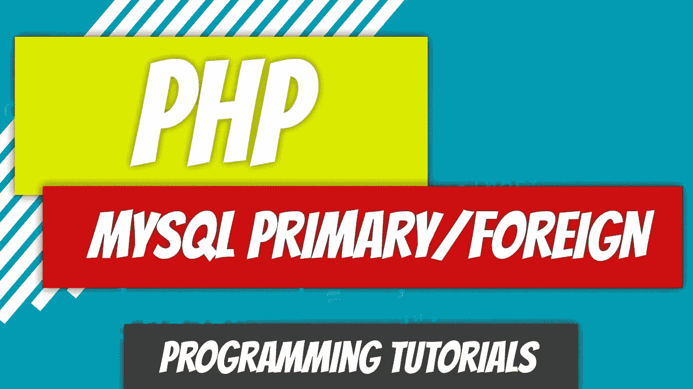
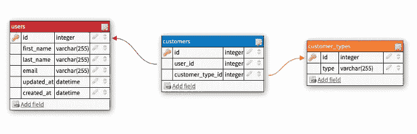
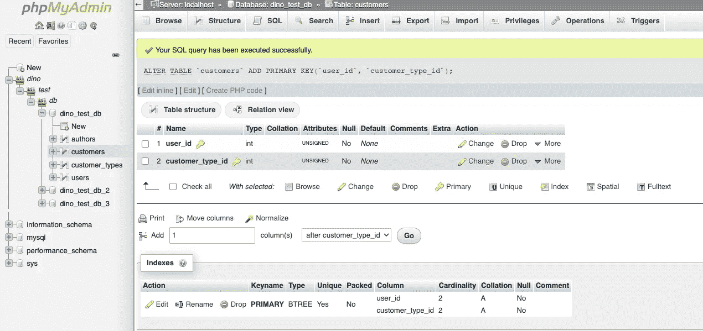
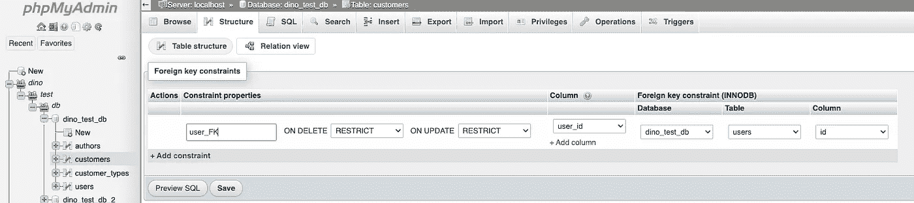
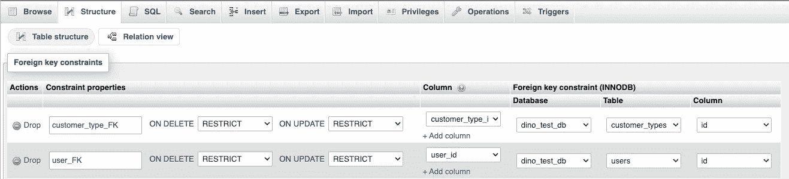

# PHP — P96: MySQL 主键和外键

> 原文：<https://blog.devgenius.io/php-p96-mysql-primary-and-foreign-keys-c087310cfb62?source=collection_archive---------6----------------------->



我们谈到了规范化，但从未完全涵盖主键和外键。这并不是 MySQL 独有的，但却是你经常听到的:主键和外键。在以前的 MySQL 文章中，我们已经看到了一个这样的例子，但是我想进一步阐述一下。

[](/php-p93-mysql-normalization-7e9a9809311e) [## PHP — P93: MySQL 规范化

### 我们将触及最后一个话题，今天就讲到 MySQL。最后一个话题是正常化。对…意味着什么

blog.devgenius.io](/php-p93-mysql-normalization-7e9a9809311e) 

# SQL 中的主键是什么？

它只是表中的一列或列的组合，对于表中的每个条目都是唯一的。一个简单的例子是一个人的社会保险号。对于政府，你的主键是你的 SSN。只有你是独一无二的。如果我们向表中添加个人，SSN 可以用作主键。

不需要像那样具体的东西。它可以是任意数字。最常见的情况是，为每条记录分配一个 ID 列。每次添加新条目时，ID 列都会增加。这意味着每条记录的 ID 列都有一个唯一的值，使其成为主键的主要候选项。因此，主键对于每条记录必须是唯一的，不能是`null`。

# 什么是外键？

这是关系数据库中关系开始兴盛的地方。外键用于定义表之间的关系。在继续之前，让我们看一个例子。



我们在数据库中创建了三个表:

*   `users`
*   `customers`
*   `customer_types`

我们的`users`表包含一个主键`id`。我们的`customer_types`桌也是如此。`customers`表还包含一个主键`id`。但是它还包含两个附加字段。第一个字段`user_id`是外键。外键表示在另一个表中有一个主键与该外键的值相匹配。通过查看`user_id`列，我们可以快速判断出这个外键指向`users`表中的`id`主键。这就是允许将一个表链接到另一个表的原因。我们现在可以将我们的`customers`表链接到`users`表。

我们还可以将我们的`customers`表链接到我们的`customer_types`表。`customer_type_id`外键将指向`customer_types`表中的`id`主键。

您可能会看到外键不必是唯一的。例如，我们的`customers`表可能将一个用户链接到多个客户类型。例如，一个用户可能是分销商客户，也可能是直接向消费者发货的客户。

但是，用户不应多次属于分销商客户类型。我们可以通过将`user_id`和`customer_type_id`的组合作为主键来限制这一点。既然我们有了主键组合，我们可以从`customers`表中删除`id`列，因为我们将有我们的主键。

请记住，外键将数据从一个表链接到另一个表。

# 使多个列充当主键

我们需要修改我们的表，使多个字段作为主字段。我们可以用下面的命令来实现:

```
ALTER TABLE `customers` ADD PRIMARY KEY(`user_id`, `customer_type_id`);
```

或者，我们可以通过 phpMyAdmin 来实现。

*   打开 phpMyAdmin
*   去你的桌子。在这种情况下，它是`customers`
*   单击“结构”选项卡
*   选择两列，然后单击主要按钮



您将看到主 keyname 被添加到底部的 indexes 下。

# 外键约束

除了引用表之外，还可以添加外键约束。我们将在下面解决这两个问题。我们希望限制删除和更新。这意味着，如果我们删除或更新父表中的值，这将阻止它，因为有一个约束。

我们可以将约束条件更改为:

*   无操作:如果我们对父对象进行了更改，操作会失败
*   级联:如果父表中的某行被删除或修改，那么子表中与该表相关联的所有行也会被删除
*   Set Null:如果在父表中删除或修改，则在子表中将所有值设置为`null`
*   Restrict:不允许删除或修改父记录，除非先删除所有相关记录。

我们可以通过 SQL 添加关系。

```
ALTER TABLE `customers` 
    ADD CONSTRAINT `user_FK` 
    FOREIGN KEY (`user_id`) 
    REFERENCES `users`(`id`) 
    ON DELETE RESTRICT 
    ON UPDATE RESTRICT;
```

或者我们可以通过 phpMyAdmin 来实现。

*   打开 phpMyAdmin
*   选择要添加外键约束的表。
*   选择“结构”选项卡
*   单击关系视图
*   添加一个约束名称，如`user_FK`
*   选择列:`user_id`
*   选择数据库:`dino_test_db`
*   选择`user_id`指向的表格:`users`
*   选择`users`表中指向的列:`id`
*   单击保存



我们可以为`customer_type_id`重复这个过程。



这里的关键是外键指向主键。


Dino Cajic 目前是 [Absolute Biotech](http://absolutebiotech.com/) 的 IT 主管，该公司是 [LSBio(寿命生物科学公司)](https://www.lsbio.com/)、 [Absolute 抗体](https://absoluteantibody.com/)、 [Kerafast](https://www.kerafast.com/) 、 [Everest BioTech](https://everestbiotech.com/) 、 [Nordic MUbio](https://www.nordicmubio.com/) 和 [Exalpha](https://www.exalpha.com/) 的母公司。他还担任我的自动系统的首席执行官。他拥有计算机科学学士学位，辅修生物学，并拥有十多年的软件工程经验。他的背景包括创建企业级电子商务应用程序、执行基于研究的软件开发，以及通过写作促进知识的传播。

你可以在 [LinkedIn](https://www.linkedin.com/in/dinocajic/) 上联系他，在 [Instagram](https://instagram.com/think.dino) 上关注他，或者[订阅他的媒体出版物](https://dinocajic.medium.com/subscribe)。

阅读 Dino Cajic(以及 Medium 上成千上万的其他作家)的每一个故事。你的会员费直接支持迪诺·卡吉克和你阅读的其他作家。你也可以在媒体上看到所有的故事。