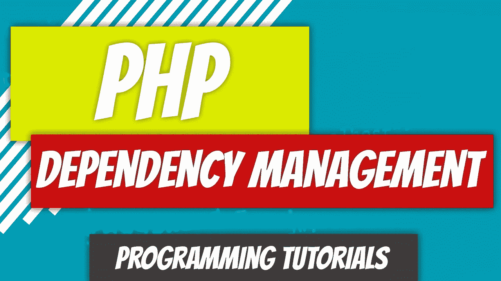
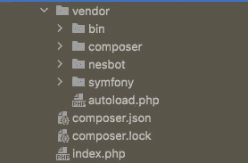
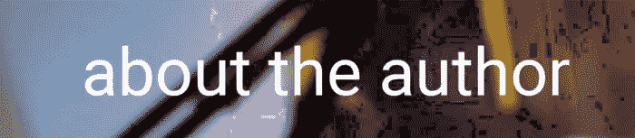

# PHP — P99:依赖管理简介

> 原文：<https://blog.devgenius.io/php-p99-dependency-management-intro-fe42877964d4?source=collection_archive---------10----------------------->



我们已经写了将近 100 篇文章，还没有讨论 PHP 中的依赖关系。我们结束了上一篇关于类中内置的`DateTime`的文章。我们用它来执行一些日期和时间操作。名单上的下一个是`Carbon`。Carbon 是一个可以使用`composer`安装的依赖项。

一旦安装，我们可以像使用任何其他内置类一样使用它。`Carbon`实际上继承了`DateTime`类并在其上扩展。但是，在我们开始之前，我想简单地谈一下 PHP 中的依赖关系。

如果你曾经在任何使用 JavaScript 的前端应用上工作过，你可能听说过`npm`。`npm`是一个依赖管理器。`npm`注册表包含成千上万的依赖项。这些是您可以下载并在应用程序中使用的代码片段。别人维护他们，大部分时候，你只是收获了别人努力的收益。

PHP 也有一个依赖管理器。叫`composer`。任何时候你需要包含一个库供你使用，你都可以使用`composer`。在我们的例子中，我们需要将它用于`Carbon`依赖项。

要获得 composer，您需要访问 composer url 并下载它。您也可以在 docker 环境中这样做(这是首选)。

[](https://getcomposer.org/) [## 设计者

### PHP 的依赖管理器

getcomposer.org](https://getcomposer.org/) 

一旦在操作系统上安装了 composer，就可以运行`composer`命令来获取所需的依赖项。

例如，`composer require nesbot/carbon`抓取`Carbon`依赖关系。这会自动抓取最新的`carbon`版本，甚至为您配置`composer.json`文件。

```
{
    "require": {
        "nesbot/carbon": "^2.63"
    }
}
```

如果你查看你的文件夹结构，你会注意到你现在有一个`vendor`目录，在它里面有`composer`和`composer`需要的任何其他依赖项。



还有一个包含自动加载器的`autoload.php`。这允许您跳过所有的`require`语句，而是加载您需要的所有内容。然而，你将需要它。

我们可以创建一个新文件，`require`我们的自动加载器，`use`我们的`Carbon\Carbon`类，因为它在一个虚拟目录(Carbon 名称空间)中，并开始使用它。

```
<?php
require 'vendor/autoload.php';

use Carbon\Carbon;

echo Carbon::now();
```

我们得到一个简单的结果:`2022–11–24 03:26:39`。

这就是依赖是多么容易。如果你需要更新你的依赖关系，使用`composer update`。我们不会比这更深入，因为这是对依赖性的介绍。在下一篇文章中，我们将更详细地研究`Carbon`。

[](https://github.com/dinocajic/php-youtube-tutorials) [## GitHub-dinocajic/PHP-YouTube-tutorials:PHP YouTube 教程的代码

### PHP YouTube 教程的代码确保你已经安装了 Docker。克隆回购。运行以下命令…

github.com](https://github.com/dinocajic/php-youtube-tutorials) 

Dino Cajic 目前是 [Absolute Biotech](http://absolutebiotech.com/) 的 IT 主管，该公司是 [LSBio(寿命生物科学公司)](https://www.lsbio.com/)、 [Absolute 抗体](https://absoluteantibody.com/)、 [Kerafast](https://www.kerafast.com/) 、 [Everest BioTech](https://everestbiotech.com/) 、 [Nordic MUbio](https://www.nordicmubio.com/) 和 [Exalpha](https://www.exalpha.com/) 的母公司。他还是我的自动系统公司的首席执行官。他拥有计算机科学学士学位，辅修生物学，并拥有十多年的软件工程经验。他的背景包括创建企业级电子商务应用程序、执行基于研究的软件开发，以及通过写作促进知识的传播。

你可以在 [LinkedIn](https://www.linkedin.com/in/dinocajic/) 上联系他，在 [Instagram](https://instagram.com/think.dino) 上关注他，或者[订阅他的媒体出版物](https://dinocajic.medium.com/subscribe)。

阅读 Dino Cajic(以及 Medium 上成千上万的其他作家)的每一个故事。你的会员费直接支持迪诺·卡吉克和你阅读的其他作家。你也可以在媒体上看到所有的故事。