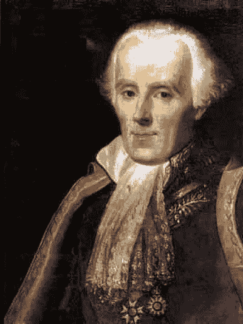
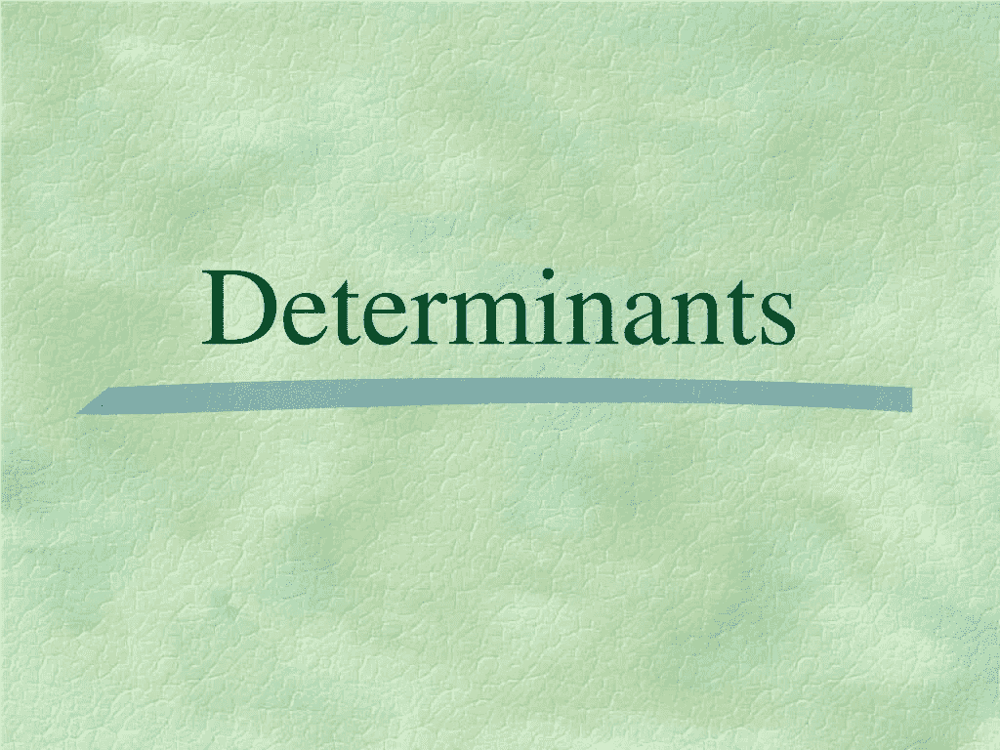
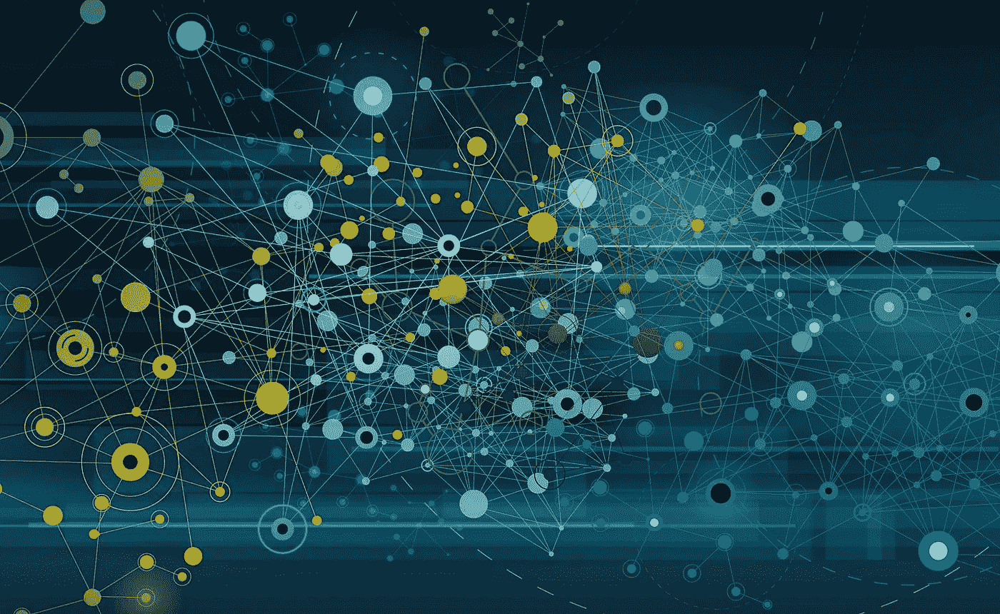
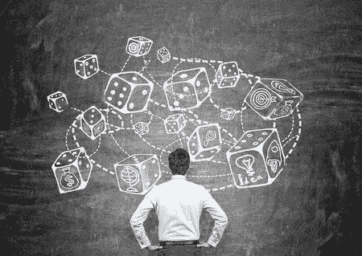

# 皮埃尔·西蒙·拉普拉斯:单枪匹马为现代技术奠定基础的人

> 原文：<https://blog.devgenius.io/pierre-simon-laplace-the-man-single-handedly-created-foundations-for-modern-technologies-342a7a927641?source=collection_archive---------7----------------------->

不仅仅是数学、天体力学和统计学。他的数学基础有助于创造人工智能、数据科学和数据通信。在这里，我们将概述皮埃尔西蒙拉普拉斯如何贡献给我们的日常生活。

## 1-卷积定理和拉普拉斯变换

也许你会问，当你在数学、工程、物理和统计课程中看到微分方程中的卷积定理和拉普拉斯变换时，它们在日常生活中的应用。更有甚者，你可能已经放弃了它们真的没用，只是用来通过你的课程，不需要其他信息。因为卷积定理和拉普拉斯变换为日益复杂的数学课题创造了基础，所以它们是数据通信和人工智能的基础。但它甚至不是普通的人工智能。它们由神经和卷积神经网络组成，需要充分利用卷积定理。

## 2-证明基本统计定理

这可能会让你感到惊讶，但是拉普拉斯通过证明贝叶斯定理贡献了统计学。今天，它们仍被用于对某些主题进行评估，尤其是在管理和创建某种现代技术基础方面。更重要的是，理解贝叶斯定理是理解网络安全、人工智能、数据科学和区块链等现代技术被应用于保持其最佳运转的可能性的第一步。

## 3-行列式

可能在你的课程中听不到，但是拉普拉斯通过数学证明他的消去法(拉普拉斯矩阵)对线性代数做出了贡献。虽然它没有在许多领域中使用，但教授们使用拉普拉斯矩阵来证明区块链中的一致性算法，同时使用拓扑证明。此外，他们在不同的共识算法中工作，以证明他们在所有可能的应用情况下都有效。

## 4-回归分析

这发生在拉普拉斯发送信件与他的同事高斯和勒让德讨论的时候。在 1805 年，他讨论了回归分析的原理(最小二乘法)后，写了两本关于回归分析的出版物。最后，他发现拉普拉斯回归和拉普拉斯断层对回归分析很重要。

## 5-天文学

这听起来可能很熟悉，因为你已经无数次听说拉普拉斯是一个天文学家，他对天体力学有着巨大的贡献。但这不仅仅是天体力学，他是第一个提到黑洞和重力场的理论家。现在，它们被天文学家和物理学家用来对银河系进行高级观测。

## 6-概率

尽管拉普拉斯并不以统计学闻名，但他对统计学的贡献是相当多的。首先，他证明了贝叶斯定理，然后他证明了分析概率、归纳概率和概率母函数。更重要的是，他证明了第一个广义中心极限定理。此外，他还在统计学中发现了拉普拉斯分布，并同时将其用于时间序列分析。

*你如何看待皮埃尔·西蒙·拉普拉斯？他是如何对现代科技做出贡献的？在下面的评论区分享你的想法。*