# Python 中的数据透视表

> 原文：<https://blog.devgenius.io/pivot-table-in-python-98f19cbeac50?source=collection_archive---------2----------------------->

Python 中的拖放数据分析

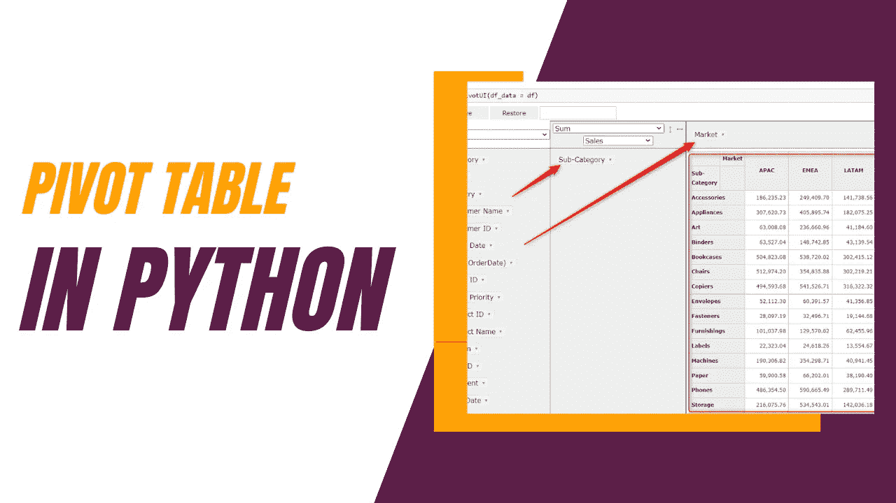

模板由@Raining Leads on Canva 提供

# 目录

> [简介](#2fce)
> [安装库](#449f)
> [数据&资源](#e0a6)
> [读取数据](#d3fc)
> [数据透视表(pivottablejs)](#8206)
> [拖动&放下数据透视表](#36bb)
> [问题处理(pivottablejs)](#77bf)
> [解题](#c2cc)
> [视频教程](#ec00)
> [最终](#b60e)

# 介绍

Python 中的探索性数据分析通常是通过使用 Pandas 库来完成的。如果您使用 Python 进行数据分析，您会知道分析不同情况下的数据是不可行的，因为您必须为各种条件(过滤器、聚合)编写单独的代码。

与**分析 Tableau** 中的数据不同，我们可以将列拖放到行&列中，以创建不同级别的聚合，并使用过滤器卡创建下拉菜单，以交互方式过滤表中的值。

我们都知道 **python** 对于清理数据、编写计算和进行分析是多么有用，但是有时，尤其是在分析开始时，我们只想快速浏览不同级别的聚合和过滤条件，以回答一些业务问题(从业务角度理解数据)。

因此，我通常会开始交替使用 Tableau 和 Python 来研究数据，这样我就可以从这两种工具中获益。

也就是说，这让我想到，如果 Python 可以和 Tableau 有类似的特性(拖放分析)会怎么样？然后我在 LinkedIn 上看到了一个随机的帖子，分享了这个叫做 [ipypivot](https://github.com/PierreMarion23/ipypivot#readme) 和 [pivottablejs](https://pypi.org/project/pivottablejs/) 的 python 库。

# 安装库

如果你还没有，你需要安装这个库。

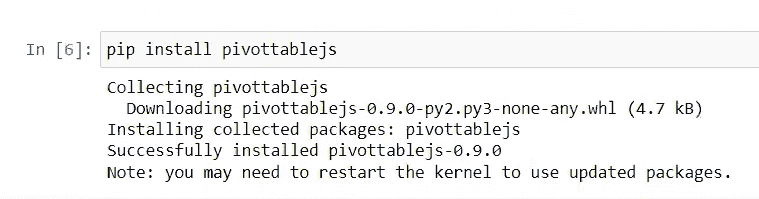

安装 pivottablejs 库

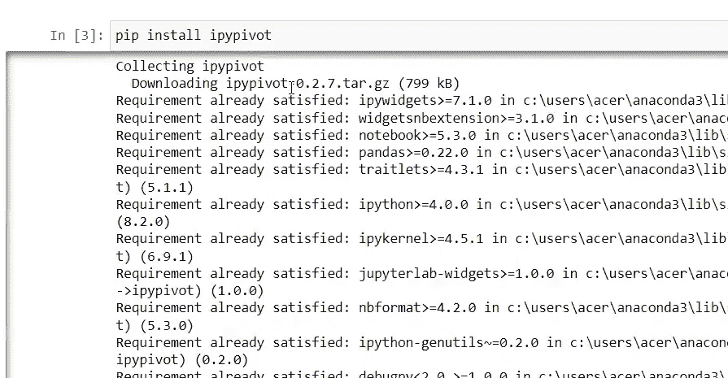

安装 ipypivot 库

# 数据和资源

数据:[g 驱动链接](https://docs.google.com/spreadsheets/d/1o-KaA43TD6Q_w_vnyEOIzaR6xMTmR9nd/edit?usp=sharing&ouid=105166131516527752739&rtpof=true&sd=true)

中:[medium.com/@foocheechuan](https://medium.com/@foocheechuan)

Youtube: [车志川](https://www.youtube.com/channel/UC73tyElpkCE_6cbZxMLKnkw)

# 读出数据

```
import pandas as pd
df = pd.read_excel(f'{filepath}/Global Superstore.xlsx')
df
```

# 数据透视表(pivottablejs)

```
from pivottablejs import pivot_ui
pivot_ui(df)
```

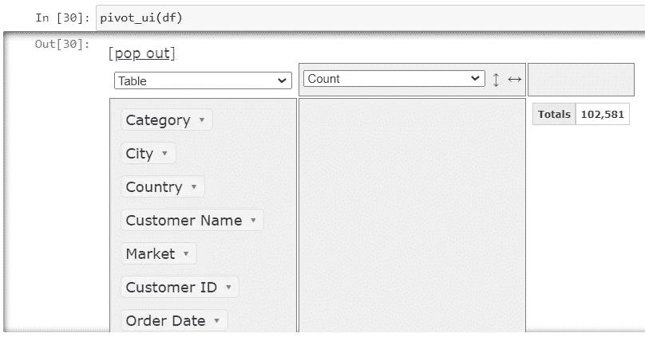

pivot_ui 调用的数据透视表(df)

# 拖放数据透视表

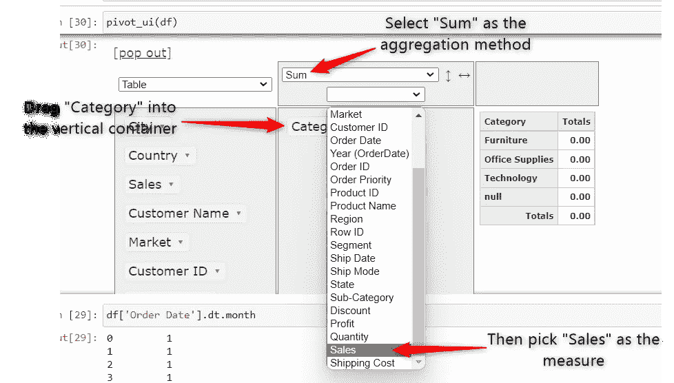

创建数据透视表

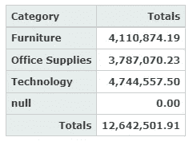

数据透视表结果

如果你以前使用过 Tableau(交叉表)或 Excel(数据透视表)，这个想法是非常相似的。我们需要一个维度(分类字段)和一个度量(数值字段)。

我们需要将一个维度拖到视图中，然后在下拉菜单中选择聚合方法和度量字段。与通常的拖放分析不同，它将维度和度量值都拖到视图中。如果我们将 Sales 拖到视图中，它将被视为一个维度。

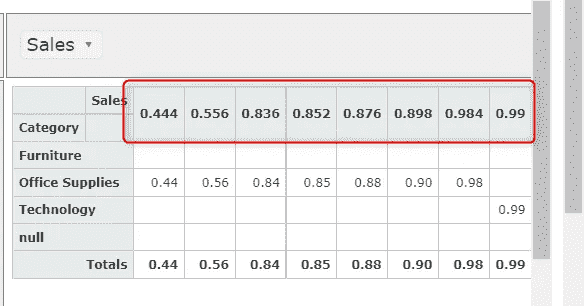

拖动到水平容器中时的分类销售值

# (pivottablejs)的问题

pivottablejs 库有一个问题。当原始数据不应该有空值时，我的表中出现了意外的空值。

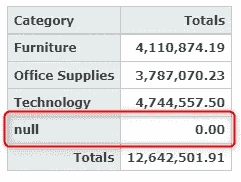

意外的空值

我将聚合改为计数，以了解发生了什么。

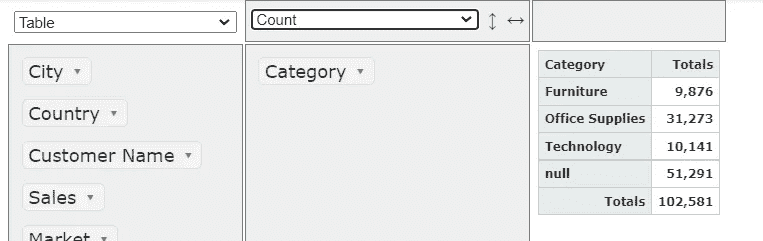

汇总方法=计数

有 51，2941 个空值和 51，290 个非空值，这意味着它是我的原始数据的副本(包括列名)。

多亏了这个[页面](https://github.com/nicolaskruchten/jupyter_pivottablejs/issues/52)上的解决方案，我解决了这个问题。

为了把它放到我的代码中，我稍微修改了一下解决方案。

```
# We already defined df before this
  # If you're starting new define your df first
def pivot_ui(df, **kwargs):
    import pivottablejs
    class _DataFrame(pd.DataFrame):
        def to_csv(self, **kwargs):
            return super().to_csv(**kwargs).replace("\r\n", "\n")
    return pivottablejs.pivot_ui(_DataFrame(df), **kwargs)

pivot_ui(df)
```

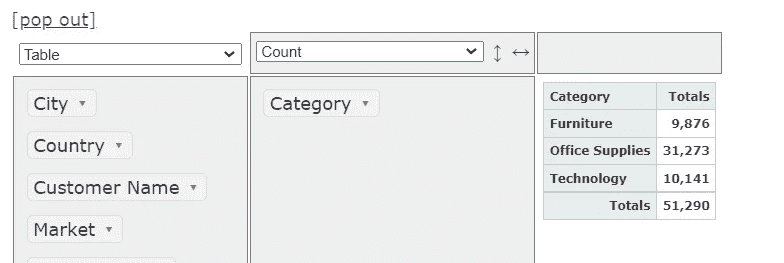

不再有空值

# 问题解决

现在让我们用这个数据透视表来回答一些基本的数据探索问题。

**问题 1:**

哪三个子类别的总利润最高？对于这些子类别，它们是否属于同一个类别？在这些子类别中，哪个市场的总利润最高？

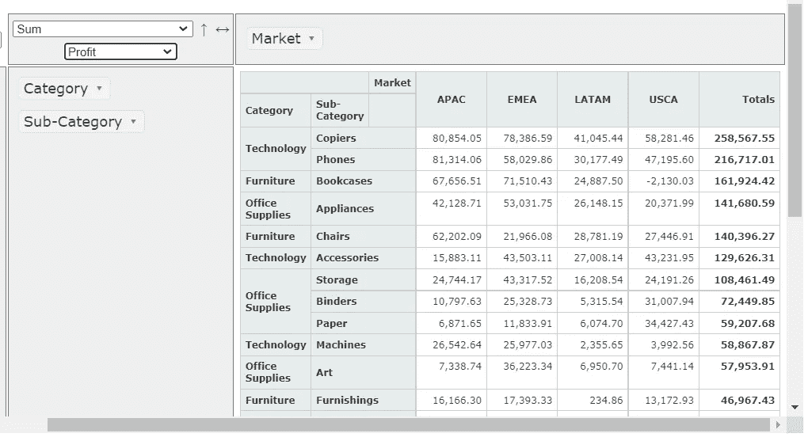

问题 1

Q1 解决方案:

> 将类别拖到垂直容器中，其后是其子类别。
> 
> 将市场拖入横向容器
> 
> 汇总方法已更改为总和
> 
> 衡量选择利润
> 
> 垂直降序排序(聚合下拉菜单旁边的箭头)

Q1 回答:

> 复印机、电话和书架的总利润最高。
> 
> 复印机和电话属于技术类，而书架属于家具类。
> 
> 复印机和电话在 APAC 市场的总利润最高，而书架在 EMEA 市场的总利润最高。

**问题二:**

「家具」品类哪个市场总利润最高？

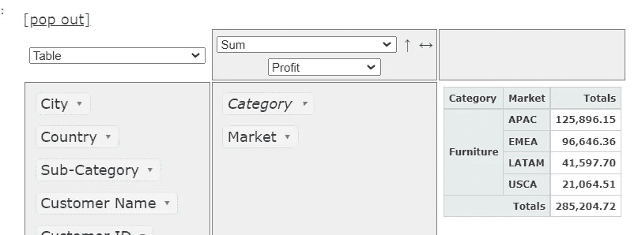

问题 2

Q2 解决方案:

> 使用相同的数据透视表从垂直容器中移除子类别(将其拖回左侧容器)。
> 
> 将 Market 从水平容器拖到垂直容器。
> 
> 将类别过滤为“家具”->单击类别旁边的箭头->取消选中除“家具”之外的所有复选框。

Q2 回答:

> APAC 市场的家具类总利润最高。

# 视频教程

# 最后的话

数据分析曾经是一个代码专用的职业。随着技术的日益进步，数据分析变得更加容易。许多公司看到了这个机会，并提供了用于拖放分析的免费 saas 工具，但收取额外费用。这使得新手很难在资源有限的情况下开始他们的第一个项目。所以我会尽力提供免费的教程，让新的学习者能够更容易更快的学习。

也就是说，请在下面留下你的评论，告诉我你想让我做什么样的教程。我会继续在我的媒体和 youtube 频道上创建这样的内容，所以请在这些平台上关注我。

谢谢你一直读到最后。下一场见。:)


照片由[思想目录](https://unsplash.com/@thoughtcatalog?utm_source=unsplash&utm_medium=referral&utm_content=creditCopyText)在 [Unsplash](https://unsplash.com/s/photos/learning?utm_source=unsplash&utm_medium=referral&utm_content=creditCopyText) 上拍摄