# 平面图形直观解释

> 原文：<https://blog.devgenius.io/planar-graphs-visually-explained-164356be2263?source=collection_archive---------8----------------------->

平面图是可以在平面上画出没有相交弧的图。这些边只能在端点相交。让我们看两个平面图。

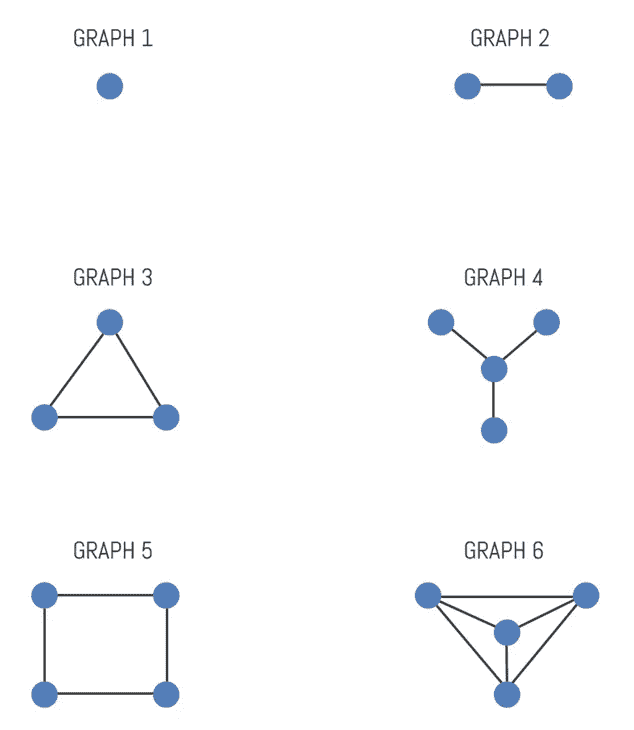

让我们快速看一下一个非平面的图形。这是著名的 K5 图。我们会试着把它做成平面的。

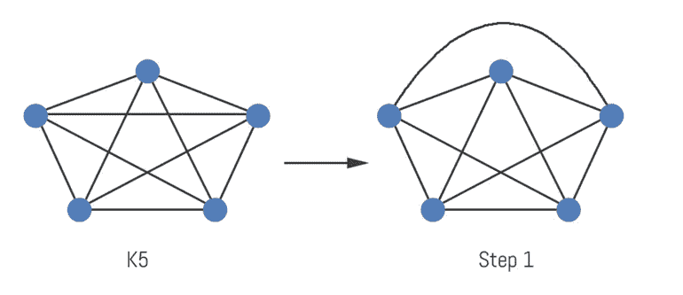

在步骤 1 之后，我们可以看到相交的边仍然存在。让我们看看第 2 步和第 3 步是什么样子的。

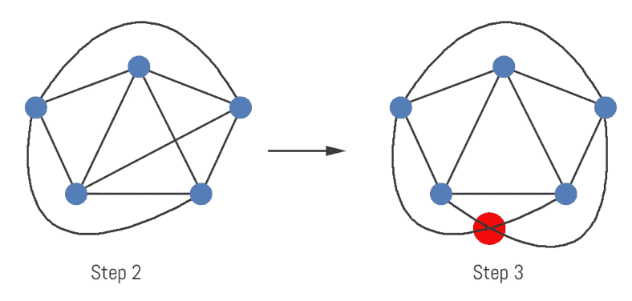

我们可以看到，在步骤 2 中，它看起来仍然很有希望。只有一条额外的相交边需要处理。然而，一旦我们试图向任何方向移动它，总会有交集。您可以看到交集出现在步骤 3 中。因此，K5 是一个非平面图形。

K *5* 图是著名的非平面图；K *3，3* 又是一个。画出 K *3，3* 图，尝试使其平面化。你很快就会发现这是不可能的。

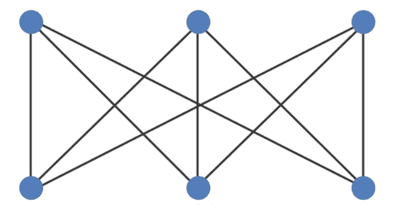

我们必须每次都通过重画来尝试绘制平面图吗？不，因为我们有欧拉公式。欧拉公式指出，在平面图形上，顶点数减去边数加上面数必须等于 2。

> ***v - e + f = 2***

让我们用几个小例子来测试一下。

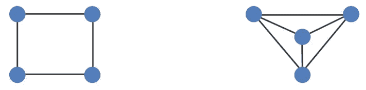

左边的图有 4 个顶点、4 条边和 2 个面。图形的外部也被认为是一个面。如果我们把这些值代入欧拉方程，我们得到 4–4+2 = 2。这是一个平面图。右边的例子有 4 个顶点，6 条边和 4 个面。如果我们把这些值代入欧拉方程，我们得到 4–6+4 = 2。由于 2 等于 2，我们可以看到右边的图也是平面图。

还有一个简单的技巧要记住。如果 *n ≥ 5* ，则每个顶点都与图中所有其他顶点相连的完全图(K *n* )不是平面的。所以，K *5* ，K *6* ，K *7* ，…，K *n* 图形不是平面的。如果 *m ≥ 3* 且 *n ≥ 3* ，则完全二部图(K *m，n* )不是平面的。我们可以很快验证 K *3，3* 图不是平面的。

当然，事情并不总是那么简单。一般的经验法则是，如果你能找到一个 K *3，3* 或 K *5* 子图，那么这个图不是平面的。让我们看看能否证明下面的图形不是平面的。

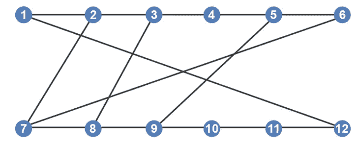

观察该图后，我们可以很快看到顶点 2、3、5、7、8 和 9 分别有 3 条边连接。我们可以朝着证明这将是一个 K *3，3* 图的方向前进。让我们在平面上画出那些点。

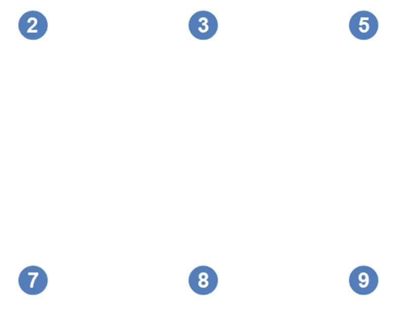

如果我们可以重新排列上面的图，使得这些点中的每一个都包含所有其他顶点，并且仍然保持每一个都有三条边，那么这足以证明这是一个 K *3，3* 图，并且不是平面的。

我们将从连接顶点 2 和 7 开始，因为有一个直接连接。

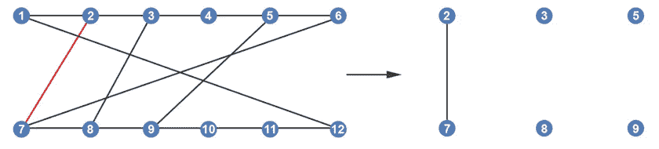

节点 2 也直接连接到节点 3。

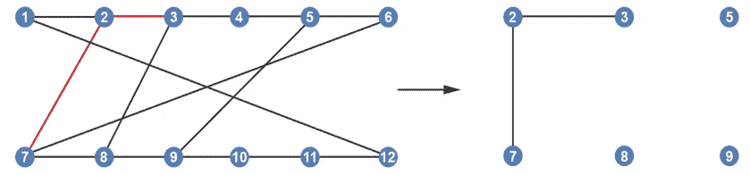

我们需要将节点 2 连接到一个额外的节点。看起来好像如果我们沿着它的路径向左，它通过节点 12、11 和 10 连接到节点 9。为了更清楚，为了到达节点 9，我们将采用一条路径，从节点 2 经过边 2–1，然后经过边 1–12，再经过边 12–11，然后经过边 11–10，最后经过边 10–9。

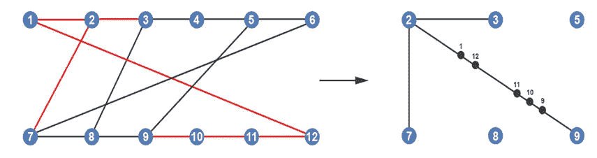

移动到边 3，它直接连接到节点 8。

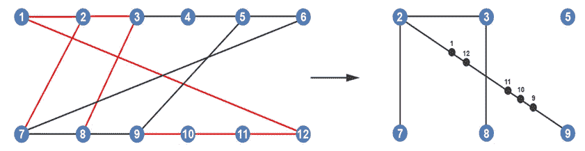

当比较左图和右图时，我们可以看到在左图中，节点 3 连接到节点 4。然而，在我们右边的图中，节点 4 并不存在。但是，节点 5 存在。我们可以看到，节点 3 通过节点 4 连接到节点 5。

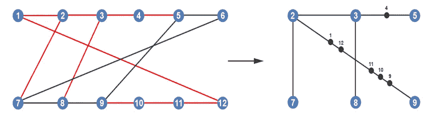

转到节点 5，它直接连接到节点 9。

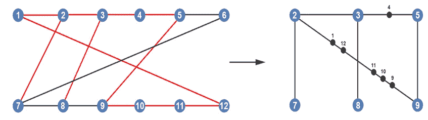

节点 5 也通过节点 6 间接连接到节点 7。

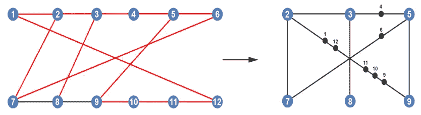

节点 7 直接连接到节点 8。

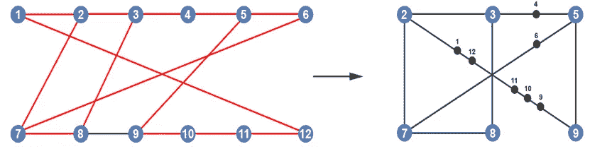

最后，节点 8 直接连接到节点 9。

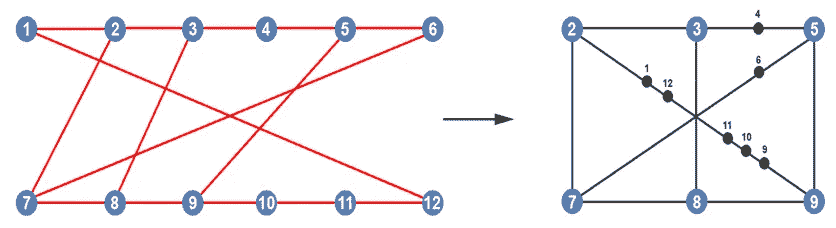

由于我们在右边生成的图中的每个顶点都连接到 3 条边，这表明生成的图是 K *3，3* 图，我们知道它实际上是非平面的。因此，左边的图也是非平面的。

*如果你喜欢你所读的，看看我的书，* [*算法说明性介绍*](https://www.amazon.com/Illustrative-Introduction-Algorithms-Dino-Cajic-ebook-dp-B07WG48NV7/dp/B07WG48NV7/ref=mt_kindle?_encoding=UTF8&me=&qid=1586643862) *。*

迪诺·卡伊奇目前是 [LSBio(生命周期生物科学公司)](https://www.lsbio.com/)、[绝对抗体](https://absoluteantibody.com/)、 [Kerafast](https://www.kerafast.com/) 、[珠穆朗玛生物](https://everestbiotech.com/)、[北欧 MUbio](https://www.nordicmubio.com/) 和 [Exalpha](https://www.exalpha.com/) 的 IT 主管。他还担任我的自动系统的首席执行官。他有十多年的软件工程经验。他拥有计算机科学学士学位，辅修生物学。他的背景包括创建企业级电子商务应用程序、执行基于研究的软件开发，以及通过写作促进知识的传播。

你可以在 [LinkedIn](https://www.linkedin.com/in/dinocajic/) 上联系他，在 [Instagram](https://instagram.com/think.dino) 上关注他，或者[订阅他的媒体出版物](https://dinocajic.medium.com/subscribe)。

[*阅读迪诺·卡吉克(以及媒体上成千上万其他作家)的每一个故事。你的会员费直接支持迪诺·卡吉克和你阅读的其他作家。你也可以在媒体上看到所有的故事。*](https://dinocajic.medium.com/membership)