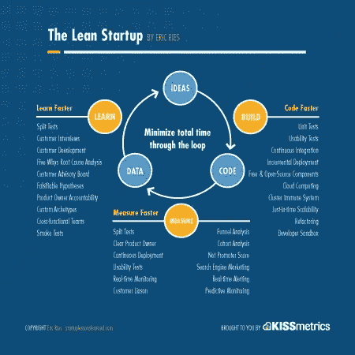

# 平台工程——帮助公司腾飞的隐形钢铁侠套装

> 原文：<https://blog.devgenius.io/platform-engineering-the-invisible-iron-man-suit-that-helps-your-company-fly-fb0c3b49e845?source=collection_archive---------21----------------------->

微服务架构——容器编排、API 网关、基础设施代码、共享身份提供者等。在许多仍在从内部部署转向云原生解决方案的大型组织中，部署哪怕是一个小型应用程序的复杂性都大大增加了。这导致了“平台工程”角色和平台工程团队的兴起。

简单地说，平台工程团队是基础设施团队、开发工具团队、软件工程团队和开发运维团队的跨职能混合体。这个团队的目标是使应用程序开发人员能够以更快、更可靠、更简单的方式向最终用户交付价值。

平台工程团队可能负责的一些示例:

*   自动化部署流程。
*   标准化 Kubernetes 部署。
*   抽象出审计、日志和安全等共享需求。
*   为开发人员编写文档。

> 平台团队最好是见而不闻。

平台团队在支持应用团队以速度和规模交付价值方面扮演着关键的角色。此外，平台团队似乎是积极的开发者体验的成败部分。许多应用程序团队最大的抱怨是:“当我自己可以很容易地完成这个过程时，为什么我要学习另一个(记录很差的)过程？”与生活中的许多事情一样，平台工程是一种平衡。实际上，这意味着任何平台团队都必须在自由和实现关键业务目标之间取得平衡。

# 平台团队的主要任务应该是明确的——使应用程序开发人员能够以更快、更可靠、更简单的方式向最终用户交付价值。

当平台团队理解这一核心任务时，优先级应该很容易协调。事实上，简单的 OKR(目标和关键结果)使得跟踪平台团队支持其核心客户(应用团队)的有效性变得极其容易。这里有几个例子:

*   平台正常运行时间。
*   应用程序部署速度(应用程序从开发进展到生产所需的时间)。
*   对部署捆绑包进行初始配置更改的次数。
*   应用团队调查。

为了继续改进这些 OKR 和开发人员的体验，**精益方法**可以用来快速迭代和改进。遵循这种方法，平台工程团队可以像(外部)面向客户的团队一样取悦其客户——通过准确交付所需的内容并快速改进。

精益方法的原型循环。构建—测量—学习。

一个警告——平台工程团队必须对平台团队*破坏*的任何事情负责(通过改变流程等)。).因为平台工程团队负责—必须为应用团队的无缝迁移/升级提供自动化流程或工具。否则，平台工程团队不得不手动修复每个 app 团队的问题。**脸书**在框架和平台中采用了这种责任模型，当涉及到变更时，它极大地激励了自动化。根据经验，任何开发团队都不应该**让**参与平台升级。

平台工程师不应该只关注为客户(在这种情况下，是应用团队)启用平台。使开发人员能够创建业务需求的工具是将组织带到下一个级别的钢铁侠套装。换句话说，理想的平台工程团队可能看起来像一个戴着平台工程帽子的开发团队。

从组织上来说，一个平台工程团队(做得好)可以减轻应用程序开发人员的负担，并允许开发团队以可持续的方式更快地交付价值。

# 摘要

在许多大型企业中，专门的平台工程团队(如果做得好)可以让应用程序开发人员以更快、更可靠、更简单的方式向最终用户交付价值。这有许多一级好处，例如:

*   提高应用程序团队交付价值的速度。
*   增加平台正常运行时间。
*   自动符合业务和/或法规要求。

此外，还有一些隐藏的(二级)好处，包括:

*   更快乐的开发人员，因为他们不必为了交付价值而摆弄配置。
*   提高组织的敏捷性—可持续的自动化变更和升级使组织能够专注于重要的事情。

有了正确的思维模式，平台工程团队就可以为企业的其他部门打造钢铁侠套装——最终让开发人员能够做他们喜欢做的事情。